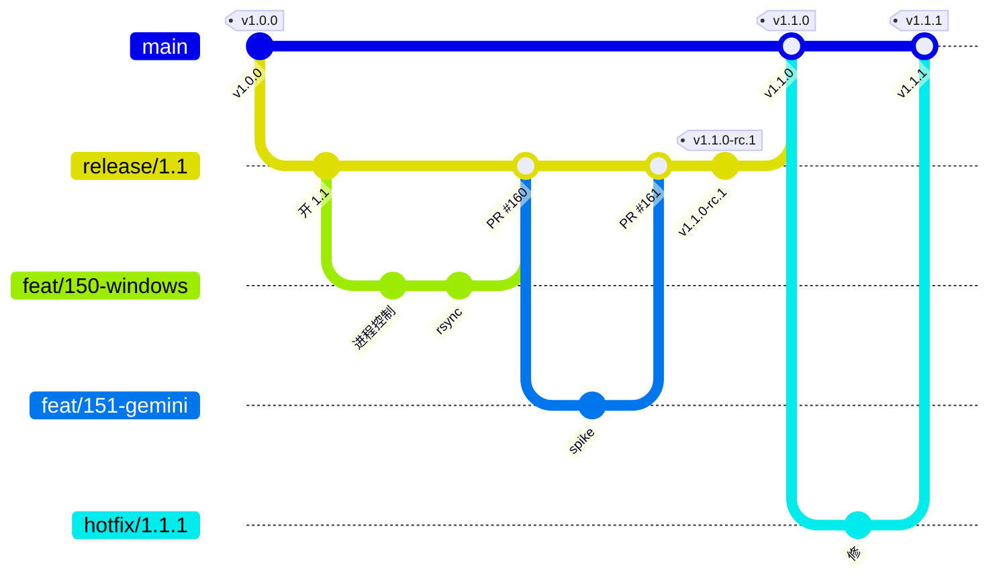

# 怎么协作

这份讲流程：一件事怎么从 issue 走到发布。规矩（红线、协作纪律、写代码与验收的标准）在 [`CLAUDE.md`](CLAUDE.md)，代码层面的细则在内仓各模块的 README，为什么这么定在 [ADR-0004](docs/adr/0004-branching-versioning-1.0.md)。两个仓（本仓、内仓 `platform/`）同一套流程。

## 分支模型

| 分支 | 从哪切 | 谁动 | 规矩 |
|---|---|---|---|
| `main` | — | 只接 PR | 永远可发；每个合入 `main` 的 commit 都对应一个 tag 或热修。受保护：不许直接 push、不许 force、要 PR + 门禁绿 + 一人 review |
| `release/X.Y` | `main`，开一个版本时切 | 只接 PR | 这一版的集成分支；受保护同 `main`。版本做完由发版人合进 `main` 并打 tag，然后删掉 |
| `feat/<issue 号>-<slug>` | 当前的 `release/X.Y` | 干活的人 | 一条 issue 一个分支；随做随提，一个逻辑单元一个 commit；做完开 PR 进 `release/X.Y` |
| `hotfix/X.Y.Z` | `main` | 发版人 | 已发版本的紧急修复；PR 进 `main`，打 PATCH tag，再合回当前的 `release/X.Y` |
| `docs/…`、`chore/…` | 同 `feat/` | 干活的人 | 只改文档或工具也走 PR，同一套门禁 |

一句话：**干活从 release 分支切出去、回到 release 分支；只有发版人碰 main。**

## 一件事的生命周期

1. **先有 issue**（开在本仓）：标题一句人话；标签三根轴——`kind:*`、`area:*`、`P0/P1/P2`；大活开 `kind:umbrella` 母 issue 挂 milestone，叶子用 sub-issue。跨仓的改动以本仓的一条 issue 为锚，两边 commit 都引它。
2. **切分支**：`git switch -c feat/<issue 号>-<slug> release/X.Y`。
3. **随做随提**：一个逻辑单元一个 commit；message 用中文、技术名词保留英文、说改了什么和为什么、末尾 `（#n）`。不加 `Co-Authored-By`、不加「Generated with」尾注、不加机器人 emoji。发现、证据、决策随做随写进 issue 评论。
4. **提交前**：`make check` 绿（两仓都有，与 CI 完全相同；别接 `| tail`）；改了行为的地方文档同步改了；`CHANGELOG.md` 的 Unreleased 加了一行。
5. **开 PR** 进 `release/X.Y`：按模板写（做了什么、引用 issue、验收怎么跑的、CHANGELOG 加了没、文档改了没）；标题就是 commit 风格的一句话。
6. **review**：至少一人认可；机器能查的不留给人查，人看意图对不对、抽象合不合理、边界想没想全；review 里的问题按 finding 逐条回复，改了贴 commit。
7. **合并**：只用「Create a merge commit」（保留每条 commit，issue 评论里引的哈希不失效）；合并后**关 issue**，评论写做了什么、在哪个 commit；分支删掉。

agent（Claude Code、Codex）参与也走同一套：它开的分支、提的 PR 与人的一样进门禁与 review；PR 里不写它是谁写的。

## 版本与发布

### 1.x 的含义

从 1.0.0 起承诺兼容。冻结的是这几样，改它们要走弃用周期：

| 冻结的 | 在哪 |
|---|---|
| `ai4sci` 的子命令与参数、退出码、stdout 那一行的形状 | `ai4sci --help`、`framework/cli/` |
| 框架认的文件：`meta.yaml`、`signed.json`、`requirement.lock`、流程文件（`stages` / `断点` / `layout`）、能力描述符的字段 | `framework/contracts/` |
| 工作区与项目的目录布局 | `framework/workspace/` |
| HTTP 端点与响应体 | `framework/chat/server.py` 文件头、`boards.py` |
| SKILL.md 的格式（agentskills.io）与 `ai4sci skill` 三个子命令 | `framework/skills/` |
| 两份按人的清单（`agents.yaml`、`computes.yaml`）的字段 | `framework/agents.py`、`framework/computes.py` |
| 端口 `Runner` / `Chat` / `Compute` 的形状 | `backends/__init__.py`、`compute/__init__.py` |

- **MAJOR**：上面任何一样不兼容地变了（删命令、改字段含义、改目录布局）。
- **MINOR**：加功能、加能力、加适配器、加端点；旧的照旧能用。
- **PATCH**：修 bug、改文案、改文档、改工具，不改行为契约。

**弃用周期**：不兼容的改动先在一个 MINOR 里加新路、旧路标弃用（命令打警告、CHANGELOG 写迁移办法），下一个 MAJOR 才删。数据布局变了要带一次性迁移脚本（外层 `scripts/oneoff/`）与回滚路径。

两个仓各自一条版本线：内仓的 tag 就是产品版本（`platform 1.x`，wheel 从它出）；本仓的 tag 是文档版本，跟着产品大版本走（1.0.0 与内仓同日发），小版本按需。milestone 与 spec 只用产品版本、带 `platform` 前缀。

### 发一个版本

1. **开版本**：从 `main` 切 `release/X.Y`，开 milestone `platform X.Y.0`，分工的 umbrella issue 挂上去。
2. **集成**：feature PR 陆续进 `release/X.Y`；CHANGELOG 的 Unreleased 随之长。
3. **预发布**：在 `release/X.Y` 上 `make release VERSION=X.Y.0-rc.1`——只打 tag、不轮转 CHANGELOG；推 tag 出包并建 pre-release（Release Notes 取 Unreleased）。内测用它；修了再 rc.2。
4. **正式发布**：发版人开 PR 把 `release/X.Y` 合进 `main`（门禁 + review 同上），在 `main` 上 `make release VERSION=X.Y.0`（轮转 CHANGELOG、提交、打 annotated tag），`git push origin main --follow-tags`；流水线校验 tag 与 CHANGELOG 一致、出包、建 Release。删 `release/X.Y`。
5. **热修**：从 `main` 切 `hotfix/X.Y.Z`，PR 进 `main`，`make release VERSION=X.Y.Z`，再把 `main` 合回当前的 `release/` 分支。

`make release` 只在本地做事、不 push；推送是出分支的动作，由发版人执行。

### CHANGELOG 怎么写

- 每个 PR 在 `## [Unreleased]` 下加**一行**：`- 用户看得见的变化，一句话（#issue）`；分类只用 新增 / 变更 / 修复 / 移除 / 安全。细节在 issue 与 commit 里，不在这里。
- 「变更」「移除」里不兼容的条目必须写迁移办法（一句话或指向文档）。
- 机器判据（`changelog.sh check`）：Unreleased 里每条 ≤ 200 字、带 `#数字` 或链接；发版时 tag 与最新版本一致；版本降序不重复。
- Release Notes 就是那一节，发版时自动取；写的时候想着它会原样出现在 Release 页面上。

## 给新人的最短路径

1. 读本仓 `README.md` 的文档地图，再读 `CLAUDE.md`。
2. 承接：`git clone` 本仓 → `./repos clone all` → `cd platform && make up`。
3. 领一条 issue（分工在 milestone 里），从 `release/X.Y` 切分支，照上面走。
4. 卡住就在 issue 里写清卡在哪、试了什么、看到什么，别憋着。
