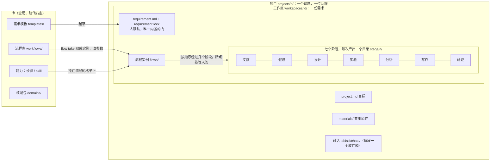

<h1 align="center">TJU AI for Science</h1>

<p align="center">科研全自动化 · 项目之家（协作仓）</p>

<p align="center">
  <a href="https://github.com/zephyr4123/TJU-AI4Science/actions/workflows/ci.yml"></a>
  <a href="https://github.com/zephyr4123/TJU-AI4Science/releases"></a>
  <a href="CHANGELOG.md"></a>
  <a href="https://zephyr4123.github.io/TJU-AI4Science/"></a>
</p>

## 这是什么

面向天津大学课题组的科研全自动化平台：研究者在页面上跟助理说清课题、确认需求，助理照流程调用平台的能力做设计、实验、分析、验证，人只在断点上确认；数能拿去用，因为每个数都能回溯到产物文件。本仓是**项目之家**：存放纲领、决策、案例、调研、外部脚本，以及指向生产代码仓的坐标。生产代码在独立的内仓 [TJU-AI4Science-Platform](https://github.com/zephyr4123/TJU-AI4Science-Platform)（私有，坐标以 `repos.json` 为准），clone 后落在本仓的 `platform/` 目录下，但对本仓的 git 完全不可见。

## 产品一眼看

四个角色：**人**确认需求、在断点上签字；**助理**（一个项目一位，coding agent 的多轮会话）读盘、选下一个阶段与能力、该问人时问人；**框架**零模型，开门、开产出目录、封评分脚本、跑内环、记账、判冻结与签字；**执行层**（能力起的 coding agent 会话）写代码。概念之间的层级与包含关系：



几个词的定义（完整词表在 [workflow.md §5](docs/architecture/workflow.md#界面适配)）：

| 词 | 指的是 |
|---|---|
| 项目 | 一个课题、一篇论文的目录，一位助理的地盘；里面几个工作区、共用原件、对话 |
| 工作区 | 项目里一份需求的家：需求、原件、流程实例、七个阶段的产出、作业 |
| 需求 | `requirement.md`，助理和人对话攒出来的；人确认（`requirement.lock`）之后阶段才开工 |
| 阶段 | 七个研究阶段之一，不定先后，任意组合 |
| 能力 | 平台会干的一件事；两个 tag：**步骤**（`ai4sci cap`，框架起执行层、开产出、能签）与 **skill**（`ai4sci skill run`，随手用、不开产出） |
| 流程 | 经过哪几个阶段、每个阶段挂哪些能力、哪儿有断点；库里的是通用的，取到工作区成实例 |
| 断点 | 流程里停下来等人确认的一项：上一项的产出要人签了，下游才能读 |
| 产出 | 一次能力调用留下的目录 `stage/n/`，`meta.yaml` 记它读了谁、谁产的；被引用或被签就冻结 |
| 助理 | 对话里的协调 agent：研究助理（项目里）、流程助理（编辑台，只造流程） |

## 五分钟承接

两种人两条路（[#138](https://github.com/zephyr4123/TJU-AI4Science/issues/138)）：

**只用平台**：不用 clone 这里。装 uv 和你要用的那家 coding agent CLI（claude 或 codex，登录好），到内仓的 Release 装 wheel（v0.2.0 的附件还只有源码包，下一版起有 wheel），`ai4sci serve` 一行起，浏览器打开；步骤在内仓 README「怎么跑 · 只用」。

**共同维护**（前提：git、uv、node 22）：

```bash
git clone https://github.com/zephyr4123/TJU-AI4Science.git
cd tju-ai4science
./repos clone all      # 按 repos.json 把内仓 clone 到位（幂等）
./repos status         # 各仓分支 / 领先落后 / 脏文件 / 线上分支漂移
make check             # 本地门禁，与 CI 完全相同
cd platform && make up # 内仓一行起服务：.venv → 页面 → skill 预热 → 自检 → ai4sci serve
```

clone 下来没有代码是预期不是故障：代码仓由 `./repos clone all` 解引用。

## 文档地图

一个事实只有一个家，其余地方一句话加链接。按「你要干什么」找：

| 你要 | 读 | 讲什么 |
|---|---|---|
| 知道规矩、怎么协作 | [`CLAUDE.md`](CLAUDE.md) | 拓扑、红线、issue driven 的协作方式、写代码与验收的标准（给人也给 agent） |
| 知道产品为什么这样 | [`docs/vision.md`](docs/vision.md) | 目标、给谁用、凭什么、定位、不做什么、今天离它多远 |
| 知道产品的边界与原则 | [`docs/architecture/README.md`](docs/architecture/README.md) | 纲领：四层、项目与工作区、可替换性、P-1 到 P-25 每条规则 + 机器判据 |
| 知道流程、内环、适配怎么定的 | [`docs/architecture/workflow.md`](docs/architecture/workflow.md) | 细则：三层与流程、磁盘布局、契约、skill、实验内环、判定与验证、人在环、算力 / 删除 / 设置 / 执行层 / 协调层 / 界面适配、词表 |
| 知道还没定什么 | [`docs/architecture/open-questions.md`](docs/architecture/open-questions.md) | 真未决的五项 |
| 看真实课题怎么跑的、坑在哪 | [`docs/cases/`](docs/cases/README.md) | 案例卡与三轮演练记录（按日期封存） |
| 知道仓库基础设施为什么这么定 | [`docs/adr/`](docs/adr/README.md) | 拓扑、版本与发布、追踪范围 |
| 看已发版本当时定了什么 | [`docs/specs/`](docs/specs/) | 每版一份 PRD，发了就封存 |
| 看调研依据 | [`research/`](research/README.md) | 行业调研、选型深读、演练评测；公开区 |
| **改代码** | 内仓 [`platform/CLAUDE.md`](https://github.com/zephyr4123/TJU-AI4Science-Platform/blob/main/CLAUDE.md) | 开发红线、编码标准、质量纪律、「改哪层先读哪份」；内仓 README 是代码侧的地图 |

阅读顺序：**只用平台的人**读内仓 README「怎么跑 · 只用」就够；**新加入改代码的人**按 `CLAUDE.md` → `docs/vision.md` → `docs/architecture/README.md` → 最近一张演练卡 → 内仓 `CLAUDE.md` → 要改的那一层的 README；**agent** 开工时自动读到两仓 `CLAUDE.md`，其余按里面的路由。

## 目录

```
tju-ai4science/
├── repos.json        内仓拓扑 manifest（唯一真相源）
├── repos             跨仓 CLI：doctor · clone · status · sync · fetch · pull · push · remotes
├── Makefile          check / release / html 入口，本地与 CI 共用
├── CHANGELOG.md      变更日志
├── CLAUDE.md         规矩；AGENTS.md 是它的符号链接（Codex 的入口）
├── docs/             vision、architecture/（纲领、细则、未决项）、specs/（每版一份 PRD）、adr/（仓库基础设施决定）、meetings/（纪要）
│                     cases/（真实科研案例与演练：案例卡 + 学长原文 + 小证据，原件在 materials/）
├── research/         调研：landscape/ selection/ literature/ domain/ evals/ —— 公开区，自动发布到 GitHub Pages
├── scripts/          外部脚本与一次性工具 —— 生产代码禁止依赖这里
├── assets/           图、幻灯片；大文件只放索引
├── materials/        案例原件（PDF / 数据 / 代码 zip），整目录 gitignore，索引与 sha256 在 docs/cases/
└── platform/         内仓（独立 git，被 .gitignore 挡住）
```

## 日常

| 想做什么 | 命令 |
|---|---|
| 看内仓状态 | `./repos status` |
| 拉取全部内仓（只快进） | `./repos pull all` |
| 推送某个内仓（永不 force） | `./repos push platform` |
| 提交前门禁 | `make check` |
| 改了 `research/` 下的 md | `make html`，把生成的 html 一起提交 |
| 发版 | `make release VERSION=x.y.z` 然后 `git push origin main --follow-tags` |

## 公开阅读版

`research/` 下的调研会被渲染成 html 并发布到 <https://zephyr4123.github.io/TJU-AI4Science/>，main 一更新就自动重发；新加调研不用改配置。

## 版本与发布

- 从 0.1.0 起步，0.x 为开发期；正式发布才进入 1.0.0。外仓与内仓各自一条版本线。
- 改动合并时写进 `CHANGELOG.md` 的 Unreleased；`make release` 把它轮转成版本小节并打 tag。
- 推送 `vX.Y.Z` tag 即触发 GitHub Release，Release Notes 直接取自 CHANGELOG 对应小节，0.x 自动标 pre-release；外层只出 Release Notes，内仓的流水线出 wheel（[ADR-0003](docs/adr/0003-tracking-scope-and-release-artifacts.md)）。
