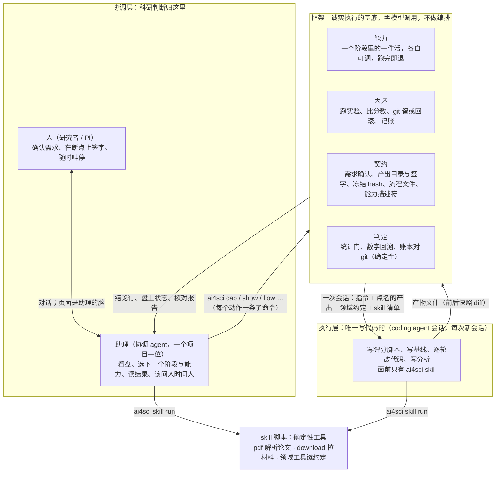
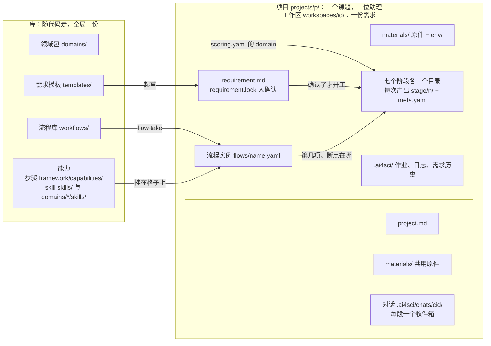
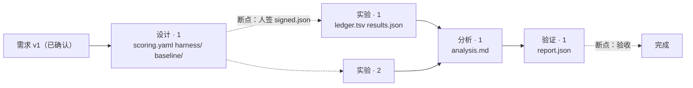

# 架构总纲领

不受任何具体任务约束的总纲领，**可以改**：改要双方认可，并在文末变更记录写清为什么。正文只写现状；历史在变更记录、外层 `CHANGELOG.md` 与 issue 里。版本相关的内容在 [`specs/`](../specs/)，流程与适配的细则在 [workflow.md](workflow.md)，还没定的在 [open-questions.md](open-questions.md)，依据在 [`research/`](../../research/)。代码层面的规矩（分层、技术栈、模式、测试）在内仓：`platform/CLAUDE.md` 是入口。

## 1. 一句话

科研链路分四层：**协调层（人 + 助理）做科研判断并拍板，框架是诚实执行的基底，执行层 coding agent 是唯一写代码的，skill 脚本是确定性工具。** 决策不在框架里；框架只做机械判定，并证明执行没有被改。

**产品是论文，不是内环**：一个研究问题进来，一篇每个数字都能被机器核对的论文出去。文献、假设、设计、实验、分析、写作、验证七个研究阶段都是这条链上的一环，实验内环只是其中唯一带循环的那一环。

## 2. 四层



分界两句话：

- **科研判断归协调层，机械判定归框架。** 下一步试什么、这条路要不要放弃、结果有没有意思、何时停、何时找人，是协调层的事；指标比大小、形状合不合约、hash 对不对、预算超没超，是框架的事。
- **产出文件的是执行，给执行层；改变流程走向的是决策，给协调层。** 框架两头都不是，它只保证执行诚实。

契约的填写权在协调层：需求（`requirement.md`）是助理和人对话攒出来、人确认的；评分契约（`scoring.yaml`：指标、方向、预算、统计门）由设计阶段的执行层照需求起草，人在断点上核对签字；框架只读，并证明它们在运行中没被改。

### 谁做什么

| | 协调层（人 + 助理） | 框架 | 执行层 | skill 脚本 |
|---|---|---|---|---|
| 定目标、写需求 | ✓ 助理问、人确认 | 开门（需求确认） | | |
| 找材料、拉代码与数据 | ✓ 助理 | | | pdf、download |
| 评分契约与评分脚本 | 人在断点核对 | 封 harness、跑基线、算预检 | ✓ 起草 | |
| 选下一个跑哪个能力、要不要回头、何时停 | ✓ | 只报状态 | | |
| 跑一个能力、跑内环、记账、棘轮 | 发起 | ✓ | 产出文件 | harness 算分 |
| accept / reject、数字核对 | 读判决 | ✓ 确定性判 | | |
| 解读结果、决定是否找人 | ✓ | | | |
| 写代码、写分析 | | | ✓ | |

协调层读判定的结果，但不当自己派出去那份活的评审：P-2 对协调层同样生效。

### 项目与工作区：一位助理的地盘、一份需求的家

端到端的起点是一个研究问题，不是一次实验。**一个项目一位助理**（一个课题、一篇论文），**一个工作区一份需求**：真实的一个课题要几个工作区支撑（复现某个模块一个、写综述一个、跑实验一个、最后合成论文一个），工作区是助理的工位不是它的边界。

```
 项目 projects/<p>/          一位助理的地盘：一个课题、一篇论文
 ├── project.md              目标一段；一级标题是项目名
 ├── materials/              几个工作区共用的原件
 ├── workspaces/<id>/        一份需求的家
 │   ├── requirement.md      需求：助理和人对话攒出来的；requirement.lock 是人的确认
 │   ├── materials/          这份需求自己的原件，只增不改
 │   ├── flows/<name>.yaml   流程实例：从库里取来、按这份需求改过参数，几条都行
 │   ├── literature/ hypothesis/ design/ experiment/ analysis/ writing/ verification/
 │   │                       七个阶段各一个目录，每次产出一个子目录 <stage>/<n>/，meta.yaml 记读了谁
 │   └── .ai4sci/            平台记录：作业、日志、需求的历史版本
 └── .ai4sci/chats/<cid>/    助理的对话归项目；每段对话一个收件箱，作业跑完排队等它
```

层级与包含关系（库是全局的，实例是项目的）：



产出之间靠 `from` 引用，扫全部 `meta.yaml` 就是一张有向无环图；一条流程是图里的一条路径（下面是 `research` 流程跑两次实验的样子）：



库是全局的，实例是项目的：能力代码、流程库（`workflows/`）、需求模板（`templates/`）、领域包、skill 库在库里；需求、流程实例、产出、作业在工作区里，对话与共用原件在项目里。每个工作区都在某个项目里，单课题就是只有一个工作区的项目。一个项目一个文件夹，整个打包能交给同事。合成论文不是项目自己干的：项目里再开一个走写作流的工作区，`--from` 兄弟工作区的产出；聚合的角色就是这位助理，不发明第二种 agent。

### 可替换性

协调层与执行层都是集成进来的 coding agent CLI，都不手搓，各自可换，两层各选一家、可以不同（P-25）：换一家就是加一个适配器文件，框架一行不改。指南只给协调层，领域 skill 只进执行层，通用 skill 两层都有（P-11、P-22）。

界面也是适配器：页面是 `ai4sci serve` 端点的客户端，换一种界面后端不改（workflow §5）。编辑台的画布编辑的是流程文件；照流程走的仍是项目里的研究助理，没有第二种运行器。

## 3. 五层与四层的对应

调研定下的五层（[行业调研 §2](../../research/landscape/2026-0908-auto-research-agents/README.md#2-五层架构总览)）落到四层里。协调层不在五层里：五层都是它驱动的对象。

| 层 | 在哪一层 | 状态 | 定了什么 | 未决 |
|---|---|---|---|---|
| 1 底座 coding agent | 执行层与协调层 | 已定 | 不手搓，集成现成 CLI；`Runner` / `Chat` 两个端口，每家一个适配器；两层各选一家（P-25） | — |
| 2 流水线 | 框架 · 能力 + 内环 | 已定 | 七个阶段、能力两个 tag、流程 = 阶段 + 断点，形状见 [workflow.md](workflow.md) | — |
| 3 学科适配（skill + 领域包） | skill 脚本 + 领域包 | 已定 | skill 按 agentskills.io 规范、框架自己注入（P-22）；领域包 = profile + 领域约定 + 领域 skill（`platform/docs/add-a-domain.md`） | — |
| 4 验证 | 框架 · 契约 + 判定 | 部分 | 零模型判定优先、fail-closed；数字回溯与账本对账已落地；模型评审未实现（P-2） | 验收怎么定义，见 Q-3 |
| 5 评测 | 框架 + 需求里的评价标准 | 未定 | 对框架做 ablation，不是对单篇打分 | 评测怎么做，见 Q-4 |

## 4. 原则

编号 P-n。每条先写规则，括号里是怎么用一条命令查（查不了的先当约定，代码落地时补成门禁），最后一句是何时定的、锚在哪条 issue。

- **P-1 执行层是唯一写代码的。** 代码、评分脚本、基线、分析稿、论文正文只由执行层产出；框架不调模型写文本。助理不写代码，但可以不经能力开一次产出手写材料清单这类东西（`ai4sci output new`，文献格的 `sources.md`）。（`framework/` 下 grep 不到任何模型 API 名。2026-09-10 定，[#18](https://github.com/zephyr4123/TJU-AI4Science/issues/18)；2026-09-23 收窄）
- **P-2 评审上下文隔离。** accept / reject、数字核对绝不由干活的那个会话做：确定性能判的用零模型代码（统计门、`verify` 的四项检查）；需要模型判断的（假设质量、写作质量）由框架派一个隔离的新会话、只给产物不给轨迹——**这一段尚未实现**，第一次真需要模型评审时再建。协调层也不裁自己派出去的活。（判定代码在 `framework/` 里，零模型。2026-09-10 定）
- **P-3 状态在磁盘不在会话。** 每次实验的 git 分支 tip 是当前最好，账本记全部尝试，能力产物落文件，助理的决定落对话与本子；任何会话被杀，重启后从磁盘续。（被杀中途重启的续跑测试）
- **P-4 契约机器可校验。** 框架层只认 `meta.yaml`、`signed.json`、`requirement.lock`、流程文件、能力描述符的形状；族内产物（实验族的 `scoring.yaml`、`results.json`、`report.json`）在族包里有 schema，对不上就失败，不降级成模板。（契约测试；`platform/framework/experiment/schemas/`）
- **P-5 框架不随课题改。** 领域包与 skill 按目录发现，没有注册表；测试夹具全在 tmp_path，不依赖仓里的样例项目。（`tests/fixtures/`；样例只在「在就校验」的用例里用）
- **P-6 评测由框架注入，模型改不了。** harness 只读、校验 hash、跑独立进程、只吃产物文件。（`harness/SHA256SUMS` 门禁）
- **P-7 fail-closed。** 验证不过就停，不涂黑、不模板兜底、不静默降级；要的机器不可用就报错，绝不退回本机；未知的值写 NaN 不写 0。（ruff 的 BLE 规则：不许裸 `except`）
- **P-8 四条工程规矩。** 每个抽象合入必须带真实调用点；每个配置项必须有读取点与断言；集成点必须有测试；不许吞异常。（review checklist；BLE 进 lint；细则在 `platform/CLAUDE.md` 与 `platform/framework/README.md`）
- **P-9 上下文卫生，但不失忆。** 进执行层会话的是账本与实验笔记（有界），不是 stdout 与整段日志；每轮新会话是为了上下文不膨胀，记忆放磁盘每轮读回来。（[#28](https://github.com/zephyr4123/TJU-AI4Science/issues/28)）
- **P-10 决策不在框架里。** 框架没有「下一步」：每条 `ai4sci` 子命令只跑一个能力，跑完写状态退出，不连跑、不回退、不等人；串起来的是协调层。（CLI 里没有一条命令会连续起两个能力；`framework/` 里没有能力顺序表）
- **P-11 两层 agent 都是集成的、各自可换；指南与领域 skill 隔离。** 两层都不手搓；两位助理的指南只进协调层，领域 skill 只进执行层的清单，通用 skill 两层共用。（`test_chat_guide`、`test_skills`）
- **P-12 能力可自由装配。** 模块的粒度是能力，不是函数；每个能力有机器可读的描述符（阶段、人话标题、五栏、参数、要不要执行层），对外是一个 Python 函数加磁盘产物，CLI 只是薄壳，助理、页面后端、测试调同一个函数。「自由」来自阶段任意组合与能力清单的丰富度，不来自检查器：不做按路径对表的拼流程校验。（`capabilities.discover()` 断言描述符与入口一致。[#33](https://github.com/zephyr4123/TJU-AI4Science/issues/33) [#93](https://github.com/zephyr4123/TJU-AI4Science/issues/93)）
- **P-13 文档即接口。** 产物是文件，不是 schema：一个文件只有一个生产者，格式由生产者定，谁要用就报名字、不问格式；schema 只在产物要给机器读时才补。命名三规矩：生产者就是命名空间（`<stage>/<n>/`）；名字是角色名词、版本在文件里（`ledger.tsv`、`report.json`，不带模型名、日期、轮次）；消费者只报生产者原样声明过的名字。它管产物怎么命名、谁能写，不管流程能不能拼。（[#54](https://github.com/zephyr4123/TJU-AI4Science/issues/54) [#93](https://github.com/zephyr4123/TJU-AI4Science/issues/93)）
- **P-14 CLI 主导封装。** 助理面前只有 `ai4sci` 一个入口：每个动作是一条子命令，参数走 flag——不写路径、不在命令前挂环境变量、不接管道、不裸跑 python、不手搬文件。配置（模型、预算、超时、目录）归按人的设置与起服务的人的环境变量，不归命令。助理需要做、却没有对应命令的动作是平台的缺口：立 issue 加能力，不放行裸命令、不开逃生口。联网只用 CLI 自带的搜索与网页读取工具，两层适配器必须放行，查到的带来源。前期别设坎：带 `.venv/bin/` 的老写法也放行。给研究者看的话不用平台内部的词。（服务的命令前缀按域给：研究助理 `ai4sci`，流程助理只有 `ai4sci show` / `ai4sci workflow`，执行层只有 `ai4sci skill`；指南代码块里每条命令以 `ai4sci ` 开头、不含 `|` `;` `&`、不挂前缀，`test_chat_guide` 守着。[#60](https://github.com/zephyr4123/TJU-AI4Science/issues/60) [#69](https://github.com/zephyr4123/TJU-AI4Science/issues/69) [#114](https://github.com/zephyr4123/TJU-AI4Science/issues/114)）
- **P-15 项目即助理的边界，工作区即需求的边界。** 一个项目 = 一位助理 = 一个课题；一个工作区 = 一份需求，每个工作区都在某个项目里。库是全局的，实例是项目的。流程分两层：库 → 工作区里的实例（`ai4sci flow take` 取来、改参数、增删步骤）；能力只在实例下跑。助理站在项目里（工作目录 = 项目），能写整个项目、读库；它的全局视角来自盘上的状态与 `ai4sci show project`，不来自对话记忆。命令不带路径，工作区级的命令带 `--ws <id>`；人在终端、执行层在产出目录里从 cwd 往上找。跨工作区读产出只限同一项目（`--from <ws>:<stage>/<n>`），冻结照旧按 hash。作业跑完进那段对话的收件箱，一条不丢。（`projects/<p>/workspaces/<id>/` 之外没有需求与产出；`framework/` 里读数据根的只有 `paths.py`；研究助理的指南里没有工作区路径。[#70](https://github.com/zephyr4123/TJU-AI4Science/issues/70) [#136](https://github.com/zephyr4123/TJU-AI4Science/issues/136)）
- **P-16 造流程与用流程分权。** 项目里的研究助理只能用流程：取一条、按需求改参数、照着跑、跑偏了修；不造新流程、不造能力。编辑台另有一位流程助理，只管把能力拼成流程存进库，不跑实验、不动任何工作区。两位助理两份指南、两组可写目录、两组命令前缀、两个端点前缀，项目里的对话物理上到不了库。（两组可写目录不相交；流程助理连 `ai4sci cap` 的前缀都不放行；研究助理的指南里没有 `workflows/` 的写法；`test_chat_guide` 守着。[#70](https://github.com/zephyr4123/TJU-AI4Science/issues/70) [#73](https://github.com/zephyr4123/TJU-AI4Science/issues/73)）
- **P-17 素材上 CDN，图标内联。** 页面里的图片与视频只写自己 CDN 的 URL，仓库里不放二进制素材；图标全站一套（Phosphor）内联 SVG，品牌标是唯一自绘的。素材从来源站下到本机、处理好再推自己的桶，来源与许可记进内仓 `docs/DESIGN.md`。（`git ls-files ui/` 里没有二进制，`make ui-check` 守着；URL 只在 `assets.ts` 一处。[#75](https://github.com/zephyr4123/TJU-AI4Science/issues/75)）
- **P-18 三层：研究阶段、能力、实现；流程是按顺序经过几个阶段，断点是停下来等人确认。** 七个阶段（文献、假设、设计、实验、分析、写作、验证）不定先后，任意组合都成立；每个阶段里几个能力（细颗粒度，描述符五栏必填：职责、边界、输入、产出、终止条件，讲机制、带专业术语）；能力下面是实现（一段代码、一个 skill、领域包里的东西）。一条流程 = 经过几个阶段、按什么顺序、每个阶段挂哪些能力（可以不挂）、阶段之间哪儿插断点。阶段之间没有显式的输入输出接口、不做数据流校验：进入下一个阶段时助理自己看盘上有什么，缺了当场说；检查只查阶段名、能力归属、参数、断点位置。编排工作台的意义是立规矩，不是校验数据流。文档、指南、文案用直白的工程语言，不写「按钮」「键」「房间」这类比喻。（`workflows.workflow_problems` 只查形状；`Capability` 五栏空着断言炸。[#93](https://github.com/zephyr4123/TJU-AI4Science/issues/93)–[#99](https://github.com/zephyr4123/TJU-AI4Science/issues/99)）
- **P-19 工作区按阶段分目录，需求是根，产出多对多。** `requirement.md` 是助理和人对话攒出来的（形式开放，按学科放模板，不定死大纲），`requirement.lock` 是人的确认——**唯一内置的门**，没确认任何阶段不开工；确认之后再改，页面显示 diff、人再确认成下一版。七个阶段各一个目录，每次产出一个子目录 `<stage>/<n>/`，id 就是路径；`meta.yaml` 记读了谁（`from`，带 hash）、谁产的、在哪条流程第几项下、按哪版需求、在哪台机器上跑、执行层用的哪家——多对多靠 `from`，进度沿 `from` 链现算。产出没被引用、没被签之前随便改，一旦被引用或被签就冻住。断点开放：几个、放哪由流程定，含义只有「这次产出要人签了下游才能读」，签字是产出目录里的 `signed.json`；出厂两条流程各放两个（评分指标核对 / 验收，复现结果核对 / 验收）。能力是纯函数：`--from` 点名输入，产出自己阶段下的一个新目录，不默认读「最新」。**只有人能确认**：确认需求与签字在助理的会话里调用一律被拒。平台自己的记录（对话、作业、日志、助理的本子）在 `.ai4sci/`，不算进产出的 hash。（读产出内部文件名的代码只在 `capabilities/` 与族包 `experiment/` 下；`contracts/` 里没有实验族字段；`refuse_if_assistant` 与 `HASH_IGNORED` 有测试。[#104](https://github.com/zephyr4123/TJU-AI4Science/issues/104)）
- **P-20 能力的接法：形状归框架、主文件归阶段、来源归 meta。** 框架层对所有能力一样：读的只有需求（须已确认）、原件、`--from` 点名的产出；写的只有自己的 `<stage>/<n>/`；留一句结论（`meta.yaml` 的 `result`）；要的文件不在就开工报错。能力层各说各的：要上游哪几个文件、留哪几个文件写在描述符「输入 / 产出」两栏。文件名按阶段定、不按能力定：每个阶段钉一个主文件（文献 `sources.md`、设计 `scoring.yaml`、实验 `ledger.tsv` + `results.json`、分析 `analysis.md`、验证 `report.json`；假设、写作待第一个能力定名），进这个阶段的任何能力都必须留下它，下游只认阶段主文件；族文件只在族包里定，能力另留的文件是私有的。谁产的记在 meta 不记在文件名。skill 不开产出目录，写哪里由调用者定。（`capabilities.MAIN_FILES` 一个阶段一行，`discover()` 断言「产出」栏写到了主文件。[#110](https://github.com/zephyr4123/TJU-AI4Science/issues/110)）
- **P-21 页面词表：一个概念一个词，名词做标签，内部名不上屏，能力文案三层。** 页面、文档、指南共用一张词表（workflow §5）；标签两到四字名词，动词只在按钮上，句子只进解释层。机器的名字（流程文件名、能力名、产出 id、参数名、CLI 参数）不上屏，翻译在源头：描述符给 `title` `brief`、参数给 `label`，前端不拼不猜；唯一例外是内容本身是命令或路径的地方（文件镜头、工具行、diff、文件清单）。能力文案三层对三种动作：名直接显示、一行 hover、详情点击跳转；执行者种类不上屏。（描述符字数与禁用词由 `discover()` 断言；页面 `copy.test.ts` 扫源码，与后端 `BANNED_WORDS` 同一张表并对账；给页面的 JSON 里凡 id / name / slug 必带中文字段。[#112](https://github.com/zephyr4123/TJU-AI4Science/issues/112)）
- **P-22 skill 是能力的一种：按开放规范写，框架自己注入，脚本自带依赖。** 能力一个词、两个 tag：**步骤**（描述符，走到那一格框架起执行层、开产出、能签，`ai4sci cap`）与 **skill**（`ai4sci skill run`，随手用、不开产出）；两种都进能力库、都能挂到流程的格子上（skill 哪个阶段都能挂、不带参数、不是门），两种不许重名。格式照 agentskills.io（`SKILL.md` + `scripts/` + `references/`，frontmatter 只用规范字段）；两处库（`skills/`、`domains/<包>/skills/`）名字全局唯一。加载不靠任何 agent 的原生机制：框架起会话时把清单拼进 prompt，agent 用 `ai4sci skill list / show / run`。脚本 PEP 723 自带依赖并锁进仓，`uv run --locked --offline` 起，不建工作区级 venv；`make skills` 预热是唯一联网的一步。（`test_skills`、`make skills`。[#113](https://github.com/zephyr4123/TJU-AI4Science/issues/113) [#134](https://github.com/zephyr4123/TJU-AI4Science/issues/134)）
- **P-23 算力归人：按人的一份文件、只有 SSH 只认密钥、agent 按名字选、对话里接机器。** 算力由使用者自己配：`~/.config/ai4sci/computes.yaml`（读写点只在 `framework/computes.py`），不进 git、不进工作区、不进数据根；一条记录只有主机 / 端口 / 用户 / 密钥路径 / 远端根，没有密码字段；Slurm 有第二个用例再写。助理看名字与状态选（`--compute <名字>` 记进 meta 当出处），缺省在文件里；需求只写要求不写机器名；要的机器不可用就报错。接机器是对话里的事：助理跑 `ai4sci compute add`，人只给 ssh 那一行与密钥路径，就地探测只报告不拒绝，不设坎。接上先盘点、再问两问（隔离新建还是用现成的、用哪个），不替人定；租来的第三方平台一律用镜像自带的现成环境（`env use`），缺包就补（`env add`），隔离新建（`env resolve`）只在实验室自己的机器上谈。远端只跑 harness，执行层 agent 在本机。（清单 schema 没有 password 字段；`Compute` 适配器只有 local 与 ssh，名字对不上退 2；meta 有 `compute`；真机器测试 `AI4SCI_LIVE_SSH` 门控。[#119](https://github.com/zephyr4123/TJU-AI4Science/issues/119) [#118](https://github.com/zephyr4123/TJU-AI4Science/issues/118)）
- **P-24 论文复现是另一条流程：找齐材料、原样跑一遍、差距才归因；机器只卡三条。** 复现的价值是校准与学习，不是研究，不走 `research`。三级由研究者在需求里选（官方代码原样重跑 / 换实现或机器或种子 / 只照论文重写）。流程 `reproduce`：文献——助理用自带的搜索与读网页找齐材料、手写 `sources.md`；设计——`reproduction` 原码复现基线：别人的代码进 `code/`，执行层只写 launcher、把它的输出算成论文那几个数的 evaluate、目标 = 论文值的 scoring，允许改别人的代码但 diff 留档，种子照论文；人签；分析——`reproducibility` 复现性分析；验证——`verify`。没对上再进实验做差距归因。两个能力与 `design` / `analysis` 同阶段并列、可替换。拉材料用 `download` skill。机器只卡三条：产物在约定位置、数由框架跑不由 agent 自报、改了别人的代码留痕；对没对上由研究者按需求里的标准判。（`MAIN_FILES` 文献行是 `sources.md`；`workflows/reproduce.yaml`；两个能力互不 import。[#120](https://github.com/zephyr4123/TJU-AI4Science/issues/120)）
- **P-25 底座归人：按人的一份文件、两层各选一家、四句话自检、旋钮上只有具体值。** `~/.config/ai4sci/agents.yaml`（读取点只在 `framework/agents.py`）与 `computes.yaml` 并列：助理用哪家、执行层用哪家（可以不同）、每家新对话用的模型与思考深度（一律具体值）、上次自检。有哪几家由适配器表定，没有 `agent add`。自检四句人话：装了没、版本够不够、登录了没、能不能说话；`ai4sci check` 全盘（底座、算力、存放），一项不过退出码非零；页面上地方栏「设置」旁一个点，有一项没过才亮，不弹窗不拦人。旋钮上没有「默认」：开新对话把设置抄进对话 meta，改设置只影响之后开的对话；「哪家」只在开新对话时选。执行层用哪家、什么模型由设置定，`--backend` 可覆盖，用了谁记进产出 meta 的 `agent`。接一家新 CLI 只信官方文档，先 spike 六件事（隔离位、权限与可写目录、命令放行、联网工具放行、事件流逐字、续接与成本上报），实测记进适配器文件头；订阅账号报不出美元的成本填 NaN。（`Knobs` 与对话 meta 的 model / effort 非空；`ai4sci check` 退出码；每家适配器有 `probe()` 与 `AI4SCI_LIVE=1` 冒烟；页面扫不到「默认（」。[#130](https://github.com/zephyr4123/TJU-AI4Science/issues/130)–[#135](https://github.com/zephyr4123/TJU-AI4Science/issues/135)）

## 5. 内仓的目录与代码规矩

内仓的目录、分层与依赖方向、技术栈、在用的模式、测试怎么写，以代码为准，写在内仓：`platform/README.md`（目录与怎么跑）、`platform/CLAUDE.md`（规矩与「改哪层先读哪份」）、`platform/framework/README.md`（后端）、`platform/ui/README.md`（前端）、`platform/tests/README.md`（测试）。这里不抄。

## 6. 文档关系

```
外层
  CLAUDE.md            红线与协作方式（给人也给 agent）
  research/            依据（调研得出什么）             ──▶ 纲领引用它
  docs/architecture/   纲领 + 细则 + 未决（系统长什么样）──▶ spec 与内仓文档引用它
  docs/specs/          版本 PRD（这版做到哪一步）
  docs/adr/            仓库基础设施的决定，只追加
  docs/cases/          案例卡与演练记录（按日期封存）
  issue                过程（在做哪一件、做到哪）        ──▶ commit 引用 issue
内仓
  CLAUDE.md            规矩与路由；framework/ tests/ ui/ 各一份 README 是那一层的细则
  docs/                手册：接课题、加能力 / skill / 领域包；PRODUCT 与 DESIGN
  coordinator/         两位助理的指南：线上 prompt
```

任何一层不复制上一层的内容，只链接；一个事实只有一个家，其余地方一句话加链接。issue 里发现纲领有冲突，回来改纲领。纲领改得慢，spec 改得快：spec 是滚动的，第 n 步的 spec 只驱动第 n+1 步的执行，做完一步回来改。

协调层的上下文来源就是这几样：issue、纲领、spec、盘上的状态（`ai4sci show project`）；聊天记录不算。这既是我们做这个项目的方式，也是平台跑起来后助理的方式。

spec 与 milestone 用产品版本命名且带 `platform` 前缀；外仓自己的版本线不进这两个名字。

## 变更记录

| 日期 | 改了什么 | 为什么 | 认可 |
|---|---|---|---|
| 2026-09-10 | 建档：三箱改四层、九条原则、五层状态表；P-9 P-10 P-11（[#18](https://github.com/zephyr4123/TJU-AI4Science/issues/18) [#28](https://github.com/zephyr4123/TJU-AI4Science/issues/28) [#29](https://github.com/zephyr4123/TJU-AI4Science/issues/29)） | 三个开源仓深读后的结论；科研判断归协调层 | 主人 + Claude |
| 2026-09-15 | P-12 能力可自由装配，低代码图是第二种协调层（[#33](https://github.com/zephyr4123/TJU-AI4Science/issues/33)） | 高度模块化 | 主人 + Claude |
| 2026-09-17 | P-13 文档即接口、P-14 CLI 主导封装；描述符加阶段与人话字段（[#53](https://github.com/zephyr4123/TJU-AI4Science/issues/53) [#54](https://github.com/zephyr4123/TJU-AI4Science/issues/54) [#60](https://github.com/zephyr4123/TJU-AI4Science/issues/60) [#69](https://github.com/zephyr4123/TJU-AI4Science/issues/69)） | 接任务实验里 agent 被白名单拒；接口靠名字不靠 schema | 主人 + Claude |
| 2026-09-18 | P-15 工作区即边界、P-16 分权、P-17 素材、P-18 三层；P-12 P-13 收窄（[#70](https://github.com/zephyr4123/TJU-AI4Science/issues/70) [#75](https://github.com/zephyr4123/TJU-AI4Science/issues/75) [#93](https://github.com/zephyr4123/TJU-AI4Science/issues/93)） | 边界、分权、素材、编排工作台是立规矩不是接管子 | 主人 + Claude |
| 2026-09-19 | P-19 需求是根、P-20 接法、P-21 词表（[#104](https://github.com/zephyr4123/TJU-AI4Science/issues/104) [#110](https://github.com/zephyr4123/TJU-AI4Science/issues/110) [#112](https://github.com/zephyr4123/TJU-AI4Science/issues/112)） | 目录按阶段、文件名封顶在阶段、内部名不上屏 | 主人 + Claude |
| 2026-09-20 | P-22 skill 系统、P-23 算力归人；P-14 补联网（[#113](https://github.com/zephyr4123/TJU-AI4Science/issues/113) [#114](https://github.com/zephyr4123/TJU-AI4Science/issues/114) [#118](https://github.com/zephyr4123/TJU-AI4Science/issues/118) [#119](https://github.com/zephyr4123/TJU-AI4Science/issues/119)） | 第一轮真任务演练 | 主人 + Claude |
| 2026-09-21 | P-24 论文复现另一条流程（[#120](https://github.com/zephyr4123/TJU-AI4Science/issues/120)） | 复现不是改进 | 主人 + Claude |
| 2026-09-22 | P-25 底座归人；P-15 改项目层；P-22 改「skill 是能力的一种」（[#130](https://github.com/zephyr4123/TJU-AI4Science/issues/130) [#134](https://github.com/zephyr4123/TJU-AI4Science/issues/134) [#136](https://github.com/zephyr4123/TJU-AI4Science/issues/136)） | 全面适配 Codex；一个项目一位助理 | 主人 + Claude |
| 2026-09-23 | 全文按代码回写：正文只留现状，每条 P-n 收成规则 + 判据 + 锚；四层图的「工具」改「skill 脚本」、「裁判」改「确定性判定」；P-1 收窄（助理可手写材料清单）、P-2 标明模型评审未实现、P-11 改「指南与领域 skill 隔离」、P-18 去掉「发布 / 验收是特例」、P-19 加「只有人能确认」的机器判据与 `agent` 字段、P-20 文献主文件已定；§5 改成链接内仓文档；§6 加内仓一侧（[#140](https://github.com/zephyr4123/TJU-AI4Science/issues/140)） | 文档盘点：纲领与代码约 120 处对不上，历史夹在正文里 | 主人 + Claude |
