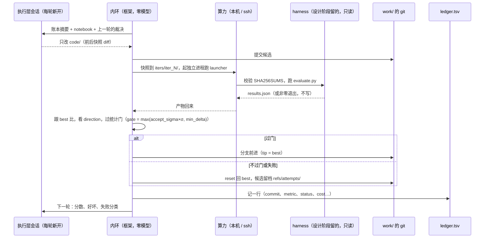

# 流水线：能力、流程、实验内环与适配

- 状态：已定（形状）；正文只写现状，历史在文末变更记录与 issue
- 依据：[InternAgent 深读](../../research/selection/2026-0909-pipeline-frameworks/internagent.md)、[autoresearch 深读](../../research/selection/2026-0909-pipeline-frameworks/autoresearch.md)、[AutoResearchClaw 深读](../../research/selection/2026-0909-pipeline-frameworks/autoresearchclaw.md)

三个仓的编排形态都是「外层 for + 硬编码状态判断」，差别全在循环之外：用什么承载状态、用什么规则收敛、用什么机器判据卡住造假。我们不写那个 for：**串联能力的是协调层（人 + 助理），框架只提供能力**。流水线层因此只有两样东西：各自可调的**能力**和住在其中一个能力里的**实验内环**。清单类的内容（有哪些能力、命令、端点）以代码或命令输出为准，这里不手抄。

## 1. 三层：研究阶段、能力、实现

科研分七个阶段：文献、假设、设计、实验、分析、写作、验证。阶段不定先后，经过哪几个阶段、按什么顺序是**流程**说了算，流程是人定的：假设完直接写作是开题报告，实验完回设计是改评分脚本，任何组合都成立（P-18）。

```
 阶段            七个固定：文献 假设 设计 实验 分析 写作 验证         不定先后，任意组合
   └ 能力        一个阶段里的一件活；两个 tag：步骤（ai4sci cap）、skill（ai4sci skill run）
       └ 实现    这件活怎么干：一段代码、一个 skill、领域包里的东西     一个能力可以有几种实现，也可以暂时零实现

 一条流程 = 经过几个阶段、按什么顺序、每个阶段挂哪些能力（可以不挂：助理看着办）、哪几个阶段完了要人签
 断点   = 这个阶段的产出要人签了下游才能读。几个、放哪由流程定；签字落在产出目录里（signed.json）
```

- **能力是细颗粒度的。** 一个只干一件说得清的活：分析阶段里的「分析初稿」只读实验留下的东西写三节初稿，不是「分析」的全部；对比、作图、复盘是这个阶段里另外的能力。
- **描述符五栏必填**（`framework/contracts/capability.py`）：职责、边界、输入、产出、终止条件。讲机制、带通用的专业术语，不是路径表。研究者、助理、工程师读同一份；`ai4sci show caps` 与 `GET /cap` 就是它。
- **能力是纯函数：显式输入 → 一个产出目录。** 输入用 `--from <stage>/<n>` 点名，产出是它所属阶段下的一个新目录。能力自己没有「最新」这种状态：选输入是协调层的事——助理看盘决定，或人指定。
- **实现是能力下面的一层。** 领域包不是一层，只是打包单位：拆开各归各的能力。代码里只在出现第二种实现时才建模。
- **阶段之间没有显式的输入输出接口，机器不做数据流校验。** 能力开工时 `from` 里没有它要的文件就报错说清缺哪个阶段的哪个文件（P-7）；流程的检查只查形状：阶段名、点名的能力在不在那个阶段、参数名与类型、断点位置。文件仍是产物的载体（P-13），但不是拼流程的接口。
- **每个能力一次执行层调用，新会话。** 上下文从磁盘来，不靠上一个能力的会话（P-1、P-3）。失败就停，不模板兜底（P-7）。回退是协调层的决定：重做一个阶段就是这个阶段下多一个产出目录，旧的原样留着。并行 0.x 不做。

现在有的步骤（清单以 `ai4sci show caps` 为准，这里只作示意）：设计阶段 `design`（评分脚本与基线）与 `reproduction`（原码复现基线，P-24）；实验阶段 `auto-research`（AutoResearch）；分析阶段 `analysis`（分析初稿）与 `reproducibility`（复现性分析）；验证阶段 `verify`（数字核对，零模型）。文献、假设、写作三个阶段还没有步骤：流程里排了这些阶段，助理自己开产出目录写（`ai4sci output new`）。skill 有 `pdf`（解析论文）、`download`（拉材料）、领域包里的 `petab`。

### 流程：经过几个阶段

一条流程一个 YAML（`workflows/*.yaml`，形状与检查在 `framework/contracts/workflows.py` 文件头）。出厂两条，原文以库里的文件为准：

```yaml
name: research                # 等于文件名
title: 从设计到验证
summary: 评分脚本与基线，人核对；AutoResearch、分析初稿、数字核对，人验收。
stages:
  - 设计                                     # 一个阶段：用什么能力由助理看着办
  - 断点: 评分指标核对                       # 设计的产出要人签
  - 实验: {auto-research: {max_iters: 3}}   # 点名步骤、带参数（参数名是描述符里的 Param）
  - 分析
  - 验证
  - 断点: 验收
```

`reproduce`（论文复现）：文献（挂 skill `pdf`、`download`）→ 设计 `reproduction` → 断点「复现结果核对」→ 分析 `reproducibility` → 验证 → 断点「验收」。skill 挂在格子上的写法是 `- 文献: [pdf, download]`：这一步推荐用的工具，哪个阶段都能挂、不带参数、不是门。

- **子集也是流程、任何顺序都是流程。** 只想根据实验结果写综述就是两行——等写作阶段有了那个能力就能挂。
- **流程分两层：库、实例**（P-15）。库在 `workflows/`，通用、不依附课题，编辑台的流程助理改它；实例在工作区 `flows/`，几条都行，研究助理 `ai4sci flow take <name>` 从库里取来，按这份需求改阶段、能力参数、断点。选流程在需求确认之后、与需求独立：一份需求会走多条流程。
- **进度不另存**：每个产出的 `meta.yaml` 记它是在哪条流程的第几项下产的，「这条流程走到哪」沿 `from` 链算出来；「在等谁」也现算：作业在跑 → 等作业；这一项的产出还没签而流程说要签 → 等人；下一项是阶段 → 轮到助理；走完 → 完成。
- **编排工作台的意义是立规矩，不是做数据流校验。** 研究者要的是三样：看得见接下来会发生什么、在关键处能拦一手、下次能照做。

### 磁盘布局

出厂件随代码走，数据随使用长；两者分开（源码模式出厂件在仓根、数据根缺省仓根；装的包里出厂件在 `framework/shipped/`、数据根 `~/ai4sci`，`AI4SCI_HOME` 可指）：

```
<出厂件>                      <数据根>
├── workflows/  流程库          ├── studio/chats/            编辑台的对话
├── templates/  需求模板        └── projects/<p>/            一个项目一位助理（P-15）
├── domains/    领域包              ├── project.md           目标一段；一级标题是项目名
├── skills/     skill 库            ├── materials/           几个工作区共用的原件
├── coordinator/ 两份指南           ├── .ai4sci/chats/<cid>/ 助理的对话；每段一个收件箱 inbox/
└── ui/         页面构建            └── workspaces/<id>/
                                        ├── requirement.md       需求：形式开放，按模板起草
                                        ├── requirement.lock     需求确认：谁、何时、hash、版本。唯一内置的门
                                        ├── materials/           原件，只增不改；env/ 是环境清单
                                        ├── flows/               取来的流程实例，几条都行
                                        ├── literature/ hypothesis/ design/ experiment/ analysis/ writing/ verification/
                                        │                        七个阶段各一个目录，每次产出一个子目录 <stage>/<n>/
                                        └── .ai4sci/             平台记录：jobs/ logs/ requirement/v1.md …

experiment/2/                  一个产出目录
├── meta.yaml                  框架只读这一份：id、stage、title、by（能力名 / assistant / human）、created_at、status、
│                              from（读了谁，每项带 sha256）、params、flow、step、requirement（哪版需求）、chat_id、
│                              finished_at、result（一句结论）、error、compute（在哪台机器上跑的）、agent（执行层哪家、模型、深度）
├── signed.json                流程里有断点才有：人签的——谁、何时、签的 hash、一句话
├── .ai4sci/                   平台记录（助理的本子 journal.md），不算进产出的 hash
└── …                          其余全是产它的那个能力自己的文件，框架不看、不定、不校验
```

- **产出的 id 就是路径**：`experiment/2`、`analysis/1`；`title` 是给人看的标签。
- **接口 = `from` + 文件名。** 不把上游整包抄进自己目录；执行层要的合成工作树在自己那次产出里（`experiment/<n>/work/`），是实现细节。
- **冻结**：产出和需求同一条规则——没被 `from` 引用、没被签之前随便改；一旦被引用或被签就冻住，改了框架按 hash 查得出并拒读。需求确认之后再改，页面显示 diff、人再确认成下一版，旧版存 `.ai4sci/requirement/`。
- **助理不经能力也能产出**：`ai4sci output new <stage> --title … --from …` 建目录写 meta，然后直接写文件。文献格的主文件 `sources.md`（材料来源）就是这么写的（P-24）。
- **跨工作区引用只限同一项目**：`--from <ws>:<stage>/<n>`，`meta.yaml` 原样记，冻结照旧按 hash。

### 契约

**框架只认 `meta.yaml`、`signed.json`、`requirement.lock`、流程文件、能力描述符这几样的形状。** 产出目录里其它一切归产它的那个能力：设计能力留 `scoring.yaml`、实验能力就去读它，两个能力私下约好的文件名写在各自描述符的「产出 / 输入」两栏里。换一个学科就是换一族能力：

```
实验族   design/1   scoring.yaml · harness/ · code/ · env/ · baseline/
综述族   design/1   search-plan.md · inclusion-criteria.md
仿真族   design/1   model.cfg · sweep.yaml
```

框架看它们都一样：`design/1/meta.yaml` 加一堆文件。实验族的 schema（scoring / results / report）与预检在族包 `framework/experiment/` 里，契约层不认识它们（P-4 的「契约机器可校验」在族里落）。

**产出目录里的文件分两层，能力不自创名字**（P-20）：**阶段主文件**按阶段定、不按能力定——进这个阶段的任何能力都必须留下它，下游只认它；**族文件**是同族能力私下的约定，只在族包 `framework/<族>/` 里定，开新族是一次决策；能力另外留的文件是**私有的**，谁都不许依赖。表在 `capabilities.MAIN_FILES`：文献 `sources.md`、设计 `scoring.yaml`、实验 `ledger.tsv` + `results.json`、分析 `analysis.md`、验证 `report.json`；假设、写作待第一个能力定名。设计那一行是实验族定的名；第二个族进设计阶段那天要么沿用、要么改成族无关的，那是一次决策。

**谁产的记在 meta，不记在文件名。** `writing/1/draft.md` 与 `writing/2/draft.md` 同名，`by`、`from`、`requirement`、`result` 不同；页面的「来源 / 输入」、`ai4sci show output`、冻结的 hash 核对都读它。扫全部 `meta.yaml` 就是一张有向无环图：节点是产出、边是 `from`、需求版本是根、签字是节点状态；一条流程是图里的一条路径。两个局限如实记：助理手写的产出 `from` 可能为空；原件 `materials/` 不是节点。

**能力描述符**（`framework/contracts/capability.py`）：每个步骤子包导出 `DESCRIPTOR`（name、stage、title、brief、五栏、params 带 label）与统一入口 `run(output_dir, inputs, ports, **params)`；`capabilities.discover()` 断言入口签名与描述符一致，子包名下划线对命令名连字符；`ai4sci cap` 的子命令从描述符生成。能力上**不写**「属于哪条流程」，`used_by` 是反查算出来的。文案三层（P-21）：`title` 是名（名词短语不超过八字，方法有公认名字的原样写）、`brief` 是一行（三十字内）、五栏是详情（工程语言陈述句，可写文件名，不写 CLI 参数、框架内部机制、口语）；参数的 `label` 是页面上的名字。接法的手册在内仓 `docs/add-a-capability.md`。

**接口是文件名，不是 schema**（P-13）：一个文件只有一个生产者，格式由生产者定；内容契约在描述符的「产出」栏里用工程语言说。

### skill

**skill 是能力的一种：tag 为 skill 的能力**（P-22）。步骤是流程里的一格、开产出目录、由框架驱动；skill 是 agent 在任何时候都能拿起来用的一套东西——一份说明、几个脚本、几份参考——研究助理（起草需求时读论文、复现时拉材料）与执行层（步骤的会话里解析文件）都能用，流程助理不跑东西不给清单。它不开 `<stage>/<n>/`，写哪里由调用它的人定：助理带 `--ws <名字>` 起，相对路径落在那个工作区（`materials/…`）；步骤写进自己的产出目录。三样东西的关系：

| | 是什么 | 谁调 | 写到哪 | 在哪儿定义 |
|---|---|---|---|---|
| 能力·步骤 | 流程里的一格，`ai4sci cap <name>` | 研究助理（照流程） | 自己的 `<stage>/<n>/` | `framework/capabilities/<name>/` |
| 能力·skill | agent 的工具包，`ai4sci skill run <name>`；也能挂在格子上当这一步推荐的工具 | 研究助理或执行层，随时 | 调用方给的 `--out` | `skills/<name>/` 或 `domains/<包>/skills/<name>/` |
| 领域包 | 打包单位：`profile.yaml` + 实验族的领域约定 + 领域 skill | `scoring.yaml` 的 `domain`（`cap design --domain`） | — | `domains/<包>/`（内仓 `docs/add-a-domain.md`） |

**格式照 agentskills.io 开放规范**，不自造：`skills/<name>/SKILL.md`（frontmatter 只用 `name` `description` `license` `compatibility` `metadata`，自定义键加 `ai4sci-` 前缀）+ `scripts/`（每个脚本 PEP 723 头 + `uv lock --script` 的锁文件进仓）+ `references/` + `assets/`；name 等于目录名，两处库合起来全局唯一；正文五百行以内，按 progressive disclosure 写。脚本：非交互、有 `--help`、结果 JSON 到 stdout、诊断到 stderr、幂等、退出码说成败、输出目录由调用方 `--out` 给；运行一律 `uv run --locked --offline`，环境在 uv 全机缓存，**不建工作区级 venv**；`make skills` 承接时预热一次（唯一联网的一步）并探测系统包。三套环境互不 import：平台 venv、课题 venv（`materials/env/` → 每次实验一份）、skill 环境；只用文件与 JSON 交接。

**加载：框架自己注入，不靠任何 agent 的原生机制。** 起会话时扫库拼 `<available_skills>`（名字 + 一句话）进 prompt——研究助理拼进 system prompt，执行层拼进能力组的 prompt 的通用段（领域约定 → 工具包 → 联网）；agent 匹配到就 `ai4sci skill show <name>` 读全文，`ai4sci skill run <name> …` 起脚本。领域 skill 不快照、不注入正文：执行层读的是库里的现版本，读了什么在那一轮的事件流里；领域包的 `prompts/experiment.md` 仍在开实验时快照、仍以「领域约定」注入。执行层会话的命令前缀只有 `ai4sci skill`。

**`pdf`**：一篇论文（本地或链接）→ `paper.md` + `images/` + `structured.json`；缺省后端 pymupdf4llm 版面模式，MinerU 实测不当缺省（内仓 `skills/pdf/references/backends.md`）。**`download`**：git 仓库（可指定 commit）/ 单个文件（可校验 sha256）/ Hugging Face 仓库 → `materials/<名字>/` 加一张收据。

## 2. 实验内环（`auto-research`）

唯一有循环的地方。这个循环是机械的，不做科研判断，所以可以留在框架里。核心是**四个角色分开**：



一次实验的目录 `experiment/<n>/`（`framework/experiment/layout.py` 是唯一出处）：`scoring.yaml` 与需求的快照、`work/`（设计那包的拷贝，自己的 git 仓）、`checkpoint.json`、`ledger.tsv`、`notebook.md`、`iters/iter_N/`（每轮的快照与 `results.json`）、`executor/iter-N/`（执行层日志）、`inflight.json`、`stop.json`、`.venv/`、`.ai4sci/journal.md`。

**规则**

- 执行层只改 `code/`，`harness` 与 `data/` 只读；框架事后 diff 与 hash 双重校验，变了判 `readonly_violated` 并回滚。
- 内环做判定：比较、留或回滚、记账、git 提交全由框架做，执行层不参与也没有 Bash 权限（P-2）。每次实验的 `work/` 是独立 git 仓：分支 tip = 当前 best，`refs/attempts/iter-N` 留档每一个被弃或失败的尝试。
- **统计门**：σ 来自设计阶段基线的 `sigma.json`（框架从 `baseline/repeats/` 算样本标准差）；gate = max(accept_sigma × σ, `budget.min_delta`)，差值不过门的判「持平」不留。σ = 0 且没给 min_delta 时 fail-closed。
- **固定预算**：墙钟预算写在 scoring.yaml，harness 到时自停；超时 1.5 倍必杀，记 timeout。
- **失败分类**：确定性规则，不调模型，按优先级：`readonly_violated` → `timeout` → `missing_dependency` → `crash` → `no_results`（results.json 缺失、不合 schema、或 status ≠ ok；假成功落在这里）→ `nan_metric`；执行层会话自己没走完判 `executor_failed`。非失败状态：`noop`、`interrupted`。同类失败连续 3 次判 `unrecoverable`，停。
- **停止条件**：`max_iterations`、连续 `patience` 轮不改进、`max_cost_usd` 用尽、`unrecoverable`；任一触发写 `stop.json` 并停。`--max-iters N` 只是本次调用的配额，用完返回 `batch_exhausted`，不算停止。
- **续跑与续命**都走 `ai4sci cap auto-research --continue experiment/<n>`：每轮开跑前写 `inflight.json`，结账后删；被杀在半路的，`--continue … --resume` 先做 checkpoint、账本、git 三方对账，对不上就 fail-closed，在飞的任务先收尾、候选 commit 进 `refs/attempts/` 再回到 best；已停的加预算（`--patience` / `--max-iterations` / `--max-cost-usd --reason`）清停止标记接着跑，助理的本子记一行。要不要续是协调层的决定（P-10）。
- **轮间记忆**：`notebook.md` 一个实验一本，框架每轮追加执行层的自述、`git diff --stat`、裁决；下一轮整本进 prompt。上下文卫生（P-9）：给执行层的是账本与笔记，不是 stdout。
- **revert-to-best**：下一轮的起点永远是分支 tip。

**账本 `ledger.tsv`**：每轮一行——iter、commit、parent、metric、direction、elapsed_s、seed、status、sigma、harness_sha、note、cost_usd、executor_s。基线不占行（活在 checkpoint 里）；每行的 `commit` 必须能在 git 里找到，`--resume` 与 `verify` 都跑这条对账；拿不到的值写 NaN 或 `-`，绝不写 0。

## 3. 判定与验证

- **确定性优先**：能用规则判的不用模型。实验能力的 accept / reject 完全确定性；验证能力是零模型的四项检查（`capabilities/verify/checks.py`）：分析存在；数据表每行（来源, 指标, 值）在那个来源的 `results.json` 里能找到（相对容差 1%）；正文里带小数点或指数的数与表里某个值在容差内相等；账本 × git 对账。引用真伪、图源两条判据**未实现**。
- **模型评审**：需要模型判断的（假设质量、写作质量），由框架派一个隔离的新会话、只给产物不给轨迹（P-2）——**尚未实现**，第一次真需要时再建。
- **协调层只读判决**：验证结论回到协调层，由它决定接受、重跑还是换方向；重跑就是新开一次产出 `<stage>/<n+1>/`，不覆盖。
- **分析的形状**（`experiment/analysis.py`）：`analysis/<n>/analysis.md` 固定三节 `## 结论` / `## 数据` / `## 证伪与未决`；`## 数据` 是表 `| 来源 | 指标 | 值 |`，值从 results.json 原样抄，是数字回溯的锚。已知边界：整数不查、百分比不查、行内代码不查。
- **报告**：`verification/<n>/report.json`（schema `framework/experiment/schemas/report.schema.json`）：`status` PASS / FAIL、每项 `passed` 与 `details`。PASS 与 FAIL 都写报告，FAIL 再退 1。
- **fail-closed**：门不过就停在门口（P-7）。

## 4. 人在环

人在协调层的对话里，不是框架的功能。

- 框架不等人：每条子命令跑完一个能力就退出并写状态，需要人判断的事由助理在对话里问。自主程度是助理的行为，不是框架的模式。
- **人只做两件事，都落成文件**：确认需求（`requirement.lock`，唯一内置的门）、在流程定的断点上签产出（`signed.json`）。两件事在页面上做，或人在终端 `ai4sci requirement confirm` / `ai4sci sign`；助理的会话里调这两条一律被拒（框架按 `AI4SCI_CHAT_ID` 判）。叫停作业与删东西也是人的动作。自动化程度是人定的：流程里放几个断点就确认几次，一个不放就是端到端。
- **长命令不占着对话等**：每个能力都有 `--detach`，框架把同一条命令起成独立进程当作业（`.ai4sci/jobs/<id>.json` + 日志），命令等作业过门、开了产出再返回，当场没开起来的直接退 1 把原因带回来；作业跑完进那段对话的**收件箱**（`chats/<cid>/inbox/`）：对话空闲就当场以「框架」的身份发一轮念完，忙就等这一轮结束接着念，一条不丢、先到先念。
- 还没有异步通知人的通道（人不在时页面刷新能看到，主动推送没有），归 Q-7。

## 5. 框架的驱动面与适配

### 协调层怎么驱动框架

框架是一个 Python 包加一条 `ai4sci` CLI，清单以 `ai4sci --help` 为准；原则只有几条：

- **每样东西要么是能力、要么是人的确认、要么是查询、要么是入口。** `cap <name>` 能力（`--from` 点名读谁、`--flow` 挂到哪条流程、`--continue` 接着干、`--compute` `--backend` 按需、`--detach` 起作业）；`requirement confirm` / `sign` 人的确认；`show …` 查询（只读，与 serve 的 GET 同一批函数）；`flow take` 取流程、`output new` 建产出、`job stop` 停作业；`env resolve / use / add` 环境清单；`compute …` 接机器；`agent …` 与 `check` 底座与自检；`skill list / show / run` 工具包；`project` / `workspace` / `chat` / `serve` 入口；各类 `remove` 删。
- **命令不带路径**（P-14、P-15）：助理的工作目录是项目，工作区级的命令带 `--ws <id>`；不带就从 cwd 往上找 `requirement.md`（人在终端、执行层在产出目录里都是这样）；站在项目里又没带 `--ws` 退 2 并列出有哪些。配置归环境变量与按人的两份清单（内仓 `framework/README.md` §5 有总表）。
- **CLI 是薄壳**：每个能力对外是一个 Python 函数，子命令只做参数解析与退出码（0 通过、1 没通过、2 用法错误）；助理走 CLI，页面后端与测试直接调函数（P-12）。stdout 只留给助理读的那一行结论，末尾 `output=<id>`。
- 演练逼出来的几条固化在代码里：`job stop`（研究者说「先停一下」）、`env resolve`（非工程师没有现成环境，清单要框架按包名算）、设计草稿封 harness 前先 `ruff --fix-only --select I`、`--continue design/<n>` 遇 `materials/env/` 变了就拒。

### 算力适配

harness 在哪跑，和执行层 agent 在哪跑，是两根正交的轴，各自一个端口、各自一组适配器；端口的形状以 `compute/__init__.py` 为准（put / sync / submit / wait / cancel / cancel_under / get / run / remove_dir / check、远端目录映射、远端怎么起 uv）。执行层 agent 永远在本机，远端只跑 harness。

**算力归人（P-23）**：`~/.config/ai4sci/computes.yaml`（`AI4SCI_COMPUTES` 可指向别处；读写点只在 `framework/computes.py`；不进 git、不进工作区、不进数据根），出厂自带 `local`；一条记录只有主机 / 端口 / 用户 / 密钥路径 / 远端根，没有密码字段，密钥留在 `~/.ssh`。

- **接机器是对话里的事**：助理跑 `ai4sci compute add <名字> --ssh user@host:port --key <路径> [--root]`，人只给 ssh 那一行与密钥路径；`add` 写进文件并就地探测（连得上、Python、uv 缺就装、GPU、磁盘、rsync、盘点已有的 Python 环境），一行一项报告，探测不过也只是报告。不设的坎：加机器不用人确认、不做白名单、不限助理改这份文件。AutoDL 关机重开端口会变：`compute check` 报连不上，`compute add` 同名覆盖。
- **agent 按名字选**：`ai4sci show computes` 看名字、种类、GPU、可不可用；`--compute <名字>` 记进产出 meta 的 `compute`；不给就用文件里的 `default:`；要的机器不可用就报错，绝不静默退回本机（P-7）。
- **接上先盘点、再问两问**：隔离新建还是用现成的、用哪个；租来的第三方平台（AutoDL 这类）一律用镜像自带的现成环境（`ai4sci env use --compute <名字> <解释器>`，`materials/env/interpreter` 记 `<算力名字>:<解释器>`，只在那一台上认），缺包就补（`ai4sci env add --compute <名字> …`）；隔离新建（`ai4sci env resolve --compute <名字> …`，到那台机器上 `uv pip compile`）只在实验室自己的机器上谈。
- **ssh 适配器**：`put` = rsync 过去（快照目录已在就拒：那是被杀的一轮，`--continue … --resume` 先收尾）；`submit` = `ssh … nohup setsid` 拿远端 pid / pgid 写句柄（落盘，续跑接得回）；`wait` 轮询；`cancel` = 远端 `kill -- -pgid`；`get` = rsync 回来；远端命令一律 `bash -lc`；远端 uv 用那台机器 pip 配的镜像当额外索引；建 venv 这类长命令也走 nohup + 轮询。基线是远端 `make_run0.sh` 从头写出的一整个 `baseline/`，拿回来后按开跑那套合约查全。执行层会话的额度按能力给（`reproduction` 读懂别人整个仓库再写壳，给 80 轮 / 6 美元）。真机器测试 `AI4SCI_LIVE_SSH=<名字>` 门控，CI 不跑。
- 不做：抽象基类加模板方法、装饰器注册表。一个后端一个文件（实测坑记文件头，几百行是正常的），与 `backends/` 同一标准。Slurm 有第二个用例再写。

### 删除边界

**平台出厂的不能删，人在平台上产生的都能删；删就从根级联删干净，没有软删除、没有回收站。** 一个东西拥有的全在它目录底下，删它 = 删目录；目录外的（对话在 CLI 那边的会话、工作区在每台机器上的镜像）跟着一起清。拒删的条件以 `framework/workspace/removal.py` 文件头为准：

| 东西 | 能不能删 | 级联删掉什么 | 什么时候拒 |
|---|---|---|---|
| 能力（步骤 / skill）、出厂流程、需求模板、领域包、底座 | **不能**，平台的底 | — | — |
| 流程库里人存的流程 | 能 | 那份文件；取到工作区的实例是拷贝，不受影响 | — |
| 项目 | 能 | 整个目录：全部工作区、共用原件、每段对话及其会话、每台 ssh 机器上的镜像 | 有作业或对话在跑 |
| 工作区 | 能 | 整个目录 + 每台 ssh 机器上的镜像 | 有作业在跑、兄弟工作区 `from` 过它的产出 |
| 对话 | 能 | 目录 + CLI 那边的会话 | 这一轮还在跑 |
| 产出 | 能，**只能删叶子** | 目录；作业记录留着、结论行补「产出已删」；编号不复用 | 被下游 `from` 读过、正在跑 |
| 流程实例 | 能 | 那份文件 | 有产出挂着、正在照它跑 |
| 算力 | 能（本机不能） | 清单里那一条 | — |

目录外那部分删不掉不吞也不拦：本机照删，没清干净的每条记成一句人话（终端退 1、页面摆在正文顶上）。页面上每处入口都是同一枚「按住一秒才算数」的键；助理只在研究者明确要求时删，删前复述要删什么。

### 设置与自检

底座照算力办（P-25）：`~/.config/ai4sci/agents.yaml`（读取点只在 `framework/agents.py`）记两层各用哪家、每家新对话用的模型与思考深度（一律具体值，必须在那家 `knobs()` 的清单上）、上次自检。三层就近生效：这一轮实际用什么 = 这段对话 meta 里记的 ← 开新对话时从 `agents.yaml` 抄进去 ← 冷启动时清单第一项；改设置只影响之后开的对话。执行层：`agents.yaml` 的缺省 ← `ai4sci cap --backend` 覆盖，用了谁记进产出 meta 的 `agent`。`probe()` 是每家适配器的模块级函数，形状以 `backends/__init__.py` 的 `AgentProbe` 为准；`ai4sci check` 三项同一种形状「探测 → 报告 → 写 `last_check`」，一项不过退出码非零；`GET /health` 带 `checks_ok`。端点 `GET /settings`、`POST /settings/agents | check | computes`。环境变量：`AI4SCI_COORDINATOR_MODEL` `_EFFORT`、`AI4SCI_EXECUTOR_MODEL` 已退役；留下的只有位置与两份清单的指向，以及能力级的轮数 / 预算 / 超时。

### 执行层适配

一个 `Runner` 协议，每家 CLI 一个适配器；形状以 `backends/__init__.py` 为准（`run(prompt, cwd, timeout_s, allowed_paths, bash_rules, tuning, max_turns, max_budget_usd) -> RunResult{exit_code, events, changed_files, cost_usd, duration_s, timed_out, stdout_tail, report}`），每家的实测清单只记在适配器文件头。

- **非交互 + 结构化输出**：Claude Code 走 `claude -p … --output-format stream-json`，Codex 走 `codex exec --json`。
- **隔离**（P-11）：Claude Code 的承重位是 `--setting-sources ""`（不带它项目 CLAUDE.md、plugin、hook 全进上下文），再加 `--strict-mcp-config` 与 `--disable-slash-commands`；Codex 的承重位是私有 `CODEX_HOME`（`auth.json` 软链到真的、凭据不复制；本机的 skills 逐个关），`ai4sci` 在沙箱外跑、其余命令留在沙箱里（execpolicy 的 `prefix_rule`）。
- **权限**：Claude Code `--permission-mode dontAsk` + `--allowedTools` 白名单，只放行 `allowed_paths` 内的 Edit / Write，绝对路径规则写 `//`；命令前缀由框架按会话给（执行层只有 `ai4sci skill`）；不用 `--dangerously-skip-permissions`。这是第一道门，真正的门是事后拿 `changed_files` 判：`code/` 之外有改动就判 `readonly_violated` 回滚（P-7）。
- **联网只用 CLI 自带的工具**：两层适配器都必须放行这家 CLI 自带的联网搜索与网页读取（Claude Code 是 WebSearch / WebFetch，Codex 是 `web_search`），prompt 写清什么时候查、只用自带工具、查到的带来源。执行层子进程的环境与协调层同一份（`build_env`：venv 的 bin 进 PATH、关后台、Bash 超时对齐本轮）。
- **changed_files 不采信 CLI 自报**：调用前后对 cwd 做快照 diff（`backends/_snapshot.py`）。
- **超时**：`kill_tree` 逐进程组杀（`backends/_procs.py`）。**成本**：只认最终事件报的美元；超时被杀或订阅账号报不出美元时填 NaN，绝不填 0。**事件流落盘**：完整 stream 与 stderr 写产出目录的 `executor/`，给执行层的只有摘要（P-9）。
- 配置从环境变量读：`AI4SCI_EXECUTOR_MAX_TURNS`、`_MAX_BUDGET_USD`、`_TIMEOUT_S`；模型从 `agents.yaml` 读。任何适配器合入必须带真实调用点、`probe()` 与真 CLI 冒烟测试（`AI4SCI_LIVE=1` 才跑）。

### 协调层适配

同一批 CLI 的第二种用法：多轮、按 session id 续接、事件边跑边出。端口 `Chat` 与 `Runner` 放同一个 `backends/__init__.py`，适配器放同一个文件；换一家 CLI 就是加一个文件，自研 agent 就是第三个适配器（主人红线：涉及 agent 的一律可替换）。形状以端口文件为准（`turn(...) -> Iterator[ChatEvent]`、`knobs()` 报这家有哪些模型与深度档位及起点、`tool_guide()`、`guide_channel`、`cost_reporting`、`forget()`）。

- **续接**：Claude Code `claude -p <message> --resume <session id> --append-system-prompt <指南>`（指南每轮整份送）；Codex `codex exec resume <thread_id> -`（指南只在开线程那次送，中途变了框架把全文塞进那一轮的话里）。
- **指南注入**：服务会话隔离了所有设置源，两份指南（`coordinator/README.md` 研究助理、`coordinator/studio.md` 流程助理，**都是线上 prompt**）由 `framework/chat/guide.py` 连同一段「你在服务里」的前言按域塞进 system prompt，前言之后接这家 CLI 自己的「工具怎么用」，研究助理再接通用 skill 的清单。指南受 lint：代码块里每条命令以 `ai4sci ` 开头（P-14）；研究助理的指南里没有 `workflows/` 的写法（P-16）。
- **分权靠三样**（P-16）：可写目录（研究助理整个项目，库 `workflows/` 与 `templates/` 只读；流程助理只写 `workflows/`）、命令前缀（研究助理 `ai4sci`；流程助理只有 `ai4sci show` 与 `ai4sci workflow`）、端点前缀（`/projects/<p>/…` 与 `/studio/…`）；配置一律走起服务的人的环境变量与按人的设置，命令上不带。
- **长命令不进后台**：适配器起会话时设 `CLAUDE_CODE_DISABLE_BACKGROUND_TASKS=1` 并把 Bash 超时抬到与本轮超时一致；真长的活走 `--detach` 作业。
- **逐字流出**：端口的 `delta` 事件，契约要求每家适配器逐字吐（Codex 没有逐字事件，一段一条）；events.jsonl 只留完整事件。
- **落盘**：会话内容在 CLI 自己的目录里，我们只记 session id；每一轮的原生事件流自己留一份在 `projects/<p>/.ai4sci/chats/<cid>/turn-N/events.jsonl`（编辑台在 `studio/chats/`），`inbox/` 是排队等念的作业结果；meta 记后端、session id、cwd、轮数、累计花费、旋钮；忙锁 `inflight.json`；一轮有 `origin`：人，或框架来念收件箱。
- **两张脸同一套函数**：`ai4sci chat new|send|list|remove [--studio]` 在终端里聊，`ai4sci serve` 起标准库 HTTP + SSE 给页面；端点清单在 `framework/chat/server.py` 文件头，看板读盘在 `boards.py`（NaN 出门前换 None）。
- **产出记对话号**：能力开工时把 `AI4SCI_CHAT_ID` 记进产出的 `meta.yaml`；对话不绑流程。
- **旋钮**：`knobs()` 由适配器自报，每轮的 `tuning`（模型 + 思考深度）翻成各家的参数；旋钮上只有具体值，「哪家」只在开新对话时选。
- 不做：多用户、鉴权（本机单人服务）。

### 界面适配

界面也是适配器：一种界面一个目录 `ui/<kind>/`，全部是上面那套端点的客户端，互相不认识、也不认识框架内部；换一种界面后端一行不改。契约就是端点清单（`framework/chat/server.py` 文件头）+ 响应体（`boards.py`），网页的 `ui/web/src/api/` 是它的照抄。网页的技术栈、代码约定、测试政策、浏览器闭环在内仓 `ui/README.md`；视觉、布局、组件、素材在内仓 `docs/DESIGN.md`；给谁用与原则在 `docs/PRODUCT.md`。这里只放词表与页面的形状。

- **词表**（P-21）：页面、文档、指南一个概念一个词；量词用「个 / 次 / 项」。机器只拦禁用词表里的（页面 `copy.test.ts` 与后端 `BANNED_WORDS` 同一张表并对账），没进表的词靠 review。

  | 词 | 指的是 | 不这么叫 |
  |---|---|---|
  | 项目 | 一个课题的目录 `projects/<p>/`：一位助理、几个工作区、共用原件 | 课题组、仓库、文件夹 |
  | 工作区 | 项目里一份需求的目录 `workspaces/<id>/` | 任务、任务包、房间、子项目 |
  | 需求 | `requirement.md` 与它的确认 `requirement.lock` | 提纲、任务书、manifest |
  | 阶段 | 七个研究阶段之一：文献、假设、设计、实验、分析、写作、验证 | 环节、步 |
  | 能力 | 平台会干的一件事，两个 tag：步骤、skill；页面与流程文件里只叫能力 | 按钮、键、能力单元、工具 |
  | 步骤 | 能力的 tag：走到流程那一格框架起执行层、开产出、能签，`ai4sci cap <name>` | 能力单元、动作、任务 |
  | skill | 能力的 tag：教 agent 做一件事的指南 + 脚本，随手用、不开产出，`ai4sci skill run <name>` | 技能、插件 |
  | 流程 | `workflows/<name>.yaml` 一份：经过哪些阶段、挂哪些能力、哪儿有断点 | 流、库、工作流、套餐 |
  | 流程库 | 全部流程文件 | 库 |
  | 断点 | 流程里停下来等人确认的一项 | 门、关卡、闸、停点 |
  | 产出 | 一次能力调用留下的目录 `<stage>/<n>/`，页面写「设计 · 1」 | 结果、run、artifact |
  | 确认 | 人在需求或产出上签字（`requirement.lock` / `signed.json`） | 签、盖章、放行、发布、验收键 |
  | 助理 | 对话里的协调 agent：研究助理（项目页与工作区页，一个项目一位）、流程助理（编辑台） | 协调层（上屏时）、agent、模型、裁判 |
  | 执行层 | 能力起的 coding agent 会话 | 底座、模型 |
  | 参数 | 能力描述符的 `params`，页面写它的 `label` | 选项、旋钮 |
  | 首页 / 项目页 / 工作区页 / 编辑台 | 项目墙 / 一个项目（对话入口 + 工作区清单）/ 一个工作区（看板 / 文件）/ 改流程库 | 主页面、工作坊、拼流台 |
  | 看板 / 文件 | 工作区页的两个镜头 | 视图、tab |
  | 流程 / 能力 | 编辑台的两个镜头 | — |
  | 职责 / 边界 / 输入 / 产出 / 终止条件 | 能力描述符的五栏 | 干什么 / 不干什么 / 要带什么进来 / 留下什么 / 什么时候停 |
  | 状态词 | 运行中、失败、待确认、已确认、完成 | 在跑、没成、签了 |
  | 按钮 | 页面上的动作：保存、覆盖、排列、确认、停止、打开对话、新建项目、新建（文档里的 UI 元件叫按钮；不用来指能力） | 整理、提交、键 |
  | 收件箱 | 一段对话里排队等念的作业结果 | 叫醒 |
  | 设置 | 按人的 `~/.config/ai4sci/` 两个文件加外观，页面上那块悬浮板 | 配置、偏好、系统 |
  | AI | 设置里「助理用哪家、执行层用哪家」那一段；每一家写产品名（Claude Code、Codex） | 底座、后端、backend |
  | 算力 | 设置里按人的机器清单；一台一块 | 集群、服务器（那是种类） |

- **文案**（P-21）：标签、列名、状态、节点名是两到四字名词；动词只在按钮上；句子只进解释层，一句为限，工程语言不口语。机器的名字不上屏，翻译在源头（描述符 `title` `brief`、参数 `label`、流程 `title`、阶段名、阶段主文件的中文名）；例外只有内容本身是命令或路径的地方（文件镜头、对话里的工具行、需求 diff、产出文件清单）。
- **页面的形状**：地方栏三个键（首页、编辑台、设置）；首页是项目墙；门口那一屏一句话起项目；项目页正中是对话入口（一个项目一位助理，入口只有这一个）+ 工作区清单；工作区页「看板 / 文件」两个镜头，看板铺满、对话是右边一块板，看板按需求确认与否分两个状态（需求文档就是页面 / 一条流程一张表，断点是列间的线，产出点开侧滑）；编辑台「流程 / 能力」两个镜头，画布铺满、对话板浮在右边；设置是压在当前地方上的悬浮板，四段 AI / 算力 / 存放 / 外观。细节与每处的理由在内仓 `docs/DESIGN.md`。
- **`ui/tui/`**：留位置没建。

## 变更记录

| 日期 | 改了什么 | 为什么 | 认可 |
|---|---|---|---|
| 2026-09-10 | 建档：阶段骨架、实验内环四角色、账本、人在环、Runner 与 Compute 端口；「阶段」改「能力」、串联归协调层（[#18](https://github.com/zephyr4123/TJU-AI4Science/issues/18) [#20](https://github.com/zephyr4123/TJU-AI4Science/issues/20) [#24](https://github.com/zephyr4123/TJU-AI4Science/issues/24) [#28](https://github.com/zephyr4123/TJU-AI4Science/issues/28)） | 三个仓深读的收敛结论；内环实现回写 | 主人 + Claude |
| 2026-09-15 ～ 09-17 | 数字回溯落地；描述符加阶段与人话字段；协调层适配、界面适配、流程文件、旋钮（[#33](https://github.com/zephyr4123/TJU-AI4Science/issues/33)–[#69](https://github.com/zephyr4123/TJU-AI4Science/issues/69)） | MVP 五件 | 主人 + Claude |
| 2026-09-18 | 三层（阶段、能力、实现）、流程 = 阶段 + 断点；工作区口径、两位助理、素材（[#70](https://github.com/zephyr4123/TJU-AI4Science/issues/70)–[#99](https://github.com/zephyr4123/TJU-AI4Science/issues/99)） | 编排工作台是立规矩不是接管子 | 主人 + Claude |
| 2026-09-19 | 磁盘布局与契约重定：一个阶段一个目录、`from` 引用、需求是根、框架只认 meta / signed / lock；阶段主文件；文件镜头（[#104](https://github.com/zephyr4123/TJU-AI4Science/issues/104) [#110](https://github.com/zephyr4123/TJU-AI4Science/issues/110) [#111](https://github.com/zephyr4123/TJU-AI4Science/issues/111) [#112](https://github.com/zephyr4123/TJU-AI4Science/issues/112)） | 目录要装得下多对多的科研 | 主人 + Claude |
| 2026-09-20 ～ 09-21 | skill 系统、算力归人、`job stop` / `env resolve / use / add`、复现流程与两个能力、`download`（[#113](https://github.com/zephyr4123/TJU-AI4Science/issues/113)–[#120](https://github.com/zephyr4123/TJU-AI4Science/issues/120)） | 两轮真任务演练 | 主人 + Claude |
| 2026-09-22 | Codex 适配器、设置与自检、删除边界、skill 是能力的一种、项目层、页面改项目口径（[#130](https://github.com/zephyr4123/TJU-AI4Science/issues/130)–[#136](https://github.com/zephyr4123/TJU-AI4Science/issues/136)） | 全面适配 Codex；一个项目一位助理 | 主人 + Claude |
| 2026-09-23 | 全文按代码回写：清单类内容改为引用命令输出或代码（能力、命令、端点、端口形状、Compute 协议）；出厂件与数据根分两棵树；meta 字段补全（status、result、agent…）；`run_N` 改 `iters/iter_N`、`loop resume` 改 `--continue … --resume`、`analysis_v{n}` 与 `--run-id` 删；验证写实际四项、引用与图源标未实现、模型评审标未实现；人在环加「助理调确认与签字被拒」；算力适配删「设置页等 PINNs 后做」「0.2.0 只有 local」「60 到 80 行」；设置与自检按现状；界面适配只留词表与形状（细节归内仓 DESIGN.md），词表补执行层、收件箱、算力、退役词；变更记录压缩（[#140](https://github.com/zephyr4123/TJU-AI4Science/issues/140)） | 文档盘点：本文约 45 处与代码对不上 | 主人 + Claude |
