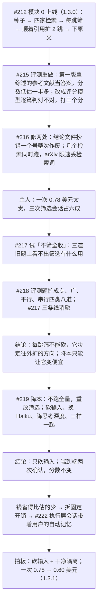
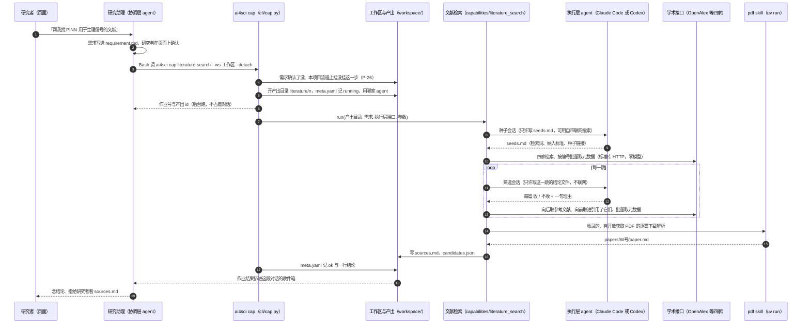
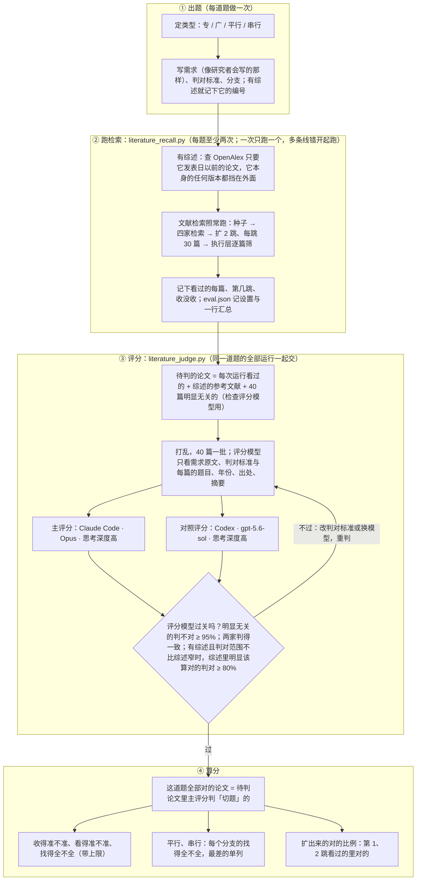

# 文献检索（literature-search）：模块 0 与第一次优化

- 状态：模块 0 随 1.3.0 发布；第一次优化随 1.3.1 发布（内仓 `framework/capabilities/literature_search/`）。
- 这份文档按顺序讲四件事：这一步是什么、怎么跑（§1–§5）；怎么给它打分（§6）；模块 0 的基线（§7）；第一次优化做了什么、得出了什么（§8）。以后再改这一步，照 §6 跑分，和 §8.7 的数比。
- 锚：[#212](https://github.com/zephyr4123/TJU-AI4Science/issues/212)（实现）、[#215](https://github.com/zephyr4123/TJU-AI4Science/issues/215)（评测重做）、[#216](https://github.com/zephyr4123/TJU-AI4Science/issues/216)（两处修复）、[#217](https://github.com/zephyr4123/TJU-AI4Science/issues/217)（筛选能不能砍）、[#218](https://github.com/zephyr4123/TJU-AI4Science/issues/218)（八道评测题）、[#219](https://github.com/zephyr4123/TJU-AI4Science/issues/219)（降本）、[#222](https://github.com/zephyr4123/TJU-AI4Science/issues/222)（执行层隔离）；还开着的 [#220](https://github.com/zephyr4123/TJU-AI4Science/issues/220)、[#221](https://github.com/zephyr4123/TJU-AI4Science/issues/221)、[#223](https://github.com/zephyr4123/TJU-AI4Science/issues/223)、[#224](https://github.com/zephyr4123/TJU-AI4Science/issues/224)。每一步的过程与数字都在 issue 评论里。
- 日期：2026-10-04
- 相关纲领：P-14（agent 面前只有 `ai4sci`）、P-20（阶段主文件）、P-25（底座可换）、P-26（按项目装载）、P-27（不要 key 也能用，有 key 用得更多）

## 0. 一页看完

**它做什么**：研究者把课题写进需求，这一步自动在网上的学术论文库里找相关论文，按收录标准筛一遍，能免费下载的原文下好并转成文字，最后交一份带来源与理由的论文清单 `sources.md`。只做检索，不写综述。

**这一轮做了什么**（2026-10-04 一天）：



**前后对比**（八道题，执行层 Claude Code · Sonnet · 思考深度中，评分 Opus；三个分的意思见 §6.4）：

| | 模块 0 | 第一次优化后 |
|---|---|---|
| 收得准不准 | 89% | 87% |
| 看得准不准 | 61% | 61% |
| 找得全不全（上限） | 48%（80%） | 47%（81%） |
| 扩出来的对的比例（第 1、2 跳看过的里对的） | 50% | 52% |
| 一次花多少（7 道题同口径） | 0.78 美元 | **0.60 美元（−23%）** |
| 改了什么 | — | 给筛选看的清单砍短（摘要 500 字、来路只数个数）；执行层关掉自动记忆 |

**这一轮得出的规律**（都按「换哪家执行层也成立」来写；某家 CLI 的私有开关只记附注）：

1. **每跳筛决定往外扩的方向。** 往外扩只从收了的论文出发；不筛时什么都当出发点，扩出去的是方法的通用奠基论文。专、平行、串行题第 1、2 跳对的比例：每跳筛 36%，不筛 15%。广题筛不筛一样（§8.2）。
2. **筛选的钱跟读进去的字数走，外加每起一次会话的固定开销。** 清单砍掉六成字，筛选省两成；剩下的大头是每次会话固定要写的缓存（§8.3.5）。
3. **小模型不一定省。** Haiku 单价是 Sonnet 的一半，但每批想 6000 多 token，省的钱和砍输入差不多，收进来的错论文翻倍，偏偏错在要细判的题上（§8.3.3）。
4. **思考深度对逐篇判断没东西可降。** Sonnet 做筛选本来几乎不想，调成 low 只省 3%（§8.3.3）。
5. **写理由让模型判得严。** 不写理由省 22%，但收得松；理由也是交给用户的东西，保留（§8.5）。
6. **续接会话不省钱。** 省下的固定写入，被每轮重读前面的对话抵掉（§8.3.5）。
7. **隔离要实测，不能看参数。** 用户设置关了，CLI 的自动记忆照样进了执行层会话，一次会话多花三成（§8.4）。
8. **一次运行分不清改动和波动。** 同一设置的两次运行，单题的找得全不全能差近 10 个点；比较要多跑、先量噪声、按题看（§6.8）。

**下一步**：§11。最大的一块花费现在是写种子的会话（0.29 美元，占一半，#223）；平行题的冷门类（#220）、串行题顺着第一步找第二步（#221）是分数上的两个缺口。

## 1. 背景

- 七个研究阶段里，文献阶段原来没有步骤：研究助理靠自己的联网搜索找材料，手写 `sources.md`（P-24 定的名字，复现流程读它）。
- 收录的社区 skill 里有检索类、精读类的（`paper-lookup`、`citation-management`、`nature-paper-card` 等），但有三个问题：只能「查一下」「读一篇」，不会把一个题目下的论文找全；它们用的学术接口不配 key 时多家限流严重（§4）；没有一个在真课题里用过。
- 主人 2026-10-04 定的方向：**先把检索这一段做好**，精读、综述都是它的下游。架构是「agent 自带搜索找种子 → 学术接口拿元数据 → 多跳顺引用扩 → 下原文解析」。多家 coding agent 都要能跑，不能只适配 Claude Code。
- 模块 0（1.3.0）发布时用「收录了几成综述参考文献」打分。主人看结果时指出这个口径有问题，于是按 §6 重做了评测（#215）。
- 评测重做后，主人嫌一次 0.78 美元对非工程师的研究生太贵，于是有了第一次优化（§8）：先问筛选能不能砍，再问怎么让它变便宜。

## 2. agent 怎么用这一步：调用路径

研究者在页面上和研究助理（协调层 agent）对话；助理照指南调用 `ai4sci` 这个唯一的入口（P-14）。从对话到论文清单，一路经过这些层：



两层 agent 能用的工具，都由平台在起会话时给定（不靠提示里的「请不要」）：

| 谁 | 能用的工具 | 在这一步里干什么 | 由谁收紧 |
|---|---|---|---|
| 研究助理（协调层） | Bash 只放行 `ai4sci` 开头的命令（单条的只读命令 CLI 自己放行）；能写的只有本项目目录；自带联网搜索 | 调 `ai4sci cap literature-search`；跑完 `ai4sci show output literature/<n>` 看结果，读 `sources.md` | `chat/guide.py::BASH_RULES`、`chat/scope.py` |
| 执行层，Claude Code | `claude -p` 一次一会话，`--permission-mode dontAsk` + `--allowedTools`：只许在产出目录里 Edit / Write、Bash 只放行 `ai4sci skill`、`WebSearch` `WebFetch`；隔离参数不读本机设置、不起 MCP，环境变量关掉自动记忆（#222） | 种子会话用 WebSearch 找种子、Write 写 `seeds.md`；筛选会话只 Write 结论文件 | `backends/claude_code.py`、`executor/session.py` |
| 执行层，Codex | `codex exec --json`，`sandbox_mode="workspace-write"` 只许写产出目录、`web_search="live"`、execpolicy 只放行 `ai4sci skill`；私有 `CODEX_HOME`，不读 AGENTS.md | 同上（种子会话用 `web_search`） | `backends/codex.py` |
| 框架（这一步本身） | 标准库 HTTP 查四家接口；`uv run --locked` 起平台自带的 `pdf` skill 脚本 | 查询、去重、排序、停不停、下原文、写清单 | 零模型（`make check` 查 `framework/` 里没有模型 API） |

执行层交回来的东西框架都要核：会话改了规定之外的文件、超时或退出码非零、`seeds.md` 缺节，这一步都判失败（产出目录留着当证据）。结论文件漏写、抄错号、同一篇写了相反结论的几篇单独补筛一次，补完还缺才判失败（#216）。执行层自己说了什么不作数，改了哪些文件看会话前后的快照对比（`backends/_snapshot.py`）。

要能调用，工作区的流程实例上要有文献这一格并挂上这一步：

```yaml
# workspaces/<名字>/flows/<流程>.yaml
stages:
  - 文献: [literature-search]
```

## 3. 它是怎么检索的

### 3.1 架构


### 3.2 每一步

1. **种子会话**（执行层一次）：读需求，写 `seeds.md` 三节——检索词 8~15 条（最概括的 3~5 条在前，后面往细里铺，需求里提到的每个对象、子方向各一条：冷门方向的论文被引少，顺着引用够不着，只能靠细的检索词）；纳入标准 3~6 条；种子 5~20 篇（DOI 或 arXiv 链接，用自带搜索找，没有搜索工具就留空，不许凭记忆写 DOI）。
2. **第 0 跳**（框架）：
   - 种子里认出 DOI 与 arXiv 号，回 OpenAlex 批量取。arXiv 号按落地页查——论文后来发了期刊的，OpenAlex 的主 DOI 是期刊的，按 arXiv 的 DOI 查是 404（第一次真跑就丢了 3 篇种子）。
   - 检索词逐条过 Crossref、arXiv、Europe PMC，前 5 条也过 OpenAlex 的关键词检索，每家每条取前 10 篇；命中的 DOI / arXiv 号 / PMID 回 OpenAlex 批量取元数据。arXiv 被限速（429）时按 5 / 15 / 30 / 60 秒退避（#216）。
   - **失败不阻塞**（#228，主人定：某家用不了只是少一些，有它就多一些）：三家各查各的（一家一个线程，每家内部照旧串行、按站点限速），一家卡在重试里拖不住别家；某家重试用完仍失败，这次就当它不可用，后面的检索词不再问它；三家一共等 120 秒（正常 arXiv 最慢，15 条约一分钟），到点没查完的那家已经回来的照收、手上那条查完就停。哪家、哪条没查成，`sources.md` 文末逐条写明。原来逐条串行重试，2026-10-05 arXiv 持续 429 时一条检索词要等约 4 分钟，15 条近一个小时；改后实测 3 条检索词 127 秒走完，Crossref、Europe PMC 全部查到。OpenAlex 查不成仍判失败：元数据都从它来。
   - 排序取每跳筛选数的两倍（默认 60 篇），种子另算：「新」「经典」两种排法轮流取（§3.3）。
   - **同一篇的不同版本认成一篇**（#232）：预印本、会议、期刊在 OpenAlex 各一个 W 号，题目归一后一样（至少 20 个字符）、年份差不过两年的并成一篇，缺的 DOI / arXiv 号 / 摘要 / PDF 链接从另一个版本补；同一批里只取一个。每一跳都这样并。#226 演练里 130 篇有 6 组 9 个多出来的版本，两个版本还被判出相反的结论；Mem0、那篇记忆综述收的都是没有 PDF 的期刊版。
3. **筛选会话**（执行层，每跳一次）：框架把这一跳候选写成清单放进提示，每篇五行：题目；年份、出处、被引数；**怎么找到的，只数每种几条**（种子、检索词几条、被几篇已收录的引用、引用了几篇已收录的）；**摘要前 500 字**。执行层按纳入标准逐篇写「W 号 | 收 或 不收 | 理由」进结论文件（提示里给绝对路径）。拿不准的收，宁多勿漏。
   - 1.3.0 时摘要截到 1500 字、「怎么找到的」列出每条检索词与每篇父论文的题目，每篇清单平均 1519 字；1.3.1 砍到约 580 字，分数不变（§8.3）。给人看的 `sources.md` 照旧写全来路。
   - 没拿到合格结论的几篇（漏写、抄错号、同一篇两条相反的）写进 `candidates-rest.md` 再起一次会话补筛（#216）。
4. **往外扩一跳**（框架）：只从这一跳新收录的出发——向后取它们的参考文献表（OpenAlex 单篇取不扣额度），向前取「谁引用了它们」（一跳合成一次查询，按被引数取前 400 篇）；新线索取元数据、排序，取前 K 篇（默认 30）交下一跳筛。**只从收了的出发，所以每跳筛决定了往外扩的方向**（§8.2）。
5. **停**：第 0 跳一篇都没收；某一跳新收录的少于停止下限（默认 3）；到了最多跳数（默认 2）；没有可筛的候选。先到哪个停在哪个。
6. **原文**（框架）：收录的、有开放获取 PDF 链接的，交平台自带的 `pdf` skill 下载并解析成 `paper.md`（#229 起并行：同时 8 篇、同一站点同时 2 篇，提交顺序按站点轮着排；#226 演练 39 篇有链接的实测串行 298 秒、4/2 70 秒、8/2 58 秒、8/4 51 秒，成功都是 35 篇，取 8/2）；出版社拦了（403、人机验证页）且有 arXiv 版本的，换 arXiv 再试；都不成的记原因，列进 `sources.md` 请研究者自己下。
7. **写清单**：`sources.md` 写检索词、纳入标准、各家命中多少、收录的每篇（题目、作者、出处、被引、链接、怎么找到的、第几跳、为什么收、原文在不在）、没拿到原文的、查不到的种子、没查成的检索（被限速的写明）。

参数（`ai4sci show caps` 里的名字）：最多跳数 `max_hops`（2）、每跳筛选数 `per_hop`（30）、停止下限 `min_new`（3）、起始年份 `since`（0，不限）、只看摘要 `abstracts_only`（缺省关，即下载原文）。

**起始年份**（#227，研究者问「近期研究怎样」时用）：只查、只收这一年及以后发表的。
- 推到每一家检索里，不只是事后滤：每条检索词每家只取前 10 篇，不推下去前 10 里多半是旧的。OpenAlex 关键词检索与「谁引用了它」加 `from_publication_date`，Crossref 加 `from-pub-date`，arXiv 加 `submittedDate` 区间（按第一版提交的日子），Europe PMC 加 `PUB_YEAR` 区间。
- 候选池兜底：早于它的不交给模型筛，挡的是种子与向后的参考文献（多是旧的）；年份不详的照常交，不知道不等于旧。早于它的种子在 `sources.md` 里记个数。
- 种子会话的提示里说清年份范围；`sources.md` 头部写一行年份。
- 只认四位年份（「近三年」由研究助理换算成今年减二），写成 3 这类当场拒，不当成公元 3 年悄悄不筛。

### 3.3 排序：每一跳交给模型看哪几篇

一篇论文被引上千、引用它的就上千篇，不可能全交给模型看，排序决定召回。规则都是零模型、按实测定的（§9，当时用的是第一版口径，待按 §6 复核）：

| 用在 | 分数 | 为什么 |
|---|---|---|
| 第 1 跳起 | 证据数 ×（1 + 2 × 字面相关度），同分看被引数 | 证据数 = 关联到几篇已收录的（它引用了或被引用）加被几路检索查到。只按证据数排分不开：关联 1 篇的线索上千条，答案就混在里面。字面相关度 = 题目加摘要命中检索词的程度，词按在这批线索里的稀有度加权（「neural」「network」几乎人人有，不算分） |
| 第 0 跳 | 上面那种（偏新论文）与再乘 1 + ln(1 + 被引数)（偏经典论文）两种排法轮流取 | 检索命中没有「被谁用到」的证据，排在前面的一半是刚出的新论文；只按被引数又会把新论文挤掉，研究者两头都要 |

### 3.4 留下哪些文件

| 文件 | 内容 | 谁读 |
|---|---|---|
| `sources.md` | 文献阶段的主文件（P-20）：上面第 7 步那份清单 | 研究者、助理、下游步骤（复现流程把它原样拼进提示） |
| `candidates.jsonl` | 看过的每篇一行：元数据、第几跳、来源标记、收不收、理由 | 排查、评测 |
| `seeds.md` | 执行层写的检索词、纳入标准、种子 | 框架 |
| `rounds/<跳>/candidates.md`、`decisions.md` | 每跳交给模型的清单与它的结论（补筛的带 `-rest`） | 排查、筛选重放（§6.7） |
| `papers/<W号>/` | `paper.md`、`structured.json`、`images/`、`source.pdf` | 研究者、精读类 skill |
| `executor/` | 每次执行层会话的事件流 | 排查、算钱 |

## 4. 用了哪些接口、能调用多少次

全部 2026-10-04 实测（`curl` 背靠背 8 次串行 + 8 次并发，再按需复测；数字在 #212）。

| 接口 | 在这一步里干什么 | 要不要 key | 额度与限速 | 实测 |
|---|---|---|---|---|
| **OpenAlex** | 元数据、摘要、参考文献表、谁引用了它；前 5 条检索词的关键词检索 | 不要也能用；**配免费 key 额度 10 倍**（`OPENALEX_API_KEY`，[领 key](https://openalex.org/settings/api)） | 不带 key：每 IP 每天 1000 积分（0.1 美元）；带 key：10000（1 美元）。关键词检索每次 10 积分，按编号批量取、谁引用了它每次 1 积分（一次最多 100 个编号 / 200 条），按编号取单篇 0。官方 2026-02 起说不带 key 只算随手用 | 串行、并发都正常；一次检索约 65 积分 → 不带 key 一天约 15 次，带 key 约 150 次。同一出口 IP 的人共用不带 key 的额度 |
| **Crossref** | 关键词检索（期刊、会议、预印本） | 不要 | 没有日额度；同时发会被拒 | 串行正常，约 1.5 秒一次；8 个并发 5 个 429 |
| **arXiv** | 关键词检索（预印本）；原文 PDF | 不要 | 没有日额度；官方要求两次请求隔 3 秒 | 正常；检索式里空格是「或」，要拼成 `all:a AND all:b`；PDF 下载曾被截断（见 §10）。同一台机器上同时跑几个检索会被 429 限速，且不带 Retry-After：现在按 5 / 15 / 30 / 60 秒退避（#216），三个检索同时起跑仍会丢检索词（#224） |
| **Europe PMC** | 关键词检索（生物医学为主） | 不要 | 没有日额度 | 串行、并发都正常，约 1.4 秒一次 |
| 开放获取 PDF 的出版社链接 | 原文 | 不要 | — | 部分出版社 403 或返回人机验证页（Elsevier、MDPI、IOP 各见过） |
| Claude Code 自带 WebSearch / WebFetch | 种子会话找种子 | 走研究者的 Claude 登录 | 跟着订阅 | 一次 10 条，只有标题与链接，另附一段模型写的总结；搜索结果由 Haiku 处理，一次种子会话平均搜 7.7 次、约 0.17 美元（#219）；WebFetch 能读 OpenAlex 的 JSON，但中间隔一个小模型 |
| Codex 自带 `web_search` | 种子会话找种子 | 走研究者的 ChatGPT 登录 | 跟着订阅 | 一次约 40 条，带标题、链接、日期、正文片段，三分之一是论文；打不开 JSON 接口；事件流里只有查了什么，看不到结果原文 |

没用的，及原因：

| 接口 | 为什么不用 |
|---|---|
| Semantic Scholar | 不配 key 几分钟后的单次请求也 429 |
| CORE | 时好时坏，单次也偶尔 429 |
| Google Scholar | 爬网页，量一大就封 |
| PubMed / PMC（E-utilities） | 每秒限 3 次、并发就拒；生物医学检索 Europe PMC 已覆盖 |
| OpenCitations | 只能一篇一篇查，查回来的编号还得回 OpenAlex 取元数据，不比合成一次的 OpenAlex 查询省 |

两家 agent 的自带搜索都只用来交种子：平台看不到搜索结果的原文，所以只认执行层写进 `seeds.md` 的链接，由框架从链接里认出编号再去查；没有联网搜索的 agent 照样能跑，只是少一路种子。

## 5. 不要 key 也能用，有 key 用得更多（P-27 改了）

原来的 P-27 是「一个 key 都不要，可选的也不要」。OpenAlex 2026-02 起不带 key 每 IP 每天 1000 积分，模块 0 最早一次检索花 160~230，一天只够五六次，开发与常用都不够。主人 2026-10-04 拍板改成：

- 平台跑起来不要任何 key，结果的形状不变；
- 可选的 key 只做量上的加法（额度更大、跑得更多），只走环境变量、一个读取点、放请求头不进 URL 与日志；现在只有 `OPENALEX_API_KEY`（读取点 `openalex.py`）；
- skill 仍一律不要 key，门禁不变。

同时把额度花法改省了：「谁引用了它」从一篇一次（一跳几十次，占一次检索的三分之一）改成一跳合成一次；批量取一次 100 个。OpenAlex 的关键词检索保留：按第一版口径，生理信号那道第 0 跳的 12 篇答案里有 6 篇只有它查得到。一次检索从 160~230 积分降到 45~75。

## 6. 怎么评测（SOP）

评测给这一步单独打分，回答三个问题：收进清单的论文对不对，挑去给模型看的论文对不对，该找的论文找回了几成。这一节是以后每次改检索都照着跑的流程；§7 是按它跑出来的基线，§8 是用它做的第一次优化。

### 6.1 第一版的打分错在哪

第一版（1.3.0 发布时的报告）拿一篇综述的参考文献当标准答案，只算「收录了几成参考文献」。真跑一遍、逐篇看过答案以外的收录之后，确认这个数不能当分数：

| 问题 | 后果 | 现在的做法 |
|---|---|---|
| 综述发表之后的论文不可能在答案里 | 工具找到了不得分，还占掉每跳 30 篇的名额，把答案挤出去；综述越旧越吃亏（宽题的综述是 2022 年的） | **按综述发表日截断**：查 OpenAlex 时只要综述发表日以前的论文，等于在综述发表那天跑这个工具 |
| 一篇综述只引了相关论文的一部分 | 答案以外的收录不得分。设备健康那道收了 93 篇、对上答案 22 篇；剩下 71 篇随机抽 25 篇，几乎都是需求要的，比如《Physics-Informed Neural Networks for Prognostics and Health Management of Lithium-Ion Batteries》 | **评分模型判**：答案以外、工具看过的论文，逐篇交评分模型判对不对 |
| 综述的参考文献里有和需求无关的 | 宽题综述引了股价预测、科学计量学、痴呆症预测这类，是写方法、讲背景时引的，研究者不要。它们算进答案，工具没找到也扣分 | **综述的参考文献也交评分模型判**，和工具找到的用同一个标准 |
| 几次检索同时跑会被 arXiv 限速 | 三个并行时 arXiv 被拒了 5~10 条检索词，紧接着单独跑的第一次也还被拒 7 条。arXiv 是出答案最多的一家，这样的运行分数偏低 | **一次只跑一个检索**，多条线并行时错开起跑（§6.8）；步骤本身也改了：被限速时等得更久（#216） |
| 单次运行抖得厉害 | 检索词与纳入标准每次由执行层重写，往外扩的起点不同；同一道题几次运行对上的答案从 15 篇到 22 篇 | **每题至少两次运行**，报每次的分和平均 |
| 只有三道题，都是 PINN 方向的「找全」型 | 看不出一个改动在不同需求下的作用：#217 在三道题上得出「筛选不指方向」，换成八道题就推翻了（§8.2） | **四类八道题，每道题自带判对标准**（§6.2） |

### 6.2 评测题：四类八道

主人定的（#218）：每道题相当于一个用户需求。需求类型不同，什么算对就不同，执行层写检索词、找种子也跟着不同。所以题目按用户要什么分四类，每类两道：

| 类型 | 用户要什么 | 什么算对 | 题（文件名） | 圈定范围的综述（截断日） | 全部对的论文 |
|---|---|---|---|---|---|
| 专 | 某个方法用在某个很窄的领域，要干净的清单 | 方法和领域都对上才算；通用方法论文、用在别的领域的都不算 | PINN 用于生理信号（`narrow-pinn-physio`） | [W4412520891](https://openalex.org/W4412520891)（2025-07-18） | 112 |
| 专 | 同上 | 同上 | 机器学习势模拟固态电解质的离子输运（`narrow-mlip-electrolyte`） | 无 | 71 |
| 广 | 一个方向的大综述，宁可多、后面自己挑 | 沾边的都算 | PINN 方法改进（`broad-pinn-methods`） | [W4309548460](https://openalex.org/W4309548460)（2022-11-21） | 239 |
| 广 | 同上 | 同上 | 深度学习用于天气与气候预报（`broad-ml-weather`） | 无 | 234 |
| 平行 | 几个并列的子方向，每一类都要有 | 每个子方向各算，最差的一类单列 | 物理信息机器学习用于五类设备的健康管理（`parallel-piml-phm`） | [W7172437325](https://openalex.org/W7172437325)（2026-08-04） | 249 |
| 平行 | 同上 | 同上 | 扩散模型用于小分子、蛋白质、晶体（`parallel-diffusion-science`） | 无 | 154 |
| 串行 | 先找 A，再找在 A 上做过的 B | 两步各算 | PDE 机器学习基准 → 在上面评测过的方法（`serial-pde-benchmarks`） | 无 | 75 |
| 串行 | 同上 | 同上 | 单细胞大规模图谱 → 在上面训练或评测的基础模型（`serial-singlecell-foundation`） | 无 | 124 |

「全部对的论文」是 §8.7 那次评分（四条线的全部运行一起判）的数，随运行加进来会变全。模块 0 的三道题（窄、宽、新）改写进了八道里：需求补了「什么算对」，设备健康那道按五类设备拆成平行题。

**每道题一个文件**（外层 `scripts/evals/literature_questions/<题>.md`，`literature_question.py` 读），写清这几样：

- **需求**：原样作工作区的 `requirement.md`，照研究者会写的样子写，不提综述；
- **类型**：专、广、平行、串行；
- **判对标准**：只给评分模型看，执行层看不到；
- **分支**：平行、串行的题才有，评分模型给对的论文标属于哪个分支；
- **综述**：可选。有综述就按它的发表日截断、把它挡在候选池外，它的参考文献进待判的论文。

### 6.3 流程



三个脚本都在外层 `scripts/evals/`，依赖内仓的代码、用内仓的 venv 跑，生产代码不依赖它们。命令见 §12。

### 6.4 分数：是什么，怎么算

先说清楚两个词：

- **对的论文**：评分模型照这道题的判对标准判「切题」的论文，也就是研究者会想放进清单的。
- **这道题全部对的论文**：把这道题每次运行看过的论文和综述的参考文献放在一起，评分模型逐篇判，判对的全部算上。这是目前已知的全部；工具和综述都没碰到过的论文，谁也数不出来，所以不算。

工具一次运行分两步：先挑出约 125 篇论文交给模型看摘要（第 0 跳 60 篇加种子，之后两跳各 30 篇），模型再从中挑出收进清单的。三个分分别查这两步和最终结果：

| 分 | 意思 | 怎么算 | 低了说明什么 |
|---|---|---|---|
| **收得准不准** | 收进清单的论文里，几成是对的 | 收录的里对的篇数 ÷ 收录的篇数 | 模型筛得太松，或纳入标准写宽了 |
| **看得准不准** | 挑去给模型看的论文里，几成是对的 | 看过的里对的篇数 ÷ 看过的篇数 | 检索和排序在送不相关的论文，名额浪费了 |
| **找得全不全** | 这道题全部对的论文里，收进清单的有几成 | 收录的里对的篇数 ÷ 这道题全部对的篇数 | 先看它离上限有多远（见下） |

**上限**：一次最多看约 125 篇，也就最多收 125 篇。要是这道题全部对的论文有 198 篇，就算一篇不错，找得全不全最高也只有 127 ÷ 198 ≈ 64%。所以报找得全不全时把上限写在旁边。离上限还远，是前两步有问题；贴着上限，是名额不够，要多看几篇或多跳一跳。

**例子**（模块 0 宽题第 4 次运行，主评分）：这道题全部对的论文 198 篇：综述参考文献里判对的 75 篇，加上综述以外判对的 123 篇。这次运行看了 127 篇，其中对的 116 篇；收了 112 篇，其中对的 111 篇（28 篇在综述里，83 篇在综述外）。

- 收得准不准 = 111 ÷ 112 = 99%
- 看得准不准 = 116 ÷ 127 = 91%
- 找得全不全 = 111 ÷ 198 = 56%，上限 127 ÷ 198 = 64%
- 第一版的旧分数 = 28 ÷ 121 = 23%：综述外那 83 篇对的不算，综述里 46 篇不相关的又算进了分母

**为什么综述的参考文献也要判、不直接算对**：宽题综述 121 篇参考文献，主评分判了 46 篇不对，比如监督学习预测股价的综述、科学计量学里评估研究领域成熟度、东盟可持续制造实践、深度 Q 学习做网络入侵检测。这些是系统综述写方法、讲背景时引的，研究者要的是「PINN 方法改进」，不会想在清单里看到它们。直接算对的话，工具没找到它们也要扣分。

**按题型另看的两个数**（#217 加的）：

- **最差分支**：平行、串行题每个分支（子方向、步骤）各算找得全不全，报最差的那个。平行题的用户要「每一类都要有」，平均分高不代表冷门的那一类有。
- **扩出来的对的比例**：第 1、2 跳看过的论文里对的比例。这是每跳筛真正起作用的地方（§8.2）：往外扩只从收了的论文出发，筛得对，扩出来的才对。改筛选时一定要看它。

**另外三个数**，用来找原因：

- **看过没收、其实是对的**：模型筛漏的篇数。
- **对的论文里，工具根本没看过的**：检索和排序没送到的篇数。
- **旧分数**：收了几成综述参考文献（第一版的算法），只作对照，看第一版低估了多少。

**比较两个版本时**：「这道题全部对的论文」会随运行变多而变全，同一次运行的找得全不全会跟着变。所以要把新旧版本的运行一起交给评分脚本，在同一份「全部对的论文」上算分；只在同一张表里比，不拿两次评分的数互相比。新版本找到的新论文判完以后，新旧版本一起重算。

### 6.5 评分模型

| 项 | 做法 | 为什么 |
|---|---|---|
| 主评分 | Claude Code · Opus · 思考深度高 | 打分要用好模型，比执行层的 Sonnet 强 |
| 对照评分 | Codex · gpt-5.6-sol（Codex 最强的一档）· 思考深度高 | 换一家模型判同一批论文，看两家判得一不一致；用它的判定算出来的分也报，看结论会不会因为换了评分模型而变 |
| 会话 | 一批 40 篇一个隔离会话，各在自己的目录里；不联网、不许跑命令，只许写一个结论文件；漏写的几篇单独补判 | 判定不受外部影响，判定文件能逐条复核 |
| 看到什么 | 需求原文、这道题的判对标准，每篇的题目、年份、出处、摘要（截到 1500 字） | 不给执行层写的纳入标准、不给被引数、不说哪篇是综述的参考文献、哪篇是工具找的；顺序打乱 |
| 判什么 | 每篇「切题」或「不切题」，加一句理由；平行、串行题再标分支 | 只有两档，判定好对账 |
| 复用 | 判过的论文按编号复用，加运行时只判新的；判对标准改了换新的评分目录 | 比较新版本时只为新论文花钱 |
| 拦截 | 评分会话被 Claude Code 的安全分类器拦下（会话正常结束、没写结论）时，这一批对半拆开重判，拆到一篇还拦就记「拒判」，单列、不计分 | 扩散模型那道题 9 批里有 2 批第一次被拦，整批再判就过了；拦截时有时无（#218） |

**评分模型先过关**。下面几条在看到结果之前就定好了；都过，它的判定才采信：

| 检查 | 线 | 意思 |
|---|---|---|
| 明显无关的，判不对 | ≥ 95% | 每道题混进 40 篇无关综述（[W4415344803](https://openalex.org/W4415344803)，大模型做组合优化）的参考文献 |
| 两家判得一致 | 一致程度 ≥ 0.6 | 同一批论文 Opus 和 Codex 各判一遍。直接数「判得一样的比例」会偏高：两家都爱判「对」时，随便猜也能对上不少。所以扣掉碰巧对上的那部分再算一致程度（统计上叫 Cohen's κ），满分 1，0.6 以上算高度一致 |
| 综述里明显该算对的，判对 | ≥ 80% | 「明显该算对的」= 题目或摘要里提到 physics-informed、PINN 这类方法的综述参考文献。**只用在判对范围不比综述窄的题上**（广、平行）：专题的判对标准写明「只占一头的不算」，综述里那些 PINN 用在别的领域的论文判不对才是对的（生理那道判对 67%，逐条看过都判得对，#218） |

八道题的实际情况（#218、#219）：无关论文八道题都是 40 / 40 判不对；两家一致程度 0.70~0.98，PDE 那道最低（Opus 判出 70 篇对的、Codex 43 篇，分歧在「方法论文摘要里看不出用没用公开基准」，判对标准要改，见 #221）；明显该算对的，PINN 方法 72 / 73、设备健康 79 / 88，都过线。

### 6.6 防泄漏

- 综述本身挡在候选池外，否则向后一跳就把答案全抄回来了。
- 执行层用自带搜索找种子时，可能找到综述的预印本或别的版本：模块 0 的设备健康题第 3 次运行把综述的 arXiv 版当成了种子，因为发表日在截断之后，没进池子。所以评测客户端同时挡掉题目和综述相同的任何版本，跑完再按题目核一遍候选里没有综述本身。
- 一篇更早的、同主题的综述被找到，不算泄漏。比如宽题找到了 2022 年 Cuomo 等人的 PINN 综述，它和答案有 34 篇参考文献重合；研究者自己查也会先找到它。

### 6.7 筛选重放：只改筛选时不用从头跑

八道题、每题两次的端到端运行一条线要跑一个多小时。改动只动筛选这一步（清单怎么写、用什么模型、想多深、理由怎么写）时，检索和往外扩不变，可以只重放筛选（#219）：

- 每跳交给筛选的清单原样存在 `rounds/<跳>/candidates.md`，里面每篇都已经有评分模型的判定。
- 把这些清单按改过的设置再交给筛选判一遍，拿收不收去对评分模型的判定：**该收的收了几成**（评分模型判对的里收了的）、**收进来的对了几成**（收了的里判对的），按题型、按跳拆。
- 不检索、不碰 arXiv，可以多条线并行、每条线里多批并行。8 道题 × 2 次 × 3 跳 = 48 批、2040 篇，一条线十来分钟。
- **先跑一条「原样再判」的线量噪声**：同一设置再判一遍，和原来的结论一致 96%，单道题的分数上下差到 4 个点。别的线和原样再判的差距不超过这个，就当没区别。
- 重放只能比筛选判得准不准、花多少，**看不到往外扩的方向变了没有**（筛的结论不同，下一跳看到的论文就不同）。重放挑出的设置，要再端到端跑几次确认。
- 重放的花费只能和同一批重放线比：几十批并行时缓存是冷的，比原来端到端的贵（#219 原样再判比原来贵 17%）；每次会话的固定开销也会让「省几成」和端到端对不上（§8.3.5）。

脚本：外层 `scripts/evals/literature_rescreen.py`（命令见 §12）。

### 6.8 跑实验的规矩

这一轮踩出来的，以后照做：

- **一次只跑一个检索；多条线并行时错开起跑。** 三条线同时起跑，arXiv 照样丢检索词（加长的退避扛不住三路同时重试）；错开以后 45 次运行没再丢（#216、#224）。
- **每题至少两次，一次运行分不清改动和波动。** 同一设置的两次运行，单题找得全不全能差 9 个点（PDE 57% 对 48%）。
- **先量噪声再下结论**：重放时先跑原样再判（§6.7）。
- **在同一份「全部对的论文」上比**（§6.4）。
- **按题看，不只看平均。** 每道题是一个需求：平均一样，可能是一道题涨、一道题跌。
- **跑坏的不重跑，故障本身是发现。** 电解质题 d 第 2 次因为结论写错位置整次作废，顺着它修了两处（§8.6）。
- **实验前不预判输赢；回来先拆过程**（每跳的论文从哪来、哪一步开始偏），再给分数。
- **找换哪家执行层都成立的规律，不针对某家 CLI 优化。** 例：Claude Code 有个没写进文档的环境变量能把缓存从存 1 小时改成存 5 分钟，一次约省 0.16 美元；它换一家、换一个版本就没了，只记附注，没占实验线（#219）。

## 7. 模块 0 的基线

### 7.1 三道题（#215，1.3.0 的步骤）

评测重做时的第一份基线：10 次运行（每题 2 次干净运行，加 4 次被 arXiv 拒过的），两家评分模型各判一遍。执行层一律 Claude Code · Sonnet（claude-sonnet-5-5）· 思考深度中；跳数 2、每跳 30 篇、停止下限 1。三道题当时叫窄（PINN 用于生理信号）、宽（PINN 方法改进）、新（物理信息机器学习用于设备健康管理），后来改写进了八道题（§6.2）。

只算干净运行；斜杠前是主评分 Opus，斜杠后是对照 Codex：

| 题 | 全部对的论文（Opus / Codex） | 收得准不准 | 看得准不准 | 找得全不全 | 上限 | 旧分数 |
|---|---|---|---|---|---|---|
| 窄 | 109 / 109 | 82% / 84% | 40% / 45% | 44% / 46% | 100% / 100% | 17% |
| 宽 | 198 / 205 | 100% / 98% | 93% / 94% | 56% / 53% | 64% / 62% | 23% |
| 新 | 265 / 282 | 72% / 84% | 61% / 72% | 28% / 31% | 47% / 44% | 10% |

全部对的论文从哪来：

| 题 | 综述的参考文献（取得到的） | 其中判对 | 各次运行看过、综述里没有的 | 其中判对 | 全部对的 |
|---|---|---|---|---|---|
| 窄 | 81 | 56 | 157 | 53 | 109 |
| 宽 | 121 | 75 | 138 | 123 | 198 |
| 新 | 177 | 143 | 216 | 122 | 265 |

三道题里，综述以外判对的论文都和综述里判对的差不多多（宽题、新题还更多）。只拿综述当答案，至少漏掉一半该算分的论文。

评分模型过关情况：无关论文三道题都是 40 / 40 判不对；两家一致程度 0.79、0.82、0.82；综述里明显该算对的，宽题 89%、新题 97%，窄题 79% 差 1 个点没过。窄题没判对的 9 篇都是 PINN 用在高速流动、纳米光学、海洋建模、固体弹性力学的论文，需求要的是生理信号，判不对是对的，Codex 对其中 8 篇判得一样：问题在「明显该算对的」这条关键词规则只看方法、不看领域。八道题时改成了只用在判对范围不比综述窄的题上（§6.5）。

每次运行的分数、花费与每一跳的贡献见附录 A。

**读出来的**：

1. **第一版的分数不到新算法的一半。** 旧分数窄题 17%、宽题 23%、新题 10%；新算法下找得全不全是 44%、56%、28%。差出来的主要是综述外的对的论文，和综述里那些不相关的参考文献。
2. **三道题卡在不同地方：**
   - **宽题卡在名额。** 看得准不准 93%、收得准不准 100%，找得全不全 56%，贴着上限 64%。想再找全只能多给名额：每跳多看，或者多跳一跳。
   - **窄题卡在检索和排序。** 名额够用（上限 100%），可看过的约 126 篇里只有四成是对的；全部对的 109 篇里约 58 篇工具根本没看到，看过没收的只有 1~3 篇。
   - **新题两头都有。** 上限 47%，实际 28%；看得准不准 61%。
3. **新题第 3 次运行跑偏了。** 执行层写的检索词里有一条泛的「physics-informed neural networks」，纳入标准又写了「PINN 及其变体即使例子不是设备健康管理也收」，第 0 跳就带进来一批通用 PINN 方法论文，第 2 跳收的 28 篇里只有 3 篇对，收得准不准掉到 57%。种子会话写的检索词和纳入标准可能比需求宽，这是步骤本身的弱点。
4. **筛选很少漏，但边界上放得宽。** 看过没收、其实是对的，每次只有 1~9 篇。多收的是边界上的通用 PINN 方法论文：执行层照提示「拿不准的收」放了进来。
5. **单次运行会抖。** 新题两次干净运行的找得全不全是 23% 和 32%。

### 7.2 八道题（#217 的 a 线：每跳筛，1.3.0 的清单）

八道题、每题两次，和第一次优化后的版本、不筛的参照一起评分（同一份「全部对的论文」，§8.7 那次）。Opus 判，两次平均：

| 题 | 收得准不准 | 看得准不准 | 找得全不全（上限） | 最差分支 | 扩出来的对的比例 | 一次花多少 |
|---|---|---|---|---|---|---|
| 专 · PINN 生理信号 | 94% | 46% | 48%（100%） | — | 35% | 0.64 美元 |
| 专 · 机器学习势电解质 | 77% | 33% | 58%（100%） | — | 22% | 0.75 美元 |
| 广 · PINN 方法改进 | 100% | 97% | 50%（54%） | — | 97% | 0.85 美元 |
| 广 · AI 天气气候 | 98% | 90% | 51%（56%） | — | 87% | 0.93 美元 |
| 平行 · 设备健康五类 | 92% | 71% | 32%（50%） | 24% | 65% | 0.71 美元 |
| 平行 · 扩散模型三方向 | 88% | 65% | 50%（83%） | 39% | 41% | 0.78 美元 |
| 串行 · PDE 基准 → 方法 | 62% | 31% | 53%（100%） | 51% | 22% | 0.78 美元 |
| 串行 · 单细胞图谱 → 模型 | 97% | 53% | 46%（100%） | 40% | 32% | 0.80 美元 |
| **八道题平均** | **89%** | **61%** | **48%（80%）** | | **50%** | **0.78 美元** |

按题型读：

- **专题**：收得准，找不全，卡在检索和排序（看得准不准三四成）。覆盖偏热门的子方向：生理那道收进来的八成是心血管、血流，呼吸类一篇没有（是文献少还是没搜到，未验证）；电解质那道偏硫化物。
- **广题**：看过的九成以上是对的，找得全不全贴着上限，卡在名额。
- **平行题**：冷门类只靠第 0 跳的检索词，往外扩放大热门类（设备健康的齿轮一类每次只收到 1~3 篇，全池对的只有 9 篇）。见 #220。
- **串行题**：第一步点名的基准、图谱都收到了；第二步大多是检索词直接搜到的，很少是顺着第一步的论文找到的。PDE 那道收得准不准只有 62%：收错的多是「方法论文，摘要看不出用了公开基准」。见 #221。

## 8. 第一次优化：一次检索从 0.78 降到 0.60 美元

### 8.1 起因：钱花在哪

一次检索 0.78 美元（五六块人民币），给非工程师的研究生用太贵。按 a 线 16 次运行拆开（#219）：

| 会话 | 平均花费 | 其中 |
|---|---|---|
| 写种子（检索词、纳入标准、种子） | 0.29 | Sonnet 自己 0.12；联网搜索 0.17（平均搜 7.7 次，搜索结果由 Haiku 处理） |
| 三次筛选 | 0.49 | 第 0 跳 0.22（约 64 篇），第 1、2 跳各约 0.13（各 30 篇） |

三次筛选占六成多。一次筛选会话（第 1 跳，30 篇，0.132 美元）里：

| 部分 | token | 占花费 |
|---|---|---|
| 论文清单（写进缓存） | 约 1.9 万 | 58% |
| 固定开销（写缓存约 5 千、读缓存约 5.7 万） | — | 24% |
| 输出（其中思考约 500） | 约 2.3~3.1 千 | 17% |

清单每篇平均 1467 字：摘要 981（67%）、「怎么找到的」355（24%）、题目 89、年份出处被引 42。摘要截到 1500 字，29% 的摘要被截过；「怎么找到的」把每篇父论文的完整题目都列出来，最长一条约 800 字。

（「固定开销写缓存约 5 千」是当时的估计，错了：实际约 1.6 万，其中一半是 #222 漏进来的自动记忆，见 §8.3.5、§8.4。）

于是分两步问：筛选能不能砍（§8.2）；砍不了的话，怎么让它变便宜（§8.3）。

### 8.2 第一个问题：筛选能不能砍（#217 #218）

#### 8.2.1 初试：三道旧题上「不筛全收」

内仓临时加了个开关：不起筛选会话，每跳挑出来的一律收，往外扩照样从它们出发。三道旧题各跑 2 次，和基线的干净运行一起评分：

| 题 | | 收得准不准 | 看得准不准 | 找得全不全（上限） | 一次花多少 |
|---|---|---|---|---|---|
| 窄 | 筛 | 82% | 40% | 43%（100%） | 0.67~0.89 |
| 窄 | 不筛 | 39% | 39% | 44%（100%） | 0.20~0.38 |
| 宽 | 筛 | 100% | 93% | 53%（61%） | |
| 宽 | 不筛 | 89% | 89% | 55%（62%） | |
| 新 | 筛 | 72% | 61% | 26%（45%） | |
| 新 | 不筛 | 57% | 57% | 26%（45%） | |

逐跳看过的里对的比例，窄题筛与不筛几乎一样（第 1 跳 30% 对 28%，第 2 跳 20% 对 22%）。当时读成：**找得全不全不掉，筛选只是把最终清单洗干净，给往外扩指方向的作用不大**。这个结论下一步被推翻了。

主人看了结果提了两点：一，对不对是相对的，要专还是要广取决于研究者想干什么；二，评测题要多样化。于是有了 #218 的八道题（§6.2），每道题自带判对标准，回答第一点。

#### 8.2.2 八道题上三条线消融

| 线 | 筛选方式 | Crossref 每条检索词取几篇 |
|---|---|---|
| a | 每跳筛（现状） | 10（现状） |
| b | 扩完最后统一筛一次（会话从四次降到两次） | 5 |
| c | 不筛全收 | 5 |

b、c 的 Crossref 减半，是因为初试里窄题第 0 跳 Crossref 查回来的只有 11~17% 对、却占了一大半名额。8 道题 × 3 条线 × 2 次 = 48 次运行，三条线并行。

八道题平均（Opus 判；这是 #217 当时那次评分，「全部对的论文」比 §7.2 少，所以数比 §7.2 高几个点，只在表内比）：

| 线 | 收得准不准 | 看得准不准 | 找得全不全（上限） | 平行、串行题的最差分支 | 一次花多少 |
|---|---|---|---|---|---|
| a 每跳筛 | 89% | 61% | 52%（82%） | 43% | 0.78 美元 |
| b 最后筛 | 90% | 54% | 45%（83%） | 36% | 0.74 美元 |
| c 不筛 | 53% | 53% | 47%（83%） | 40% | 0.31 美元 |

Codex 判的结论相同：a 82% / 57% / 51%，b 86% / 52% / 47%，c 51% / 51% / 48%。

**差别全在往外扩的第 1、2 跳。** 第 0 跳（检索词搜来的）三条线差不多；第 1、2 跳看过的论文里对的比例：

| 题 | a 每跳筛 | b 最后筛 | c 不筛 |
|---|---|---|---|
| 专 · PINN 生理信号 | 42 / 120 = 35% | 10 / 120 = 8% | 7 / 120 = 6% |
| 专 · 机器学习势电解质 | 26 / 120 = 22% | 4 / 120 = 3% | 2 / 120 = 2% |
| 平行 · 设备健康五类 | 78 / 120 = 65% | 51 / 120 = 43% | 44 / 120 = 37% |
| 平行 · 扩散模型三方向 | 49 / 120 = 41% | 35 / 120 = 29% | 33 / 120 = 28% |
| 串行 · PDE 基准 → 方法 | 27 / 120 = 23% | 2 / 120 = 2% | 3 / 120 = 3% |
| 串行 · 单细胞图谱 → 模型 | 38 / 120 = 32% | 23 / 120 = 19% | 20 / 120 = 17% |
| 广 · PINN 方法改进 | 116 / 120 = 97% | 112 / 120 = 93% | 111 / 120 = 93% |
| 广 · AI 天气气候 | 104 / 120 = 87% | 104 / 120 = 87% | 96 / 120 = 80% |

**为什么**：不筛的时候，看过的论文全当父论文往外扩，扩出来的按「被几篇父论文同时引到」排前 30。排在前面的是这个方法的通用奠基论文：生理题第 2 跳是 CAN-PINN、FBPINNs、高速流 PINN、B-PINNs；电解质题第 2 跳是 ANI-1、SchNet、分子原子化能。方法对、领域不对，正是专题用户点名不要的。每跳筛只拿判过「收」的论文当父论文，扩出去还留在题目里。

**初试为什么没看出来**：三道旧题都是 PINN 方向；窄题本身往外扩就只有两三成对，宽题筛不筛一样，差别被埋住了。换成八道、四类需求以后，专、平行、串行题上差别一下就出来了。

**b 为什么没省钱**：b 最后一次把看过的约 250 篇全交给执行层判，a 分三次判同样多的论文。花费跟读进去的清单量走，不跟会话次数走，所以 b ≈ a；b 往外扩时又没有方向，找得全不全反而更低（45% 对 52%）。

#### 8.2.3 按题型拆（主人要求：每道题就是一个用户需求，不只看平均）

| 题型 | 用户要什么 | 三条线比下来 | 该改的 |
|---|---|---|---|
| 专 | 两头都对上的干净清单 | c 两次收错 163 篇（生理）、收了 NequIP、MACE 这些方法论文本身（电解质），正是用户排除的；a 收得准不准 94% / 77%，c 33% / 26% | 每跳筛必需；降本只能让它变便宜 |
| 广 | 尽量全，后面自己挑 | 三条线交出来的差不多：天气题点名的 GraphCast、Pangu、FourCastNet 每次都有；c 收错的（农业、光伏、Adam 优化器）对这类用户可以接受 | 可以不筛，省下的拿去多看；卡在名额 |
| 平行 | 每一类都要有 | 冷门类几乎全靠第 0 跳；a 第 1、2 跳新增的对的：设备健康 电池 24、轴承 26、齿轮 2、涡轮 5、结构 3；扩散 小分子 22、蛋白质 22、晶体 1 | 冷门类补检索，或往外扩按类分名额（#220） |
| 串行 | 先找 A，再顺着 A 找 B | 第一步都做到了；第二步主要是检索词直接搜到的（PDE 题 a 收进来对的方法论文 48 篇：检索词与种子 24，顺着基准论文扩出来 9） | 把「B 引用了 A」当成往外扩与判对的依据（#221） |

#### 8.2.4 结论（主人 2026-10-04 定）

- **每跳筛不能砍**，它决定往外扩的方向，专、平行、串行题效果最好。降本要让每跳筛变便宜，而不是去掉它。
- b 放弃；c 只对广题合适，现在不按题切换。需求原文里写着「宁可多一些」还是「只要两头都对上」，以后可以让种子会话读需求、定这道题筛不筛（未做）。
- 实验用的开关（不筛全收、筛选方式三选一、Crossref 减半）只留在实验分支上，没有上线。

### 8.3 第二个问题：每跳筛怎么变便宜（#219）

#### 8.3.1 三个变量，各自能省多少

主人定的三个变量：砍输入、换模型、降思考深度。按 §8.1 的拆分算出只算钱的上限（不预判分数）：

| 变量 | 改法 | 估计能省（一次检索） |
|---|---|---|
| 砍输入 | 摘要截到 500 字；「怎么找到的」只数每种几条 | 清单约减一半，筛选约省三成，约 0.15 |
| 换模型 | 筛选会话用 Haiku 4.5（单价是 Sonnet 的一半） | 筛选省一半，约 0.25 |
| 降思考深度 | 筛选会话从 medium 降到 low | 思考只占筛选输出的六分之一，最多约 0.02 |

#### 8.3.2 不跑全量：重放筛选

原设计是四条新线各端到端跑 8 题 × 2 次（64 次运行）。主人嫌太慢，改成重放（方法见 §6.7）：拿 a 线 16 次运行每跳的清单（48 批、2040 篇），按各线的改法再判一遍，对 Opus 的判定。

| 线 | 筛选怎么跑 |
|---|---|
| a2 原样再判 | 和 a 完全一样（Sonnet、medium、原清单）：量同一批判两次的噪声 |
| d 砍输入 | 摘要截到 500 字；「怎么找到的」只数每种几条（每篇清单从平均 1519 字降到 582 字，减 62%） |
| e 换模型 | Haiku 4.5 |
| f 降深度 | Sonnet，low |
| g 三样一起 | d + e + f |
| h 砍输入 + low | d + f（主人看了前五条加的） |

#### 8.3.3 重放结果

六条线全部跑完、0 漏判。「收全」= Opus 判对的里收了几成，「收准」= 收了的里对了几成；花费是每跳 16 批的中位数相加（只算筛选）：

| 线 | 筛选花费 | 比 a2 | 清单字 / 篇 | 收全 / 收准 | 和 a 原结论一致 |
|---|---|---|---|---|---|
| a 原筛选 | 0.488 | — | 1519 | 95% / 91% | 100% |
| a2 原样再判 | 0.570 | 基准 | 1519 | 94% / 91% | 96% |
| d 砍输入 | 0.384 | −33% | 582 | 93% / 90% | 94% |
| e Haiku | 0.392 | −31% | 1519 | 96% / 80% | 87% |
| f 深度 low | 0.551 | −3% | 1519 | 93% / 91% | 96% |
| g 三样一起 | 0.334 | −41% | 582 | 95% / 80% | 86% |
| h 砍输入 + low | 0.380 | −33% | 582 | 93% / 91% | 94% |

按题（收全 / 收准）：

| 题 | a2 原样再判 | d 砍输入 | e Haiku | f low | g 三样 |
|---|---|---|---|---|---|
| 专 电解质 | 99% / 76% | 93% / 76% | 99% / 60% | 99% / 84% | 90% / 67% |
| 专 生理 | 97% / 95% | 94% / 92% | 96% / 93% | 95% / 94% | 91% / 91% |
| 广 天气 | 99% / 100% | 99% / 99% | 100% / 99% | 100% / 100% | 100% / 95% |
| 广 PINN | 96% / 100% | 95% / 100% | 96% / 100% | 94% / 100% | 97% / 100% |
| 平行 扩散 | 93% / 87% | 91% / 88% | 93% / 80% | 93% / 88% | 93% / 79% |
| 平行 设备健康 | 91% / 92% | 90% / 91% | 91% / 79% | 91% / 91% | 90% / 86% |
| 串行 PDE | 95% / 66% | 95% / 60% | 99% / 41% | 98% / 61% | 99% / 41% |
| 串行 单细胞 | 84% / 95% | 82% / 93% | 93% / 75% | 79% / 96% | 95% / 71% |

用人话读（「漏掉的」= 100% − 收全，「收进来的错的」= 100% − 收准）：

| 办法 | 筛选省钱 | 漏掉的 | 收进来的错的 | 结论 |
|---|---|---|---|---|
| a2 原样再判 | — | 6% | 9% | 对照：同样设置判两次本来就有出入 |
| d 砍输入 | 三分之一 | 7% | 10% | 和对照差不多准，划算 |
| e 换 Haiku | 三分之一 | 4% | 20% | 错的翻一倍 |
| f 少想 | 3% | 7% | 9% | 一样准，几乎不省钱 |
| g 三样一起 | 四成 | 5% | 20% | 最省，错的同样翻倍 |
| h 砍输入 + 少想 | 三分之一 | 7% | 9% | 和 d 一样，少想没多省 |

**读出来的**：

1. **筛选的钱跟读进去的字数走。** 清单砍掉 62%，筛选省 33%（剩下的是每次会话的固定开销和输出）。准确度大多在噪声里；掉得最多的是电解质题的收全（99% → 93%）：3 篇论文的关键信息（用了机器学习势）在摘要 500 字以后。
2. **换小模型省下的钱被它多想吃掉了，还判得松。** Haiku 每批想 6000 多 token（Sonnet 中位数 0），输出是 Sonnet 的 4 倍，最后省的和砍输入差不多。它收得更多：广题没差别，专、平行、串行题收准掉 10~25 个点，正好是要细判的题。第 1、2 跳的收准只有 72% / 74%（a2 83% / 88%）——这些是要当父论文往外扩的，按 §8.2 会把方向带偏。Haiku 设 low 也照样想 7000 多 token，像是不认这个参数（未验证）。
3. **降思考深度没东西可降。** Sonnet 做逐篇判断本来几乎不想：每批思考 token 中位数四条 Sonnet 线都是 0（均值 a2 342、d 116、f 115、h 83），输出约 2000 token 基本是结论本身。

**结论（主人确认）**：不换模型、不降思考深度，只砍输入。

#### 8.3.4 端到端确认：d 跑两次

内仓清单砍短（`b676e54`）后，d 线 8 道题各端到端跑两次。第 1 次还漏着自动记忆，第 2 次带 #222 的修复（§8.4）；电解质题第 2 次跑坏（§8.6），只有 1 次。和 a、b、c 一起评分（同一份「全部对的论文」）：8 道题无关论文都 40 / 40，两家一致程度 0.70~0.97，0 拒判。

八道题平均（Opus；Codex 结论相同）：

| 线 | 收得准不准 | 看得准不准 | 找得全不全（上限） | 扩出来的对的比例 |
|---|---|---|---|---|
| a 原清单（2 次） | 89% | 61% | 48%（80%） | 50% |
| d 砍输入（2 次） | 87% | 61% | 47%（81%） | 52% |
| c 不筛（参照） | 53% | 53% | 44%（81%） | 33% |

每次运行的找得全不全（平行、串行题斜杠后是最差分支）：

| 题 | a 第 1 次 | a 第 2 次 | d 第 1 次 | d 第 2 次 |
|---|---|---|---|---|
| 广 天气 | 51% | 50% | 48% | 50% |
| 广 PINN | 50% | 51% | 49% | 50% |
| 专 电解质 | 59% | 56% | 52% | 跑坏 |
| 专 生理 | 45% | 51% | 41% | 43% |
| 平行 扩散 | 48% / 46% | 52% / 32% | 56% / 51% | 51% / 48% |
| 平行 设备健康 | 33% / 28% | 32% / 20% | 32% / 10% | 33% / 10% |
| 串行 PDE | 57% / 55% | 48% / 47% | 44% / 39% | 44% / 36% |
| 串行 单细胞 | 45% / 38% | 46% / 42% | 63% / 45% | 44% / 38% |

- **平均和 a 一样，往外扩的方向保住了**（扩出来的对的比例 52% 对 50%，不筛是 33%）。
- **两次都偏低的**：专 生理（41、43 对 45、51）、串行 PDE（44、44 对 57、48）、设备健康最差的一类（两次都是 10%；这一类全池只有 9 篇对的，差一两篇就是这个数）。**两次都不低于 a 的**：扩散、两道广题。
- 重放里同一批候选上，d 对 PDE 的收全和原清单一样（95%）。所以这两道题若真有损失，不在「同一篇判得对不对」，而在往外扩时看到了哪些论文；两次运行还分不清是不是波动（§11）。

#### 8.3.5 钱省得比估的少：每次会话的固定开销

d 第 1 次端到端，一次检索 0.78 → 0.67，三次筛选只省 21%，不是重放估的 33%。两个原因：

- **每起一次筛选会话，不管清单多长，都要写一笔缓存。** 用 48 个第 1、2 跳会话拟合：写缓存 ≈ 15712 + 0.18 × 清单字数（token）。§8.1 估成约 5 千，估错了。清单砍短以后，这笔固定开销成了筛选的大头：第 1 跳会话 a 写 2.4 万 token，d 写 1.9 万。
- **重放的对照线被抬高了**：几十批并行时缓存是冷的，a2 比原来的端到端贵 17%，「省三分之一」是和抬高了的 a2 比的。

于是试了「减少会话次数」：同一个执行层会话续接着筛下一跳（仓库外的干净目录，Sonnet medium）：

| | 首轮写缓存 | 读缓存 | 这一跳花费 |
|---|---|---|---|
| 新起会话筛第 1 跳 | 11663 | 15981 | 0.081 |
| 同一会话接着筛第 2 跳 | 9858 | 29252 | 0.081 |

省下的那点固定写入，被每轮要重读前面整段对话抵掉了，新一跳的清单照样要写。**续接会话不省钱，搁置。**

做这个对照时发现：同一份提示，会话目录在外层仓库里花 0.110，仓库外 0.082——1.6 万的固定开销里有一半不该有。查下去是 #222。

### 8.4 查出来的隔离漏洞：执行层会话带着用户的自动记忆（#222）

**现象**：评测的数据根在外层仓库的 `materials/` 下。同一份第 1 跳筛选提示，会话目录在仓库里比在仓库外多写 7300 token 缓存，一次会话多花三成。

**诊断**（先错后对）：开 issue 时归到外层的 `CLAUDE.md` 与 `CLAUDE.local.md`，错了。用探针直接问会话上下文里有什么（`--setting-sources "" --strict-mcp-config --disable-slash-commands`，会话目录在外层仓库里）：

| 环境变量 | 上下文里有没有 MEMORY.md | 有没有用户级 CLAUDE.md | 有没有项目 CLAUDE.md |
|---|---|---|---|
| 不设 | **有**（原样抄出第一行） | 没有 | 没有 |
| `CLAUDE_CODE_DISABLE_CLAUDE_MDS=1` | 没有（但系统提示里还有记忆目录的用法说明） | 没有 | 没有 |
| `CLAUDE_CODE_DISABLE_AUTO_MEMORY=1` | 没有 | 没有 | 没有 |

- `--setting-sources ""` 挡得住 CLAUDE.md。
- 挡不住的是 CLI 的**自动记忆**：会话所在的仓库若被这个人用 Claude Code 开过，`~/.claude/projects/<仓库>/memory/MEMORY.md`（这里 1.5 万字，开发者对这个项目的记忆索引）连同记忆用法说明整段进了上下文。

**修法**：两层会话（执行层、协调层）的环境里都设 `CLAUDE_CODE_DISABLE_AUTO_MEMORY=1`（只挡这一样，也关掉记忆用法说明与写记忆）；`docs/architecture/workflow.md` 的隔离一节写上。Codex 那边 `project_doc_max_bytes=0` 已挡 AGENTS.md；Codex 有没有类似的记忆功能另查（未验证，§11）。

**效果**：同一份筛选提示，一次会话 0.110 → 0.076；重放里砍输入后的三次筛选 0.384 → 0.313（再省 18%）；端到端 d 第 2 次一次检索 0.60。

**影响面**：#215 #217 #219 量的花费都含这一块（一次检索约多 0.11），各线的相对高低不受影响（大家多读的一样）。真实用户：工作区放在自己用 Claude Code 开过的目录下，他的记忆就会进平台会话——这是隔离问题，不只是钱。

### 8.5 理由怎么写（干净环境的重放）

筛选的输出约占会话花费四分之一，大头是每篇一句理由。在干净环境（带 #222 修复）、d 的短清单上重放三种写法：

| 线 | 筛选花费（一次检索） | 比 d2 | 每批输出 token（中位） | 收全 / 收准 |
|---|---|---|---|---|
| d2 每篇都写理由（现在的做法） | 0.313 | 基准 | 2302 | 93% / 90% |
| i 只给收的写理由 | 0.292 | −7% | 2227 | 92% / 92% |
| n 都不写理由 | 0.244 | −22% | 1219 | 94% / 88% |

- **不写理由，模型判得松**：收得更多、收准 −2；生理、单细胞、PDE 这几道要细判的题收准掉 4~5 个点。写一句理由相当于逼它先想清楚再下结论。
- **只给收的写理由省得很少**：不收的只占四成，输出里还有固定的一截。
- **理由是交给用户的东西**：`sources.md` 写「为什么收」，`candidates.jsonl` 逐篇带「为什么没收」。**保留理由。**

### 8.6 跑坏的那一次：结论写错了位置

d 第 2 次电解质题：第 2 跳筛选会话把结论写到了产出目录根下的 `decisions.md`，该写的是 `rounds/2/decisions.md`。结论本身完整（30 行），框架按「改了允许之外的文件」判整次失败，前两跳白跑。照规矩没重跑，拆开看会话的事件流：

- 提示里给的是相对路径；Claude Code 的 Write 只收绝对路径，执行层自己拼的时候丢了 `rounds/2/`。
- 会话自己察觉了「文件位置可能不对」，想核对：带管道的 `ls` 被拒；再想用 Glob，CLI 回「No such tool available: Glob」——**2.1.289 已经没有 Glob、Grep 工具了，但平台给两层 agent 的「工具怎么用」还在教它们用**。

1.3.1 修了两处：结论文件在提示里直接给绝对路径（越界照旧判失败）；「工具怎么用」改成读文件用 Read、找文件搜内容用单条的 `ls` / `find` / `grep`（实测 dontAsk 下单条的只读命令自动放行，带管道的被拒）。约 200 次筛选会话里见到这 1 次。

### 8.7 拍板与最终数字

**主人拍板（2026-10-04）：砍输入 + 干净隔离。** 筛选清单砍短（摘要 500 字、来路只数个数），执行层关自动记忆；模型（Sonnet）、思考深度（medium）、理由写法都不动。这一轮告一段落，算局部最优。

一次检索花多少（7 道题同口径：电解质题 d 第 2 次跑坏，三行都不算它）：

| | 合计 | 写种子 | 三次筛选 |
|---|---|---|---|
| a 模块 0（2 次） | 0.78 | 0.30 | 0.49 |
| d 第 1 次：砍输入（漏着自动记忆） | 0.67 | 0.29 | 0.38 |
| d 第 2 次：砍输入 + 干净隔离 | **0.60** | 0.29 | 0.31 |

砍输入单独省 14%（a 和 d 第 1 次都漏着记忆，比得上）；修隔离再省约 11%，只对执行层带上了自动记忆的人有效。

每道题（Opus 判；a、d 各 2 次平均，电解质 d 只有 1 次；c 不筛作参照）：

| 题 | 全部对的 | 线 | 收得准不准 | 看得准不准 | 找得全不全（上限） | 最差分支 | 扩出来的对的比例 | 一次花多少 |
|---|---|---|---|---|---|---|---|---|
| 专 · PINN 生理信号 | 112 | a | 94% | 46% | 48%（100%） | — | 35% | 0.64 |
| | | d | 93% | 41% | 42%（100%） | — | 32% | 0.49 |
| | | c | 33% | 33% | 37%（100%） | — | 6% | 0.23 |
| 专 · 机器学习势电解质 | 71 | a | 77% | 33% | 58%（100%） | — | 22% | 0.75 |
| | | d | 70% | 32% | 52%（100%） | — | 27% | 0.57 |
| | | c | 26% | 26% | 45%（100%） | — | 2% | 0.27 |
| 广 · PINN 方法改进 | 239 | a | 100% | 97% | 50%（54%） | — | 97% | 0.85 |
| | | d | 100% | 96% | 50%（53%） | — | 97% | 0.59 |
| | | c | 95% | 95% | 50%（53%） | — | 92% | 0.24 |
| 广 · AI 天气气候 | 234 | a | 98% | 90% | 51%（56%） | — | 87% | 0.93 |
| | | d | 99% | 90% | 49%（56%） | — | 88% | 0.73 |
| | | c | 84% | 84% | 48%（57%） | — | 80% | 0.46 |
| 平行 · 设备健康五类 | 249 | a | 92% | 71% | 32%（50%） | 24% | 65% | 0.71 |
| | | d | 90% | 72% | 33%（50%） | 10% | 68% | 0.65 |
| | | c | 52% | 52% | 26%（50%） | 9% | 37% | 0.35 |
| 平行 · 扩散模型三方向 | 154 | a | 88% | 65% | 50%（83%） | 39% | 41% | 0.78 |
| | | d | 88% | 66% | 54%（85%） | 49% | 45% | 0.65 |
| | | c | 60% | 60% | 51%（85%） | 51% | 28% | 0.30 |
| 串行 · PDE 基准 → 方法 | 75 | a | 62% | 31% | 53%（100%） | 51% | 22% | 0.78 |
| | | d | 62% | 29% | 44%（100%） | 38% | 17% | 0.71 |
| | | c | 26% | 26% | 45%（100%） | 37% | 2% | 0.34 |
| 串行 · 单细胞图谱 → 模型 | 124 | a | 97% | 53% | 46%（100%） | 40% | 32% | 0.80 |
| | | d | 91% | 59% | 54%（100%） | 42% | 43% | 0.63 |
| | | c | 47% | 47% | 49%（100%） | 47% | 17% | 0.29 |
| **八道题平均** | | a | **89%** | **61%** | **48%（80%）** | | **50%** | **0.78** |
| | | d | **87%** | **61%** | **47%（81%）** | | **52%** | **0.63** |
| | | c | 53% | 53% | 44%（81%） | | 33% | 0.31 |

（这张表里 d 的花费是两次的平均，第 1 次还漏着记忆；只看修了隔离的第 2 次是上面的 0.60。）

以后改检索，拿 d 这一行比：八道题平均收得准不准 87%、看得准不准 61%、找得全不全 47%（上限 81%）、扩出来的对的比例 52%、一次 0.60 美元。

### 8.8 一路上改过的结论

都在 issue 里当场更正过，这里集中列出，以后读老评论时对照：

| 先说的 | 后来查清的 | 怎么查清的 |
|---|---|---|
| 筛选只是洗干净清单，给往外扩指方向的作用不大（#217 初试） | 每跳筛决定往外扩的方向；三道旧题看不出来 | 八道、四类题上三条线消融（§8.2.2） |
| 执行层不知道一道题是专是广，不能按题切换筛不筛 | 需求原文写着「宁可多一些」或「只要两头都对上」，种子会话读得到 | 回头读需求原文 |
| 一次筛选会话的固定开销写缓存约 5 千 token | 约 1.6 万，其中一半是漏进来的自动记忆 | 48 个会话拟合；仓库里外对照 |
| 砍输入让筛选省 33% | 端到端省 21%（加上修隔离省到 36%） | 端到端运行；重放的对照线并行时缓存冷 |
| 多出来的 7300 token 是外层的 CLAUDE.md | 是 CLI 的自动记忆（MEMORY.md） | 探针问会话上下文里有什么（§8.4） |

## 9. 开发时的比较（第一版口径，待按 §6 复核）

模块 0 实现那天定排序、定「谁引用了它」的查法，用的是第一版口径：只数前 30 / 60 篇里有几篇综述参考文献，而且没有截断。这些比较是同一批线索里换排法的离线重放，相对高低大体可信，但绝对数不能和 §7 比；哪条要再动，先按 §6 重测。

**每跳看多少篇（K）**：窄题同一份种子，K 从 30 翻到 60，看过的从 144 篇到 234 篇，收录的综述参考文献只从 18 到 19。没轮到筛的答案多数只关联 1~3 篇已收录的，而线索池里关联 1 篇的有 3121 条，所以当时判断卡在排序。这和 §7 新算法下的结论一致：窄题不缺名额、卡在检索和排序；但宽题当时没测过，新算法下它恰恰卡在名额。

**第 1 跳的排法**（同一份第 0 跳结论重放，前 30 / 60 / 120 篇里的综述参考文献）：

| 排法 | 窄题（966 条线索里 33 篇） | 宽题（1570 条里 43 篇） |
|---|---|---|
| 只按关联数，同数看被引（第一版） | 11 / 15 / 21 | 6 / 13 / 23 |
| 关联数 ×（1 + 1 × 字面相关度） | 13 / 16 / 21 | 7 / 13 / 23 |
| **关联数 ×（1 + 2 × 字面相关度）（采用）** | **15 / 16 / 21** | **7 / 14 / 22** |
| 关联数 ×（1 + 3 × 字面相关度） | 14 / 16 / 20 | 8 / 14 / 21 |
| 只看字面相关度 | 8 / 8 / 14 | 0 / 2 / 4 |
| 采用的再乘 1 + 0.5 ln(1 + 被引数) | 9 / 15 / 20 | 7 / 15 / 23 |

**第 0 跳的排法**（一次运行的 370 篇检索命中，其中 12 篇综述参考文献，看前 30 / 60 / 120 篇）：按命中次数乘字面相关度是 3 / 4 / 8，前 60 里 42 篇是 2025 年后的；再乘被引数是 6 / 9 / 12，新论文只剩 15 篇；**两种轮流取（采用）** 是 5 / 6 / 12，新论文 26 篇。第一版口径天然不认新论文，所以当时取了折中。按新口径，新论文切题的照样算分，这条该重测。

**「谁引用了它」的查法**（第 1 跳重放，前 30 / 60 篇里的综述参考文献）：一跳合成一次、按被引数取前 400（采用）：窄题 7 / 7、宽题 8 / 17，约 13 次请求；一篇一次、每篇前 25（第一版）：7 / 10、7 / 8，约 61 次；一篇一次、每篇取最新的 25：4 / 4、4 / 7，约 109 次。

当时还读出两条，和新口径不冲突：参考文献方向比「谁引用了它」准（窄题里来源是「被收录的引用」的 30% 是综述参考文献，「引用了收录的」只有 8%）；种子本身几乎不是答案，它的作用是往外扩的起点。

## 10. 改了什么

**步骤本身**（内仓）：

| 版本 | 发现 | 根因 | 修法 | commit |
|---|---|---|---|---|
| 1.3.0 | 第一版：只接 OpenAlex | 不配 key 的几家里只有它稳、且有引用关系 | 步骤落地：种子会话、第 0 跳、多跳、筛选、原文、清单 | `b12a4cf` |
| 1.3.0 | 3 条 arXiv 种子查不到 | 发了期刊的，OpenAlex 主 DOI 是期刊的 | arXiv 号按落地页查 | `2dc3f9a` |
| 1.3.0 | 命令行跑出来一篇原文没下 | 「下载原文」写成缺省为真的开关，CLI 上开关缺省只能是关 | 改成「只看摘要」，并断言 bool 参数缺省只能是 False | `2dc3f9a` |
| 1.3.0 | 两篇 arXiv 的 PDF 解析报 `not a dict (null)` | 平台 `pdf` skill 下载只 `read` 一次，连接中途断了不报错 | 读到结尾，比 Content-Length 短按下载失败 | `e235eca` |
| 1.3.0 | 出版社返回人机验证页 | 出版社拦程序下载 | 有 arXiv 版本的换 arXiv 再试 | `e235eca` |
| 1.3.0 | 每跳多看也找不到更多 | 排序分不开 | 乘字面相关度 | `48dbe83` |
| 1.3.0 | 小方向的应用论文找不到 | 检索词太少太粗，OpenAlex 关键词检索太贵铺不开 | 四家联查、检索词 8~15 条 | `72a7f1d` |
| 1.3.0 | 第 0 跳被新论文占满 | 检索命中没有被引证据 | 新、经典两种排法轮流取 | `83aec72` |
| 1.3.0 | 不带 key 一天只够五六次 | OpenAlex 2026-02 起限额；「谁引用了它」一篇一次 | 可选 key（P-27 改）；合成一次查；批量 100 | `81d650f` |
| 1.3.1 | 结论文件抄错一个号，整次检索作废（#216） | 漏写、抄错号就判失败 | 没拿到合格结论的几篇单独补筛一次，补完还缺才判失败 | `4af4295` |
| 1.3.1 | 同时跑几个检索，arXiv 被拒的检索词直接丢掉（#216） | 429 不带 Retry-After，退避 1 / 2 / 4 秒三次就放弃 | arXiv 按 5 / 15 / 30 / 60 秒退避 | `4af4295` |
| 1.3.1 | 一次检索 0.78 美元，三次筛选占六成（#219） | 清单每篇 1519 字，摘要与来路占九成 | 摘要截到 500 字、来路只数个数 | `b676e54` |
| 1.3.1 | 执行层会话带着用户的自动记忆（#222） | `--setting-sources ""` 管不到自动记忆 | 两层会话设 `CLAUDE_CODE_DISABLE_AUTO_MEMORY=1` | `4ce05c6` |
| 1.3.1 | 「工具怎么用」教已经没有的 Glob / Grep（#219） | CLI 2.1.289 去掉了这两个工具 | 改教 Read 与单条的 `ls` / `find` / `grep` | `62ccabc` |
| 1.3.1 | 结论写错位置整次作废（#219） | 提示给相对路径，执行层拼路径丢了一级目录 | 提示里给绝对路径 | `f235e49` |

**评测**（外层 `scripts/evals/`）：

| 发现 | 修法 | commit |
|---|---|---|
| 综述发表后的论文找到了不得分，还占名额 | 召回实测按综述发表日截断；核心答案的计数挪进脚本 | `0bdf4a2` |
| 答案以外的收录不得分；综述的参考文献里有和需求无关的 | 评分模型判全部待判论文，打三个分；两家评分模型对照；判过的按编号复用 | `4b28b2b` |
| 执行层可能把综述的预印本当种子 | 评测客户端挡掉题目与综述相同的任何版本 | `39f7de5` |
| 三道题都是 PINN 方向的「找全」型，看不出不同需求下的作用（#218） | 四类八道题，每道题自带判对标准与分支；评分照题判、按分支算 | `95bab0e` |
| 评分会话偶尔被安全分类器拦下，整次评分崩掉（#218） | 对半拆开重判，拆到一篇还拦记拒判 | `61044d0` |
| 只改筛选也要从头跑，一条线一个多小时（#219） | 筛选重放脚本；理由写法也能试 | `3b6ff51` `bc27aa3` |
| eval.json 不记给筛选的摘要截到多长 | 记下 `abstract_max` | `466d389` |
| 实验开关留在评测脚本里（#217） | 删掉已放弃的筛选方式与 Crossref 开关；重放对上上线版的提示 | `b4438d3` |

**没有上线的实验改动**：不筛全收开关、筛选方式三选一、Crossref 减半（#217 的 b、c 线）、模型清单加 Haiku（#219 的 e、g 线）。它们只在实验分支上，结论出来后连分支一起删了，做法与结果记在 #217 #219 与本文 §8。

## 11. 已知限制与下一步

| 先做 | 是什么 | 现在的数 | 看哪个分 | issue |
|---|---|---|---|---|
| 1 | **写种子的会话**：现在是一次检索最大的一块（0.29 美元，其中联网搜索 0.17）。主人定为单独的优化项 | 0.29 / 0.60 | 花费；种子与第 0 跳的看得准不准 | [#223](https://github.com/zephyr4123/TJU-AI4Science/issues/223) |
| 2 | **平行题的冷门类**：只靠第 0 跳的检索词，往外扩放大热门类 | 设备健康最差的一类 10%~24% | 最差分支 | [#220](https://github.com/zephyr4123/TJU-AI4Science/issues/220) |
| 3 | **串行题顺着第一步找第二步**：第二步大多是检索词直接搜到的；PDE 题的判对标准要改（「引用了公开基准、并且有对比实验」） | PDE 收得准不准 62%，两家一致程度 0.70 | 串行题的收得准不准、最差分支 | [#221](https://github.com/zephyr4123/TJU-AI4Science/issues/221) |
| 4 | **专题的检索与排序**：看过的只有三四成对；种子会话的检索词要带领域词，纳入标准不许比需求宽（防跑偏） | 生理、电解质看得准不准 41%、32% | 专题的看得准不准、对的里没看过的 | — |
| 5 | **广题加名额**：贴着上限 | 找得全不全 50% / 上限 54%~56% | 广题的找得全不全与上限 | — |
| 6 | **几个检索同时起跑，arXiv 照样丢检索词**：丢掉的排到本跳最后再试、退避加随机抖动、报告里写明少了哪几条 | 三路同时起跑每路丢 3 条 | 没查成的检索 | [#224](https://github.com/zephyr4123/TJU-AI4Science/issues/224) |

还没定的：

- **生理、PDE 两道题 d 两次都比 a 低 6~9 个点**：是砍短的损失还是波动，两次分不清。下一次改检索跑分时，这两道多跑几次。
- **按需求定筛不筛**：广题不筛也一样（c 线），省下的钱可以拿去多看。需求里写着用户要专还是要广，种子会话可以读出来（§8.2.4）。
- **Codex 有没有类似自动记忆的功能**：未验证。下次 Codex 真跑时探一次会话上下文。

其余限制：

- **中文库**（知网、万方）没有可用的公开接口，查不了；付费期刊的原文下不了。
- **出厂流程里还没有这一步**：`research`、`reproduce` 都不经过文献阶段，要用得在流程实例上挂（§2）。
- **「全部对的论文」只是已知的全部**：综述和工具都没碰到过的论文没法数，所以找得全不全会偏高一些。题目越窄、运行越多，这个偏差越小。
- **评分模型不是人**：两家判得一样的比例九成以上，分歧多在「方法学奠基工作算不算」「别的领域的同类方法算不算」「摘要看不出用没用某个基准」这种边界上。判对标准写得越清楚，分歧越少。

## 12. 怎么复现

```bash
# 1. 评测用的数据根，别碰正式数据；一道题一个工作区，需求用题目文件里「需求」一节的原文
export AI4SCI_HOME=<评测的数据根> && cd platform
.venv/bin/ai4sci project new lit && cd $AI4SCI_HOME/projects/lit
Q=narrow-pinn-physio   # 八道题见 scripts/evals/literature_questions/
ai4sci workspace new $Q
#   把题目文件「## 需求」下面的原文存成 workspaces/$Q/requirement.md
printf 'name: lit\ntitle: 文献检索\nsummary: 按需求找论文。\nstages:\n  - 文献: [literature-search]\n' > workspaces/$Q/flows/lit.yaml
(cd workspaces/$Q && ai4sci requirement confirm --ws $Q)

# 2. 跑检索（在外层仓根；一次只跑一个，多条线并行时错开起跑；每题至少两次）
. ~/.secrets/loader.sh
withkey openalex platform/.venv/bin/python scripts/evals/literature_recall.py \
  $AI4SCI_HOME/projects/lit/workspaces/$Q scripts/evals/literature_questions/$Q.md \
  claude_code 2 30 1 > $Q-1.log 2>&1
grep -c index_failed $Q-1.log    # 不是 0 就说明 arXiv 丢过检索词，记下来

# 3. 打分：同一道题的全部运行（含要比较的各版本）一起给；先 Codex 判一遍，再 Opus 判并对照
R=$AI4SCI_HOME/projects/lit/workspaces/$Q
withkey openalex platform/.venv/bin/python scripts/evals/literature_judge.py \
  scripts/evals/literature_questions/$Q.md judge/$Q-codex $R/literature/1 $R/literature/2 \
  --backend codex --model gpt-5.6-sol --effort high
withkey openalex platform/.venv/bin/python scripts/evals/literature_judge.py \
  scripts/evals/literature_questions/$Q.md judge/$Q-claude_code $R/literature/1 $R/literature/2 \
  --against judge/$Q-codex/judge.json
# 结果：judge/$Q-claude_code/judge.json（过关检查、一致率、每次运行的分数、每篇的判定与理由）

# 4. 只改筛选时：重放（§6.7）。先跑一条原样再判的线量噪声，再跑要试的设置
AI4SCI_HOME=$AI4SCI_HOME platform/.venv/bin/python scripts/evals/literature_rescreen.py \
  rescreen/same $R/literature/1 $R/literature/2
AI4SCI_HOME=$AI4SCI_HOME platform/.venv/bin/python scripts/evals/literature_rescreen.py \
  rescreen/try $R/literature/1 $R/literature/2 --effort low
# 每批一个 rescreen/<线>/<工作区>-<次>/hop-<跳>/result.json：收不收、理由、花费、token；拿去对 judge.json 的判定
```

这一轮的运行、评分、重放数据与拆过程的脚本在外层 `materials/evals/literature/`（本机，不进 git；README 说明每个目录）。

## 附录 A：模块 0 三道题每次运行的明细（#215）

主评分 Opus：

| 题 | 第几次 | 干净 | 看过 | 收录 | 收得准不准 | 看得准不准 | 找得全不全（上限） | 旧分数 | 看过没收、其实对 | 对的里没看过 |
|---|---|---|---|---|---|---|---|---|---|---|
| 窄 | 5 | 否 | 124 | 66 | 76% | 43% | 46%（100%） | 17% | 3 | 56 |
| 窄 | 6 | 是 | 126 | 56 | 84% | 40% | 43%（100%） | 17% | 3 | 59 |
| 窄 | 7 | 是 | 126 | 63 | 79% | 40% | 46%（100%） | 17% | 1 | 58 |
| 宽 | 3 | 否 | 128 | 113 | 97% | 91% | 56%（65%） | 24% | 6 | 82 |
| 宽 | 4 | 是 | 127 | 112 | 99% | 91% | 56%（64%） | 23% | 5 | 82 |
| 宽 | 5 | 是 | 125 | 110 | 100% | 95% | 56%（63%） | 23% | 9 | 79 |
| 新 | 1 | 否 | 125 | 93 | 90% | 69% | 32%（47%） | 12% | 2 | 179 |
| 新 | 2 | 否 | 125 | 102 | 79% | 66% | 31%（47%） | 11% | 1 | 183 |
| 新 | 3 | 是 | 127 | 108 | 57% | 52% | 23%（48%） | 8% | 4 | 199 |
| 新 | 5 | 是 | 124 | 99 | 87% | 70% | 32%（47%） | 12% | 1 | 178 |

「干净」= 这次运行 arXiv 一条检索词都没被拒。不干净的 4 次只让它们看过的论文进待判池，分数不进 §7.1 的平均。新题第 4 次运行中途失败：执行层在结论文件里把两个相近的编号抄混了，当时的步骤因此整次作废（#216 已修），所以表里没有它。

对照评分 Codex：

| 题 | 第几次 | 干净 | 看过 | 收录 | 收得准不准 | 看得准不准 | 找得全不全（上限） | 旧分数 | 看过没收、其实对 | 对的里没看过 |
|---|---|---|---|---|---|---|---|---|---|---|
| 窄 | 5 | 否 | 124 | 66 | 80% | 48% | 49%（100%） | 17% | 6 | 50 |
| 窄 | 6 | 是 | 126 | 56 | 86% | 46% | 44%（100%） | 17% | 10 | 51 |
| 窄 | 7 | 是 | 126 | 63 | 82% | 44% | 48%（100%） | 17% | 4 | 53 |
| 宽 | 3 | 否 | 128 | 113 | 98% | 94% | 54%（62%） | 24% | 9 | 85 |
| 宽 | 4 | 是 | 127 | 112 | 98% | 92% | 54%（62%） | 23% | 7 | 88 |
| 宽 | 5 | 是 | 125 | 110 | 98% | 95% | 53%（61%） | 23% | 11 | 86 |
| 新 | 1 | 否 | 125 | 93 | 90% | 77% | 30%（44%） | 12% | 12 | 186 |
| 新 | 2 | 否 | 125 | 102 | 91% | 75% | 33%（44%） | 11% | 1 | 188 |
| 新 | 3 | 是 | 127 | 108 | 78% | 69% | 30%（45%） | 8% | 4 | 194 |
| 新 | 5 | 是 | 124 | 99 | 91% | 74% | 32%（44%） | 12% | 2 | 190 |

每次运行的成本：

| 题 | 第几次 | arXiv 被拒的检索词 | 会话 | token（输出 / 读缓存 / 写缓存） | 花费 | 墙钟 | OpenAlex 请求 |
|---|---|---|---|---|---|---|---|
| 窄 | 5 | 10 | 4 | 12.4k / 284.8k / 120.7k | 0.82 美元 | 6 分 29 秒 | 39 |
| 窄 | 6 | 0 | 4 | 10.1k / 294.8k / 98.8k | 0.67 美元 | 3 分 51 秒 | 43 |
| 窄 | 7 | 0 | 4 | 12.2k / 321.7k / 100.4k | 0.71 美元 | 3 分 53 秒 | 41 |
| 宽 | 3 | 5 | 4 | 12.4k / 321.4k / 130.1k | 0.89 美元 | 5 分 00 秒 | 41 |
| 宽 | 4 | 0 | 4 | 10.4k / 320.8k / 108.4k | 0.76 美元 | 3 分 51 秒 | 43 |
| 宽 | 5 | 0 | 4 | 10.2k / 304.1k / 108.8k | 0.75 美元 | 3 分 45 秒 | 44 |
| 新 | 1 | 8 | 4 | 11.1k / 307.2k / 112.6k | 0.76 美元 | 5 分 53 秒 | 41 |
| 新 | 2 | 7 | 4 | 11.1k / 292.1k / 95.3k | 0.71 美元 | 5 分 06 秒 | 41 |
| 新 | 3 | 0 | 4 | 11.8k / 302.9k / 106.1k | 0.76 美元 | 4 分 06 秒 | 42 |
| 新 | 5 | 0 | 4 | 10.6k / 323.4k / 95.7k | 0.72 美元 | 3 分 53 秒 | 43 |

Claude Code 报的美元是按 API 价折算的，订阅账号不另付；这些花费都含 #222 漏进来的自动记忆（§8.4）。模型会话本身每次合计约 1.5~2 分钟，其余时间在查接口：四家检索 15 条约 1.5 分钟，因为 arXiv 两次请求要隔 3 秒。OpenAlex 每次约 40 个请求、45~75 积分（按响应头的剩余积分前后相减）。

评分的花费：Opus 32 个会话，按 API 价折合 8.36 美元，会话合计约 21 分钟；Codex 31 个会话，输入 137 万 token（其中缓存 91 万）、输出 8.5 万 token，订阅账号报不出美元。三道题一共判了约 1000 篇。

每一跳的贡献（干净运行）：

| 题 | 第几次 | 第 0 跳：看过 / 收录 / 收录里对的 | 第 1 跳 | 第 2 跳 |
|---|---|---|---|---|
| 窄 | 6 | 66 / 39 / 35 | 30 / 12 / 10 | 30 / 5 / 2 |
| 窄 | 7 | 66 / 39 / 35 | 30 / 13 / 7 | 30 / 11 / 8 |
| 宽 | 4 | 67 / 56 / 56 | 30 / 28 / 28 | 30 / 28 / 27 |
| 宽 | 5 | 65 / 55 / 55 | 30 / 28 / 28 | 30 / 27 / 27 |
| 新 | 3 | 67 / 56 / 47 | 30 / 24 / 12 | 30 / 28 / 3 |
| 新 | 5 | 64 / 51 / 50 | 30 / 25 / 23 | 30 / 23 / 13 |
