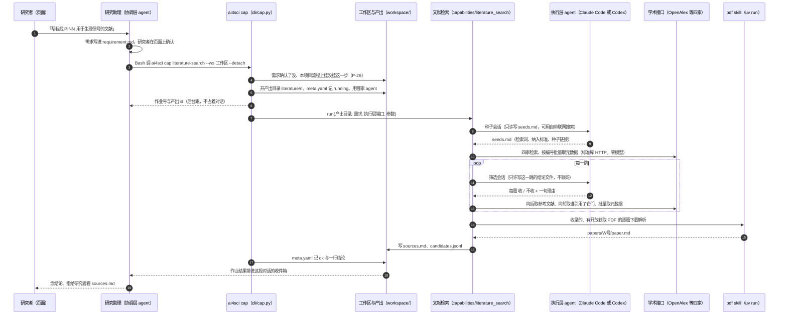
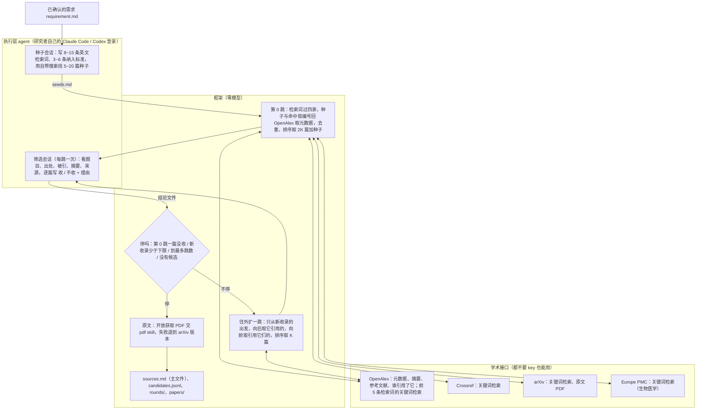

# 文献检索（literature-search）：设计、实测与结论

- 状态：已实现，代码在内仓 `framework/capabilities/literature_search/`；合入 `release/1.3`，随下一版发布
- 锚：[#212](https://github.com/zephyr4123/TJU-AI4Science/issues/212)（过程、数字、每一步的 commit 都在评论里）
- 日期：2026-10-04（一天做完：讨论、实现、两家 agent 真跑、两道题召回实测、按结果改了四轮）
- 相关纲领：P-14（agent 面前只有 `ai4sci`）、P-20（阶段主文件）、P-25（底座可换）、P-26（按项目装载）、P-27（不要 key 也能用，有 key 用得更多，本次改）

## 0. 一句话与一张表

**它做什么**：研究者把课题写进需求，这一步自动在网上的学术论文库里把相关论文找全、按收录标准筛一遍、能免费下载的原文下好并转成文字，最后交一份带来源与理由的论文清单 `sources.md`。只做检索，不写综述。

| | 结果 |
|---|---|
| 能不能用 | Claude Code 与 Codex 都真跑通过；不配任何 key 也能跑 |
| 一次跑多久、花多少 | 2 跳约 4~5 分钟；Claude Code（Sonnet，思考深度中）约 0.75~0.80 美元；Codex 订阅账号报不出美元 |
| 找得全不全 | 拿两篇综述的参考文献当标准答案：OpenAlex 里取得到的答案里，收录了 17%~22%（窄题）与 21%（宽题）；和 PINN 直接相关的「核心答案」里收录了 28%~35% 与 33% |
| 额度 | 一次检索约 65 个 OpenAlex 积分；不配 key 每天 1000（约 15 次），配免费 key 每天 10000（约 150 次） |
| 做不到的 | 中文库（知网、万方）查不了；付费期刊的原文下不了，只列出来请研究者自己下 |

## 1. 背景

- 七个研究阶段里，文献阶段一直没有步骤：研究助理靠自己的联网搜索找材料、手写 `sources.md`（P-24 定名，复现流程读它）。
- 收录的社区 skill 里有检索与精读类的（`paper-lookup`、`citation-management`、`nature-paper-card` 等），但：只能「查一下」「读一篇」，不会把一个题目下的论文找全；它们用的学术接口不配 key 时多家限流严重（下面 §6 有实测）；没有一个在真课题里用过。
- 主人 2026-10-04 定的方向：**先把检索这一段做好**，精读、综述都是它的下游；架构是「agent 自带搜索找种子 → 学术接口拿元数据 → 多跳顺引用扩 → 下原文解析」；多家 coding agent 要都能跑，不能只适配 Claude Code。

## 2. agent 怎么用这一步：调用路径

研究者在页面上和研究助理（协调层 agent）对话；助理照指南调用 `ai4sci` 这个唯一的入口（P-14）。从对话到论文清单，一路经过这些层：



两层 agent 能用的工具，都由平台在起会话时给定（不靠提示里的「请不要」）：

| 谁 | 能用的工具 | 在这一步里干什么 | 由谁收紧 |
|---|---|---|---|
| 研究助理（协调层） | Bash 只放行 `ai4sci` 开头的命令；能写的只有本项目目录；自带联网搜索 | 调 `ai4sci cap literature-search`；跑完 `ai4sci show output literature/<n>` 看结果，读 `sources.md` | `chat/guide.py::BASH_RULES`、`chat/scope.py` |
| 执行层，Claude Code | `claude -p` 一次一会话，`--permission-mode dontAsk` + `--allowedTools`：只许在产出目录里 Edit / Write、Bash 只放行 `ai4sci skill`、`WebSearch` `WebFetch`；隔离参数不读本机设置、不起 MCP | 种子会话用 WebSearch 找种子、Write 写 `seeds.md`；筛选会话只 Write 结论文件 | `backends/claude_code.py`、`executor/session.py` |
| 执行层，Codex | `codex exec --json`，`sandbox_mode="workspace-write"` 只许写产出目录、`web_search="live"`、execpolicy 只放行 `ai4sci skill`；私有 `CODEX_HOME`，不读 AGENTS.md | 同上（种子会话用 `web_search`） | `backends/codex.py` |
| 框架（这一步本身） | 标准库 HTTP 查四家接口；`uv run --locked` 起平台自带的 `pdf` skill 脚本 | 查询、去重、排序、停不停、下原文、写清单 | 零模型（`make check` 查 `framework/` 里没有模型 API） |

执行层交回来的东西框架都要核：会话改了规定之外的文件、超时或退出码非零、`seeds.md` 缺节、结论文件少一篇或多一篇或写了不认的结论，这一步都判失败（产出目录留着当证据）。执行层自己说了什么不作数，改了哪些文件看会话前后的快照对比（`backends/_snapshot.py`）。

要能调用，工作区的流程实例上要有文献这一格并挂上这一步：

```yaml
# workspaces/<名字>/flows/<流程>.yaml
stages:
  - 文献: [literature-search]
```

## 3. 它是怎么检索的

### 3.1 架构



### 3.2 每一步

1. **种子会话**（执行层一次）：读需求，写 `seeds.md` 三节——检索词 8~15 条（最概括的 3~5 条在前，后面往细里铺，需求里提到的每个对象、子方向各一条：冷门方向的论文被引少，顺着引用够不着，只能靠细的检索词）；纳入标准 3~6 条；种子 5~20 篇（DOI 或 arXiv 链接，用自带搜索找，没有搜索工具就留空，不许凭记忆写 DOI）。
2. **第 0 跳**（框架）：
   - 种子里认出 DOI 与 arXiv 号，回 OpenAlex 批量取。arXiv 号按落地页查——论文后来发了期刊的，OpenAlex 的主 DOI 是期刊的，按 arXiv 的 DOI 查是 404（第一次真跑就丢了 3 篇种子）。
   - 检索词逐条过 Crossref、arXiv、Europe PMC，前 5 条也过 OpenAlex 的关键词检索，每家每条取前 10 篇；命中的 DOI / arXiv 号 / PMID 回 OpenAlex 批量取元数据。
   - 排序取每跳筛选数的两倍（默认 60 篇），种子另算：「新」「经典」两种排法轮流取（§3.3）。
3. **筛选会话**（执行层，每跳一次）：框架把这一跳候选的题目、年份、出处、被引数、摘要（截到 1500 字）、怎么找到的写进提示，执行层按纳入标准逐篇写「W 号 | 收 或 不收 | 理由」。拿不准的收，宁多勿漏。
4. **往外扩一跳**（框架）：只从这一跳新收录的出发——向后取它们的参考文献表（OpenAlex 单篇取不扣额度），向前取「谁引用了它们」（一跳合成一次查询，按被引数取前 400 篇）；新线索取元数据、排序，取前 K 篇（默认 30）交下一跳筛。
5. **停**：第 0 跳一篇都没收；某一跳新收录的少于停止下限（默认 3）；到了最多跳数（默认 2）；没有可筛的候选。先到哪个停在哪个。
6. **原文**（框架）：收录的、有开放获取 PDF 链接的，逐篇交平台自带的 `pdf` skill 下载并解析成 `paper.md`；出版社拦了（403、人机验证页）且有 arXiv 版本的，换 arXiv 再试；都不成的记原因，列进 `sources.md` 请研究者自己下。
7. **写清单**：`sources.md` 写检索词、纳入标准、各家命中多少、收录的每篇（题目、作者、出处、被引、链接、怎么找到的、第几跳、为什么收、原文在不在）、没拿到原文的、查不到的种子、没查成的检索。

参数（`ai4sci show caps` 里的名字）：最多跳数 `max_hops`（2）、每跳筛选数 `per_hop`（30）、停止下限 `min_new`（3）、只看摘要 `abstracts_only`（缺省关，即下载原文）。

### 3.3 排序：每一跳交给模型看哪几篇

一篇论文被引上千、引用它的就上千篇，不可能全交给模型看，排序决定召回。规则都是零模型、按实测定的（§7.4）：

| 用在 | 分数 | 为什么 |
|---|---|---|
| 第 1 跳起 | 证据数 ×（1 + 2 × 字面相关度），同分看被引数 | 证据数 = 关联到几篇已收录的（它引用了或被引用）加被几路检索查到。只按证据数排分不开：关联 1 篇的线索上千条，答案就混在里面。字面相关度 = 题目加摘要命中检索词的程度，词按在这批线索里的稀有度加权（「neural」「network」几乎人人有，不算分） |
| 第 0 跳 | 上面那种（偏新论文）与再乘 1 + ln(1 + 被引数)（偏经典论文）两种排法轮流取 | 检索命中没有「被谁用到」的证据，排在前面的一半是刚出的新论文；只按被引数又会把新论文挤掉，研究者两头都要 |

### 3.4 留下哪些文件

| 文件 | 内容 | 谁读 |
|---|---|---|
| `sources.md` | 文献阶段的主文件（P-20）：上面第 7 步那份清单 | 研究者、助理、下游步骤（复现流程把它原样拼进提示） |
| `candidates.jsonl` | 看过的每篇一行：元数据、第几跳、来源标记、收不收、理由 | 排查、评测 |
| `seeds.md` | 执行层写的检索词、纳入标准、种子 | 框架 |
| `rounds/<跳>/candidates.md`、`decisions.md` | 每跳交给模型的清单与它的结论 | 排查 |
| `papers/<W号>/` | `paper.md`、`structured.json`、`images/`、`source.pdf` | 研究者、精读类 skill |
| `executor/` | 每次执行层会话的事件流 | 排查 |

## 4. 用了哪些接口、能调用多少次

全部 2026-10-04 实测（`curl` 背靠背 8 次串行 + 8 次并发，再按需复测；数字在 #212）。

| 接口 | 在这一步里干什么 | 要不要 key | 额度与限速 | 实测 |
|---|---|---|---|---|
| **OpenAlex** | 元数据、摘要、参考文献表、谁引用了它；前 5 条检索词的关键词检索 | 不要也能用；**配免费 key 额度 10 倍**（`OPENALEX_API_KEY`，[领 key](https://openalex.org/settings/api)） | 不带 key：每 IP 每天 1000 积分（0.1 美元）；带 key：10000（1 美元）。关键词检索每次 10 积分，按编号批量取、谁引用了它每次 1 积分（一次最多 100 个编号 / 200 条），按编号取单篇 0。官方 2026-02 起说不带 key 只算随手用 | 串行、并发都正常；一次检索约 65 积分 → 不带 key 一天约 15 次，带 key 约 150 次。同一出口 IP 的人共用不带 key 的额度 |
| **Crossref** | 关键词检索（期刊、会议、预印本） | 不要 | 没有日额度；同时发会被拒 | 串行正常，约 1.5 秒一次；8 个并发 5 个 429 |
| **arXiv** | 关键词检索（预印本）；原文 PDF | 不要 | 没有日额度；官方要求两次请求隔 3 秒 | 正常；检索式里空格是「或」，要拼成 `all:a AND all:b`；PDF 下载曾被截断（见 §8） |
| **Europe PMC** | 关键词检索（生物医学为主） | 不要 | 没有日额度 | 串行、并发都正常，约 1.4 秒一次 |
| 开放获取 PDF 的出版社链接 | 原文 | 不要 | — | 部分出版社 403 或返回人机验证页（Elsevier、MDPI、IOP 各见过） |
| Claude Code 自带 WebSearch / WebFetch | 种子会话找种子 | 走研究者的 Claude 登录 | 跟着订阅 | 一次 10 条，只有标题与链接，另附一段模型写的总结；WebFetch 能读 OpenAlex 的 JSON，但中间隔一个小模型 |
| Codex 自带 `web_search` | 种子会话找种子 | 走研究者的 ChatGPT 登录 | 跟着订阅 | 一次约 40 条，带标题、链接、日期、正文片段，三分之一是论文；打不开 JSON 接口；事件流里只有查了什么，看不到结果原文 |

没用的，及原因：

| 接口 | 为什么不用 |
|---|---|
| Semantic Scholar | 不配 key 几分钟后的单次请求也 429 |
| CORE | 时好时坏，单次也偶尔 429 |
| Google Scholar | 爬网页，量一大就封 |
| PubMed / PMC（E-utilities） | 每秒限 3 次、并发就拒；生物医学检索 Europe PMC 已覆盖 |
| OpenCitations | 只能一篇一篇查，查回来的编号还得回 OpenAlex 取元数据，不比合成一次的 OpenAlex 查询省 |

两家 agent 的自带搜索都只用来交种子：平台看不到搜索结果的原文，所以只认执行层写进 `seeds.md` 的链接，由框架从链接里认出编号再去查；没有联网搜索的 agent 照样能跑，只是少一路种子。

## 5. 不要 key 也能用，有 key 用得更多（P-27 改了）

原来的 P-27 是「一个 key 都不要，可选的也不要」。OpenAlex 2026-02 起不带 key 每 IP 每天 1000 积分，第一版一次检索花 160~230，一天只够五六次，开发与常用都不够。主人 2026-10-04 拍板改成：

- 平台跑起来不要任何 key，结果的形状不变；
- 可选的 key 只做量上的加法（额度更大、跑得更多），只走环境变量、一个读取点、放请求头不进 URL 与日志；现在只有 `OPENALEX_API_KEY`（读取点 `openalex.py`）；
- skill 仍一律不要 key，门禁不变。

同时把额度花法改省了：「谁引用了它」从一篇一次（一跳几十次，占一次检索的三分之一）改成一跳合成一次；批量取一次 100 个。OpenAlex 的关键词检索保留——生理信号那道第 0 跳的 12 篇答案里有 6 篇只有它查得到。一次检索从 160~230 积分降到约 65。

## 6. 实测怎么做的

### 6.1 真跑

建一个临时数据根（`AI4SCI_HOME` 指到会话临时目录，不碰正式数据），一个项目、三个工作区，每个工作区一份需求、一条只有「文献: [literature-search]」的流程，需求经 `ai4sci requirement confirm` 确认，然后 `ai4sci cap literature-search --ws <名字> --backend <哪家>`。

### 6.2 召回实测

「找得全不全」没有现成答案，借一篇综述的参考文献当标准答案：

- 需求只按综述的范围写，像研究者会写的那样，不提它的参考文献；
- 跑的时候把这篇综述挡在候选池外（否则向后一跳就把答案全抄回来）；
- 量三个数：答案里有几篇被模型看过摘要、几篇被收录、几篇在线索里出现过（含没轮到筛的）；按跳拆开。
- 分母：综述的参考文献里，有的在 OpenAlex 是坏记录（按编号查 404，谁用 OpenAlex 都拿不到），只算取得到的；「核心答案」= 题目或摘要提到 physics-informed / PINN / physics-guided / physics-constrained 的，排掉 L-BFGS、自动微分综述、生理模型原文这类背景引用。

| 题目 | 综述 | 参考文献 | OpenAlex 取得到 | 核心 |
|---|---|---|---|---|
| 窄：PINN 用于生理信号 | [W4412520891](https://openalex.org/W4412520891)，2025，叙述综述 | 104 | 81 | 43 |
| 宽：PINN 方法改进 | [W4309548460](https://openalex.org/W4309548460)，2022，系统综述 | 134 | 121 | 73 |

脚本：外层 `scripts/evals/literature_recall.py`（用法见文件头）。排序与「谁引用了它」的比较是离线重放：拿一次真跑的第 0 跳结论，照框架的扩法走一遍（OpenAlex 的回答全走缓存，不起模型、不扣额度），比不同排法的前 30 / 60 篇里各有几篇答案。

## 7. 结果

### 7.1 每次运行：用了什么 agent、多少钱、多久

执行层的模型与思考深度来自 `~/.config/ai4sci/agents.yaml`（P-25），每次都记进产出的 `meta.yaml`。Claude Code 报的美元是它按 API 价折算的（`total_cost_usd`），订阅账号不另付；Codex 订阅账号报不出美元，记 NaN（P-25），这里给 token 数。

| # | 运行 | 执行层 | 模型 · 思考深度 | 检索方式 | 跳数 / 每跳 | 会话 | token（输出 / 读缓存 / 写缓存） | 花费 | 墙钟 | OpenAlex 积分 |
|---|---|---|---|---|---|---|---|---|---|---|
| 1 | 第一次真跑：PINN 反问题 | Claude Code | claude-sonnet-5-5 · 中 | 只 OpenAlex，5 条检索词 | 2 / 30 | 4 | 11.6k / 332k / 119k | 0.86 美元 | 4 分 30 秒 | 约 160 |
| 2 | Codex 真跑：PINN 反问题，含下原文 | Codex | gpt-5.6-terra · 中 | 同上 | 0 / 30 | 2 | 输入 352k（缓存 287k）/ 输出 6.3k | NaN（订阅） | 8 分 4 秒（含 25 篇 PDF） | 约 55 |
| 3 | 召回：窄题 | Claude Code | claude-sonnet-5-5 · 中 | 同上 | 3 / 30 | 5 | 15.7k / 350k / 122k | 0.87 美元 | 5 分 22 秒 | 约 230 |
| 4 | 召回：窄题，同一份种子 | Claude Code | claude-sonnet-5-5 · 中 | 同上 | 3 / 60 | 4 | 16.9k / 274k / 154k | 0.84 美元 | 3 分 47 秒 | 多走缓存 |
| 5 | 召回：宽题 | Claude Code | claude-sonnet-5-5 · 中 | 同上 | 1 / 30 | 3 | 8.3k / 211k / 75k | 0.65 美元 | 2 分 48 秒 | 约 110 |
| 6 | 召回：窄题 | Claude Code | claude-sonnet-5-5 · 中 | 四家，15 条检索词 | 1 / 30 | 3 | 8.4k / 240k / 77k | 0.56 美元 | 4 分 13 秒 | 约 133 |
| 7 | 召回：窄题（最终版） | Claude Code | claude-sonnet-5-5 · 中 | 四家 + 新排序 + 带 key | 2 / 30 | 4 | 12.3k / 330k / 108k | 0.75 美元 | 4 分 15 秒 | 约 65 |
| 8 | 召回：宽题（最终版） | Claude Code | claude-sonnet-5-5 · 中 | 同上 | 2 / 30 | 4 | 9.9k / 290k / 120k | 0.80 美元 | 3 分 59 秒 | 约 65 |

模型会话本身每次合计约 1.5~2 分钟，其余是查接口（四家检索 15 条约 1.5 分钟：arXiv 要隔 3 秒）与取元数据。OpenAlex 积分按响应头的剩余数前后相减，几次并行跑的分不开时写「约」。

### 7.2 找得全不全

收录的答案 / 取得到的答案（窄题 81、宽题 121）；括号里是核心答案（窄题 43、宽题 73）：

| # | 题目 | 版本 | 到第 0 跳 | 到第 1 跳 | 到第 2 跳 | 到第 3 跳 | 线索里出现过 | 一共看过 / 收录 |
|---|---|---|---|---|---|---|---|---|
| 3 | 窄 | 只 OpenAlex | 6（6） | 15（13） | 18（15） | 18（15） | 56（含取不到的） | 144 / 90 |
| 4 | 窄 | 同上，每跳 60 | 6（6） | 18（15） | 19（15） | 19（15） | 49 | 234 / 107 |
| 6 | 窄 | 四家 | 3（3） | 13（13） | — | — | 29（只跑 1 跳） | 98 / 74 |
| 7 | 窄 | 最终版 | 5（5） | 12（12） | **14（12）** | — | 39 | 126 / 76 |
| 5 | 宽 | 只 OpenAlex | 4（4） | 10（9） | — | — | 48（只跑 1 跳） | 81 / 77 |
| 8 | 宽 | 最终版 | 6（6） | 14（13） | **25（24）** | — | 68 | 128 / 114 |

换成比例（默认的 2 跳、每跳 30）：

| 题目 | 收录 / 取得到的答案 | 收录 / 核心答案 | 看过摘要的里收了多少 |
|---|---|---|---|
| 窄（#3，只 OpenAlex） | 18 / 81 = 22% | 15 / 43 = 35% | 76 / 114 |
| 窄（#7，最终版） | 14 / 81 = 17% | 12 / 43 = 28% | 76 / 126 |
| 宽（#8，最终版） | 25 / 121 = 21% | 24 / 73 = 33% | 114 / 128 |

### 7.3 每跳看多少篇（K）：30 与 60

同一份种子（#3 与 #4）：K 从 30 翻到 60，看过的从 144 篇到 234 篇，收录的答案只从 18 到 19。**每跳多看没用，卡在排序**：没轮到筛的答案多数只关联 1~3 篇已收录的，而线索池里关联 1 篇的有 3121 条。

### 7.4 排序的离线比较

第 1 跳（同一份第 0 跳结论重放），前 30 / 60 / 120 篇里的答案：

| 排法 | 窄题（966 条线索里 33 篇答案） | 宽题（1570 条里 43 篇） |
|---|---|---|
| 只按关联数，同数看被引（第一版） | 11 / 15 / 21 | 6 / 13 / 23 |
| 关联数 ×（1 + 1 × 字面相关度） | 13 / 16 / 21 | 7 / 13 / 23 |
| **关联数 ×（1 + 2 × 字面相关度）（采用）** | **15 / 16 / 21** | **7 / 14 / 22** |
| 关联数 ×（1 + 3 × 字面相关度） | 14 / 16 / 20 | 8 / 14 / 21 |
| 只看字面相关度 | 8 / 8 / 14 | 0 / 2 / 4 |
| 采用的再乘 1 + 0.5 ln(1 + 被引数) | 9 / 15 / 20 | 7 / 15 / 23 |

第 0 跳（#6 的 370 篇检索命中，里面 12 篇答案），前 30 / 60 / 120 篇：

| 排法 | 答案 | 前 60 里 2025 年后的论文 |
|---|---|---|
| 命中次数 ×（1 + 2 × 字面相关度） | 3 / 4 / 8 | 42 |
| 再乘 1 + ln(1 + 被引数) | 6 / 9 / 12 | 15 |
| **两种轮流取（采用）** | **5 / 6 / 12** | **26** |

第 0 跳乘被引数答案最多，可答案取自 2025 年的综述，天然不含新论文，研究者又两头都要，所以轮流取；第 1 跳候选本来就是被已收录的引用的，再乘被引数反而更差（窄题前 30 篇 15→9）。

### 7.5 「谁引用了它」的三种查法

第 1 跳重放，前 30 / 60 篇里的答案：

| 查法 | 窄题 | 宽题 | 这一步的 OpenAlex 请求 |
|---|---|---|---|
| **一跳合成一次，按被引数前 400（采用）** | 7 / 7 | 8 / 17 | 约 13 |
| 一篇一次，每篇按被引数前 25（第一版） | 7 / 10 | 7 / 8 | 约 61 |
| 一篇一次，每篇取最新的 25 | 4 / 4 | 4 / 7 | 约 109 |

### 7.6 读出来的

1. **瓶颈是排序，不是每跳看多少**（§7.3）。改排序让第 1 跳前 30 篇的答案从 11 篇到 15 篇。
2. **向后（参考文献）比向前（谁引用了它）准**：窄题里来源标记是「被收录的引用」的 30% 是答案，「引用了收录的」只有 8%。
3. **种子几乎不出答案**：#3 的种子没有一篇在答案里，第 0 跳的答案都来自检索词。种子的作用是往外扩的起点，不是答案本身。
4. **四家联查多查到一倍，但被 60 篇的名额卡住**：第 0 跳的答案从「54 篇里 6 篇」变成「370 篇里 12 篇」，取前 60 仍是 6 篇；多出来的大半是 2025~2026 年的新论文——旧综述当答案量不出它们的价值。答案被哪家查到：arXiv 10 次、OpenAlex 8 次、Crossref 1 次、Europe PMC 0 次。
5. **单次比较有三四篇的抖动**：检索词与纳入标准每次由执行层重写，第 0 跳收的不一样，往外扩的起点就不一样。窄题最终版（#7，14 篇）比第一版（#3，18 篇）少，离线查过不是「谁引用了它」改法造成的（§7.5），是这次第 0 跳不同。要下结论得每个配置跑几次取均值。
6. **宽题筛得松**：#8 看过 128 篇收了 114 篇。范围宽、提示里又要求「拿不准的收」，筛选几乎不剔人；对检索是好事（漏得少），对清单的精度不是。

## 8. 一天里改了什么（按真跑暴露的问题）

| 发现 | 根因 | 修法 | commit（内仓） |
|---|---|---|---|
| 第一版：只接 OpenAlex | 不配 key 的几家里只有它稳、且有引用关系 | 步骤落地：种子会话、第 0 跳、多跳、筛选、原文、清单 | `b12a4cf` |
| 3 条 arXiv 种子查不到 | 发了期刊的，OpenAlex 主 DOI 是期刊的 | arXiv 号按落地页查 | `2dc3f9a` |
| 命令行跑出来一篇原文没下 | 「下载原文」写成缺省为真的开关，CLI 上开关缺省只能是关 | 改成「只看摘要」，并断言 bool 参数缺省只能是 False | `2dc3f9a` |
| 两篇 arXiv 的 PDF 解析报 `not a dict (null)` | 平台 `pdf` skill 下载只 `read` 一次，连接中途断了不报错，文件停在正好 1 MiB / 8 MiB | 读到结尾，比 Content-Length 短按下载失败 | `e235eca` |
| 出版社返回人机验证页 | 出版社拦程序下载 | 有 arXiv 版本的换 arXiv 再试 | `e235eca` |
| 每跳多看也找不到更多 | 排序分不开 | 乘字面相关度 | `48dbe83` |
| 小方向的应用论文找不到 | 检索词太少太粗，OpenAlex 关键词检索太贵铺不开 | 四家联查、检索词 8~15 条 | `72a7f1d` |
| 第 0 跳被新论文占满 | 检索命中没有被引证据 | 新、经典两种排法轮流取 | `83aec72` |
| 不带 key 一天只够五六次 | OpenAlex 2026-02 起限额；「谁引用了它」一篇一次 | 可选 key（P-27 改）；合成一次查；批量 100 | `81d650f` |

## 9. 已知限制与下一步

- **召回还不高**：取得到的答案收录两成左右，核心答案三成左右。下一步最值得试的：第 0 跳筛完后，让执行层按已收录论文的主题补几条更细的检索词再查一轮；第 0 跳名额从 2K 放宽到 3K（离线看前 120 篇能拿到全部 12 篇）。每个配置跑三次取均值再定。
- **评测偏向旧论文**：答案取自综述，新论文的价值量不出来；要补一种不依赖综述的评法（比如请研究者对一份清单打分）。
- **中文库**（知网、万方）没有可用的公开接口，查不了；付费全文下不了。
- **出厂流程里还没有它**：`research`、`reproduce` 都不经过文献阶段，用时要在流程实例上挂（§2）。
- **筛选的松紧**：宽题几乎全收，要不要让纳入标准更严，或者加一轮精筛，等研究者用过再定。

## 10. 怎么复现

```bash
# 1. 临时数据根，别碰正式数据
export AI4SCI_HOME=/tmp/lit-home && cd platform
.venv/bin/ai4sci project new lit && cd $AI4SCI_HOME/projects/lit
ai4sci workspace new physio          # 写好 workspaces/physio/requirement.md
mkdir -p workspaces/physio/flows && printf 'name: lit\ntitle: 文献检索\nsummary: 按需求找论文。\nstages:\n  - 文献: [literature-search]\n' > workspaces/physio/flows/lit.yaml
cd workspaces/physio && ai4sci requirement confirm --ws physio

# 2. 真跑一次（带 key 额度大十倍；不带照常跑）
. ~/.secrets/loader.sh && withkey openalex ai4sci cap literature-search --ws physio --backend claude_code

# 3. 召回实测（在外层仓根）
withkey openalex platform/.venv/bin/python scripts/evals/literature_recall.py \
  $AI4SCI_HOME/projects/lit/workspaces/physio W4412520891 claude_code 2 30 1
```
