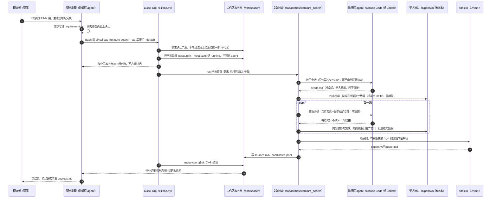
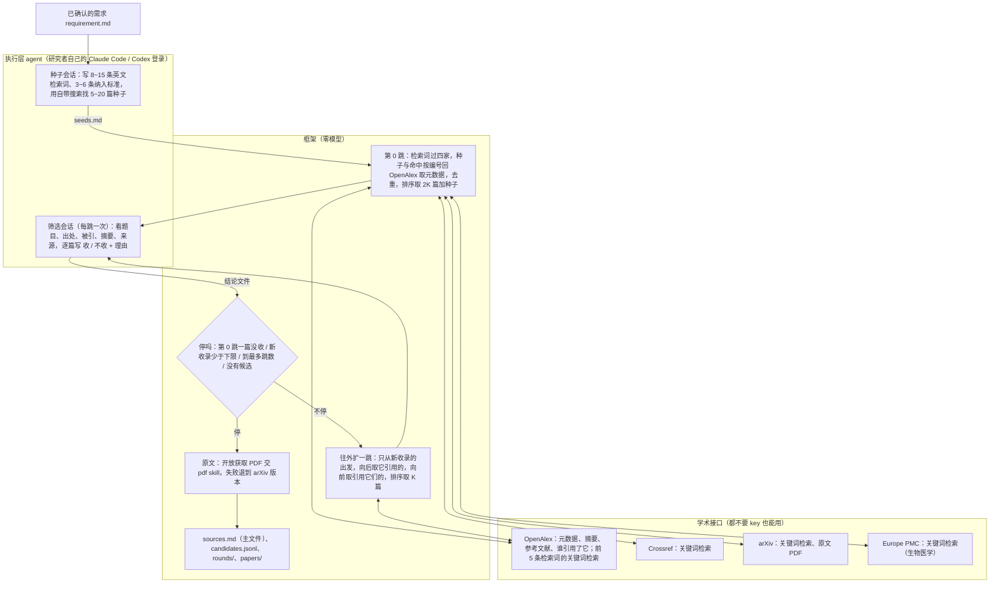
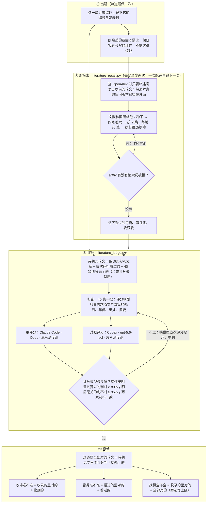

# 文献检索（literature-search）：设计、评测与基线

- 状态：步骤已实现，随 1.3.0 发布（内仓 `framework/capabilities/literature_search/`）。评测按 §6 的流程重做，§7 是以后改进对照的基线。
- 锚：[#212](https://github.com/zephyr4123/TJU-AI4Science/issues/212)（实现）、[#215](https://github.com/zephyr4123/TJU-AI4Science/issues/215)（评测重做）。过程、数字、每一步的 commit 都在 issue 评论里。
- 日期：2026-10-04
- 相关纲领：P-14（agent 面前只有 `ai4sci`）、P-20（阶段主文件）、P-25（底座可换）、P-26（按项目装载）、P-27（不要 key 也能用，有 key 用得更多）

## 0. 一句话与一张表

**它做什么**：研究者把课题写进需求，这一步自动在网上的学术论文库里找相关论文，按收录标准筛一遍，能免费下载的原文下好并转成文字，最后交一份带来源与理由的论文清单 `sources.md`。只做检索，不写综述。

**怎么打分**：三道题，每道用一篇系统综述圈定范围。综述的参考文献和工具看过的论文放在一起，交评分模型（Claude Code · Opus · 思考深度高）逐篇判对不对，判对的就是这道题全部对的论文。一次运行打三个分（§6.3）：

- **收得准不准**：收进清单的论文里，几成是对的；
- **看得准不准**：挑去给模型看的约 125 篇里，几成是对的；
- **找得全不全**：这道题全部对的论文里，收进清单的有几成。一次最多看约 125 篇，全部对的论文比这多时有上限，所以旁边写上限。

| | 基线（干净运行的平均；主评分 Opus） |
|---|---|
| 能不能用 | Claude Code 与 Codex 都真跑通过；不配任何 key 也能跑 |
| 一次多久、花多少 | 2 跳约 4~6 分钟；执行层 Claude Code（Sonnet，思考深度中）约 0.7~0.9 美元；Codex 订阅账号报不出美元 |
| 收得准不准 | 窄题 82%、宽题 100%、新题 72%：窄题、宽题收进清单的论文八成以上是对的；新题有一次跑偏（57%），拉低了平均 |
| 看得准不准 | 窄题 40%、宽题 93%、新题 61%：窄题的名额一多半花在了不相关的论文上 |
| 找得全不全（上限） | 窄题 44%（100%）、宽题 56%（64%）、新题 28%（47%）：宽题已经贴着上限，窄题离上限最远 |
| 第一版的旧分数 | 窄题 17%、宽题 23%、新题 10%：只拿综述当答案，分数不到新算法的一半 |
| 卡在哪 | 宽题卡在名额，窄题卡在检索和排序，新题两头都有（§7.6） |
| 额度 | 一次检索约 40 个 OpenAlex 请求、45~75 积分；不配 key 每天约 15 次，配免费 key 约 150 次 |
| 做不到的 | 中文库（知网、万方）查不了；付费期刊的原文下不了，只列出来请研究者自己下 |

## 1. 背景

- 七个研究阶段里，文献阶段原来没有步骤：研究助理靠自己的联网搜索找材料，手写 `sources.md`（P-24 定的名字，复现流程读它）。
- 收录的社区 skill 里有检索类、精读类的（`paper-lookup`、`citation-management`、`nature-paper-card` 等），但有三个问题：只能「查一下」「读一篇」，不会把一个题目下的论文找全；它们用的学术接口不配 key 时多家限流严重（§4）；没有一个在真课题里用过。
- 主人 2026-10-04 定的方向：**先把检索这一段做好**，精读、综述都是它的下游。架构是「agent 自带搜索找种子 → 学术接口拿元数据 → 多跳顺引用扩 → 下原文解析」。多家 coding agent 都要能跑，不能只适配 Claude Code。
- 第一版报告用「收录了几成综述参考文献」当分数。主人看结果时指出这个口径有问题，于是按 §6 重做了评测：问题实实在在存在，修了评测，分数才可信，以后的改进也才有基线可比。

## 2. agent 怎么用这一步：调用路径

研究者在页面上和研究助理（协调层 agent）对话；助理照指南调用 `ai4sci` 这个唯一的入口（P-14）。从对话到论文清单，一路经过这些层：



两层 agent 能用的工具，都由平台在起会话时给定（不靠提示里的「请不要」）：

| 谁 | 能用的工具 | 在这一步里干什么 | 由谁收紧 |
|---|---|---|---|
| 研究助理（协调层） | Bash 只放行 `ai4sci` 开头的命令；能写的只有本项目目录；自带联网搜索 | 调 `ai4sci cap literature-search`；跑完 `ai4sci show output literature/<n>` 看结果，读 `sources.md` | `chat/guide.py::BASH_RULES`、`chat/scope.py` |
| 执行层，Claude Code | `claude -p` 一次一会话，`--permission-mode dontAsk` + `--allowedTools`：只许在产出目录里 Edit / Write、Bash 只放行 `ai4sci skill`、`WebSearch` `WebFetch`；隔离参数不读本机设置、不起 MCP | 种子会话用 WebSearch 找种子、Write 写 `seeds.md`；筛选会话只 Write 结论文件 | `backends/claude_code.py`、`executor/session.py` |
| 执行层，Codex | `codex exec --json`，`sandbox_mode="workspace-write"` 只许写产出目录、`web_search="live"`、execpolicy 只放行 `ai4sci skill`；私有 `CODEX_HOME`，不读 AGENTS.md | 同上（种子会话用 `web_search`） | `backends/codex.py` |
| 框架（这一步本身） | 标准库 HTTP 查四家接口；`uv run --locked` 起平台自带的 `pdf` skill 脚本 | 查询、去重、排序、停不停、下原文、写清单 | 零模型（`make check` 查 `framework/` 里没有模型 API） |

执行层交回来的东西框架都要核：会话改了规定之外的文件、超时或退出码非零、`seeds.md` 缺节、结论文件少一篇或多一篇或写了不认的结论，这一步都判失败（产出目录留着当证据）。执行层自己说了什么不作数，改了哪些文件看会话前后的快照对比（`backends/_snapshot.py`）。

要能调用，工作区的流程实例上要有文献这一格并挂上这一步：

```yaml
# workspaces/<名字>/flows/<流程>.yaml
stages:
  - 文献: [literature-search]
```

## 3. 它是怎么检索的

### 3.1 架构



### 3.2 每一步

1. **种子会话**（执行层一次）：读需求，写 `seeds.md` 三节——检索词 8~15 条（最概括的 3~5 条在前，后面往细里铺，需求里提到的每个对象、子方向各一条：冷门方向的论文被引少，顺着引用够不着，只能靠细的检索词）；纳入标准 3~6 条；种子 5~20 篇（DOI 或 arXiv 链接，用自带搜索找，没有搜索工具就留空，不许凭记忆写 DOI）。
2. **第 0 跳**（框架）：
   - 种子里认出 DOI 与 arXiv 号，回 OpenAlex 批量取。arXiv 号按落地页查——论文后来发了期刊的，OpenAlex 的主 DOI 是期刊的，按 arXiv 的 DOI 查是 404（第一次真跑就丢了 3 篇种子）。
   - 检索词逐条过 Crossref、arXiv、Europe PMC，前 5 条也过 OpenAlex 的关键词检索，每家每条取前 10 篇；命中的 DOI / arXiv 号 / PMID 回 OpenAlex 批量取元数据。
   - 排序取每跳筛选数的两倍（默认 60 篇），种子另算：「新」「经典」两种排法轮流取（§3.3）。
3. **筛选会话**（执行层，每跳一次）：框架把这一跳候选的题目、年份、出处、被引数、摘要（截到 1500 字）、怎么找到的写进提示，执行层按纳入标准逐篇写「W 号 | 收 或 不收 | 理由」。拿不准的收，宁多勿漏。
4. **往外扩一跳**（框架）：只从这一跳新收录的出发——向后取它们的参考文献表（OpenAlex 单篇取不扣额度），向前取「谁引用了它们」（一跳合成一次查询，按被引数取前 400 篇）；新线索取元数据、排序，取前 K 篇（默认 30）交下一跳筛。
5. **停**：第 0 跳一篇都没收；某一跳新收录的少于停止下限（默认 3）；到了最多跳数（默认 2）；没有可筛的候选。先到哪个停在哪个。
6. **原文**（框架）：收录的、有开放获取 PDF 链接的，逐篇交平台自带的 `pdf` skill 下载并解析成 `paper.md`；出版社拦了（403、人机验证页）且有 arXiv 版本的，换 arXiv 再试；都不成的记原因，列进 `sources.md` 请研究者自己下。
7. **写清单**：`sources.md` 写检索词、纳入标准、各家命中多少、收录的每篇（题目、作者、出处、被引、链接、怎么找到的、第几跳、为什么收、原文在不在）、没拿到原文的、查不到的种子、没查成的检索。

参数（`ai4sci show caps` 里的名字）：最多跳数 `max_hops`（2）、每跳筛选数 `per_hop`（30）、停止下限 `min_new`（3）、只看摘要 `abstracts_only`（缺省关，即下载原文）。

### 3.3 排序：每一跳交给模型看哪几篇

一篇论文被引上千、引用它的就上千篇，不可能全交给模型看，排序决定召回。规则都是零模型、按实测定的（§8，当时用的是第一版口径，待按 §6 复核）：

| 用在 | 分数 | 为什么 |
|---|---|---|
| 第 1 跳起 | 证据数 ×（1 + 2 × 字面相关度），同分看被引数 | 证据数 = 关联到几篇已收录的（它引用了或被引用）加被几路检索查到。只按证据数排分不开：关联 1 篇的线索上千条，答案就混在里面。字面相关度 = 题目加摘要命中检索词的程度，词按在这批线索里的稀有度加权（「neural」「network」几乎人人有，不算分） |
| 第 0 跳 | 上面那种（偏新论文）与再乘 1 + ln(1 + 被引数)（偏经典论文）两种排法轮流取 | 检索命中没有「被谁用到」的证据，排在前面的一半是刚出的新论文；只按被引数又会把新论文挤掉，研究者两头都要 |

### 3.4 留下哪些文件

| 文件 | 内容 | 谁读 |
|---|---|---|
| `sources.md` | 文献阶段的主文件（P-20）：上面第 7 步那份清单 | 研究者、助理、下游步骤（复现流程把它原样拼进提示） |
| `candidates.jsonl` | 看过的每篇一行：元数据、第几跳、来源标记、收不收、理由 | 排查、评测 |
| `seeds.md` | 执行层写的检索词、纳入标准、种子 | 框架 |
| `rounds/<跳>/candidates.md`、`decisions.md` | 每跳交给模型的清单与它的结论 | 排查 |
| `papers/<W号>/` | `paper.md`、`structured.json`、`images/`、`source.pdf` | 研究者、精读类 skill |
| `executor/` | 每次执行层会话的事件流 | 排查 |

## 4. 用了哪些接口、能调用多少次

全部 2026-10-04 实测（`curl` 背靠背 8 次串行 + 8 次并发，再按需复测；数字在 #212）。

| 接口 | 在这一步里干什么 | 要不要 key | 额度与限速 | 实测 |
|---|---|---|---|---|
| **OpenAlex** | 元数据、摘要、参考文献表、谁引用了它；前 5 条检索词的关键词检索 | 不要也能用；**配免费 key 额度 10 倍**（`OPENALEX_API_KEY`，[领 key](https://openalex.org/settings/api)） | 不带 key：每 IP 每天 1000 积分（0.1 美元）；带 key：10000（1 美元）。关键词检索每次 10 积分，按编号批量取、谁引用了它每次 1 积分（一次最多 100 个编号 / 200 条），按编号取单篇 0。官方 2026-02 起说不带 key 只算随手用 | 串行、并发都正常；一次检索约 65 积分 → 不带 key 一天约 15 次，带 key 约 150 次。同一出口 IP 的人共用不带 key 的额度 |
| **Crossref** | 关键词检索（期刊、会议、预印本） | 不要 | 没有日额度；同时发会被拒 | 串行正常，约 1.5 秒一次；8 个并发 5 个 429 |
| **arXiv** | 关键词检索（预印本）；原文 PDF | 不要 | 没有日额度；官方要求两次请求隔 3 秒 | 正常；检索式里空格是「或」，要拼成 `all:a AND all:b`；PDF 下载曾被截断（见 §9）。同一台机器上同时跑几个检索会被 429 限速，且不带 Retry-After：现在被拒时按 5 / 15 / 30 / 60 秒退避（#216） |
| **Europe PMC** | 关键词检索（生物医学为主） | 不要 | 没有日额度 | 串行、并发都正常，约 1.4 秒一次 |
| 开放获取 PDF 的出版社链接 | 原文 | 不要 | — | 部分出版社 403 或返回人机验证页（Elsevier、MDPI、IOP 各见过） |
| Claude Code 自带 WebSearch / WebFetch | 种子会话找种子 | 走研究者的 Claude 登录 | 跟着订阅 | 一次 10 条，只有标题与链接，另附一段模型写的总结；WebFetch 能读 OpenAlex 的 JSON，但中间隔一个小模型 |
| Codex 自带 `web_search` | 种子会话找种子 | 走研究者的 ChatGPT 登录 | 跟着订阅 | 一次约 40 条，带标题、链接、日期、正文片段，三分之一是论文；打不开 JSON 接口；事件流里只有查了什么，看不到结果原文 |

没用的，及原因：

| 接口 | 为什么不用 |
|---|---|
| Semantic Scholar | 不配 key 几分钟后的单次请求也 429 |
| CORE | 时好时坏，单次也偶尔 429 |
| Google Scholar | 爬网页，量一大就封 |
| PubMed / PMC（E-utilities） | 每秒限 3 次、并发就拒；生物医学检索 Europe PMC 已覆盖 |
| OpenCitations | 只能一篇一篇查，查回来的编号还得回 OpenAlex 取元数据，不比合成一次的 OpenAlex 查询省 |

两家 agent 的自带搜索都只用来交种子：平台看不到搜索结果的原文，所以只认执行层写进 `seeds.md` 的链接，由框架从链接里认出编号再去查；没有联网搜索的 agent 照样能跑，只是少一路种子。

## 5. 不要 key 也能用，有 key 用得更多（P-27 改了）

原来的 P-27 是「一个 key 都不要，可选的也不要」。OpenAlex 2026-02 起不带 key 每 IP 每天 1000 积分，第一版一次检索花 160~230，一天只够五六次，开发与常用都不够。主人 2026-10-04 拍板改成：

- 平台跑起来不要任何 key，结果的形状不变；
- 可选的 key 只做量上的加法（额度更大、跑得更多），只走环境变量、一个读取点、放请求头不进 URL 与日志；现在只有 `OPENALEX_API_KEY`（读取点 `openalex.py`）；
- skill 仍一律不要 key，门禁不变。

同时把额度花法改省了：「谁引用了它」从一篇一次（一跳几十次，占一次检索的三分之一）改成一跳合成一次；批量取一次 100 个。OpenAlex 的关键词检索保留：按第一版口径，生理信号那道第 0 跳的 12 篇答案里有 6 篇只有它查得到。一次检索从 160~230 积分降到 45~75。

## 6. 怎么评测（SOP）

评测给这一步单独打分，回答三个问题：收进清单的论文对不对，挑去给模型看的论文对不对，该找的论文找回了几成。这一节是以后每次改检索都照着跑的流程，§7 是按它跑出来的基线。

### 6.1 第一版的打分错在哪

第一版（1.3.0 发布时的报告）拿一篇综述的参考文献当标准答案，只算「收录了几成参考文献」。真跑一遍、逐篇看过答案以外的收录之后，确认这个数不能当分数：

| 问题 | 后果 | 现在的做法 |
|---|---|---|
| 综述发表之后的论文不可能在答案里 | 工具找到了不得分，还占掉每跳 30 篇的名额，把答案挤出去；综述越旧越吃亏（宽题的综述是 2022 年的） | **按综述发表日截断**：查 OpenAlex 时只要综述发表日以前的论文，等于在综述发表那天跑这个工具 |
| 一篇综述只引了相关论文的一部分 | 答案以外的收录不得分。新题收了 93 篇、对上答案 22 篇；剩下 71 篇随机抽 25 篇，几乎都是需求要的，比如《Physics-Informed Neural Networks for Prognostics and Health Management of Lithium-Ion Batteries》 | **评分模型判**：答案以外、工具看过的论文，逐篇交评分模型判对不对 |
| 综述的参考文献里有和需求无关的 | 宽题综述引了股价预测、科学计量学、痴呆症预测这类，是写方法、讲背景时引的，研究者不要。它们算进答案，工具没找到也扣分 | **综述的参考文献也交评分模型判**，和工具找到的用同一个标准 |
| 几次检索同时跑会被 arXiv 限速 | 三个并行时 arXiv 被拒了 5~10 条检索词，紧接着单独跑的第一次也还被拒 7 条。arXiv 是出答案最多的一家，这样的运行分数偏低 | **一次只跑一个检索**；日志里 arXiv 一条都没被拒的运行才进基线。步骤本身也改了：被限速时等得更久（#216） |
| 单次运行抖得厉害 | 检索词与纳入标准每次由执行层重写，往外扩的起点不同；新题几次运行对上的答案从 15 篇到 22 篇 | **每题至少两次干净运行**，报每次的分和平均 |

### 6.2 流程



两个脚本都在外层 `scripts/evals/`，依赖内仓的代码、用内仓的 venv 跑，生产代码不依赖它们。命令见 §11。

### 6.3 三个分：是什么，怎么算

先说清楚两个词：

- **对的论文**：评分模型判「切题」的论文，也就是在需求说的范围里、研究者会想放进清单的。
- **这道题全部对的论文**：把综述的参考文献和这道题每次运行看过的论文放在一起，评分模型逐篇判，判对的全部算上。这是目前已知的全部；工具和综述都没碰到过的论文，谁也数不出来，所以不算。

工具一次运行分两步：先挑出约 125 篇论文交给模型看摘要（第 0 跳 60 篇加种子，之后两跳各 30 篇），模型再从中挑出收进清单的。三个分分别查这两步和最终结果：

| 分 | 意思 | 怎么算 | 低了说明什么 |
|---|---|---|---|
| **收得准不准** | 收进清单的论文里，几成是对的 | 收录的里对的篇数 ÷ 收录的篇数 | 模型筛得太松，或纳入标准写宽了 |
| **看得准不准** | 挑去给模型看的论文里，几成是对的 | 看过的里对的篇数 ÷ 看过的篇数 | 检索和排序在送不相关的论文，名额浪费了 |
| **找得全不全** | 这道题全部对的论文里，收进清单的有几成 | 收录的里对的篇数 ÷ 这道题全部对的篇数 | 先看它离上限有多远（见下） |

**上限**：一次最多看约 125 篇，也就最多收 125 篇。要是这道题全部对的论文有 198 篇（宽题就是），就算一篇不错，找得全不全最高也只有 127 ÷ 198 ≈ 64%。所以报找得全不全时把上限写在旁边。离上限还远，是前两步有问题；贴着上限，是名额不够，要多看几篇或多跳一跳。

**例子**（宽题第 4 次运行，主评分）：这道题全部对的论文 198 篇：综述参考文献里判对的 75 篇，加上综述以外判对的 123 篇。这次运行看了 127 篇，其中对的 116 篇；收了 112 篇，其中对的 111 篇（28 篇在综述里，83 篇在综述外）。

- 收得准不准 = 111 ÷ 112 = 99%
- 看得准不准 = 116 ÷ 127 = 91%
- 找得全不全 = 111 ÷ 198 = 56%，上限 127 ÷ 198 = 64%
- 第一版的旧分数 = 28 ÷ 121 = 23%：综述外那 83 篇对的不算，综述里 46 篇不相关的又算进了分母

**为什么综述的参考文献也要判、不直接算对**：宽题综述 121 篇参考文献，主评分判了 46 篇不对，比如监督学习预测股价的综述、科学计量学里评估研究领域成熟度、东盟可持续制造实践、深度 Q 学习做网络入侵检测。这些是系统综述写方法、讲背景时引的，研究者要的是「PINN 方法改进」，不会想在清单里看到它们。直接算对的话，工具没找到它们也要扣分。

**另外三个数**，用来找原因：

- **看过没收、其实是对的**：模型筛漏的篇数。
- **对的论文里，工具根本没看过的**：检索和排序没送到的篇数。
- **旧分数**：收了几成综述参考文献（第一版的算法），只作对照，看第一版低估了多少。

**比较两个版本时**：「这道题全部对的论文」会随运行变多而变全，同一次运行的找得全不全会跟着变。所以要把新旧版本的运行一起交给评分脚本，在同一份「全部对的论文」上算分。新版本找到的新论文判完以后，新旧版本一起重算。

### 6.4 评分模型

| 项 | 做法 | 为什么 |
|---|---|---|
| 主评分 | Claude Code · Opus · 思考深度高 | 打分要用好模型，比执行层的 Sonnet 强 |
| 对照评分 | Codex · gpt-5.6-sol（Codex 最强的一档）· 思考深度高 | 换一家模型判同一批论文，看两家判得一不一致；用它的判定算出来的分也报，看结论会不会因为换了评分模型而变 |
| 会话 | 一批 40 篇一个隔离会话，各在自己的目录里；不联网、不许跑命令，只许写一个结论文件；漏写的几篇单独补判 | 判定不受外部影响，判定文件能逐条复核 |
| 看到什么 | 需求原文，每篇的题目、年份、出处、摘要（截到 1500 字） | 不给执行层写的纳入标准、不给被引数、不说哪篇是综述的参考文献、哪篇是工具找的；顺序打乱 |
| 判什么 | 每篇「切题」或「不切题」，加一句理由 | 只有两档，判定好对账 |
| 复用 | 判过的论文按编号复用，加运行、加题时只判新的 | 比较新版本时只为新论文花钱 |

**评分模型先过关**。下面三条在看到结果之前就定好了，写在 #215 里；三条都过，它的判定才采信：

| 检查 | 线 | 意思 |
|---|---|---|
| 综述里明显该算对的，判对 | ≥ 80% | 「明显该算对的」= 题目或摘要里提到 physics-informed、PINN、physics-guided、physics-constrained 的综述参考文献。这是按关键词圈的，里面混着需求范围以外的 PINN 应用，所以不要求 100% |
| 明显无关的，判不对 | ≥ 95% | 每道题混进 40 篇无关综述（[W4415344803](https://openalex.org/W4415344803)，大模型做组合优化）的参考文献 |
| 两家判得一致 | 一致程度 ≥ 0.6 | 同一批论文 Opus 和 Codex 各判一遍。直接数「判得一样的比例」会偏高：两家都爱判「对」时，随便猜也能对上不少。所以扣掉碰巧对上的那部分再算一致程度（统计上叫 Cohen's κ），满分 1，0.6 以上算高度一致 |

### 6.5 三道题

| 题 | 圈定范围的综述 | 发表日（截断） | 参考文献 / OpenAlex 取得到 / 核心 | 为什么选它 |
|---|---|---|---|---|
| 窄：PINN 用于生理信号 | [W4412520891](https://openalex.org/W4412520891)，*Physiological Measurement*，叙述综述 | 2025-07-18 | 104 / 81 / 43 | 小方向，相关论文少、散在各个应用里 |
| 宽：PINN 方法改进 | [W4309548460](https://openalex.org/W4309548460)，*Big Data and Cognitive Computing*，系统综述 | 2022-11-21 | 134 / 121 / 73 | 方法类大方向，引用关系密 |
| 新：物理信息机器学习用于故障预测与健康管理 | [W7172437325](https://openalex.org/W7172437325)，*Journal of Intelligent Manufacturing*，系统综述（212 篇研究） | 2026-08-04 | 179 / 177 / 88 | 主人提议加的：最近才发表，截断前后几乎没差别；覆盖各类设备与任务，题宽 |

需求都照综述的范围写，像研究者会写的那样，不提这篇综述。原文在外层 `scripts/evals/literature_questions/<题>.md`（`physio` 窄、`slr` 宽、`phm` 新），评测时原样作工作区的 `requirement.md`。

### 6.6 防泄漏

- 综述本身挡在候选池外，否则向后一跳就把答案全抄回来了。
- 执行层用自带搜索找种子时，可能找到综述的预印本或别的版本：新题第 3 次运行把综述的 arXiv 版当成了种子，因为发表日在截断之后，没进池子。所以评测客户端同时挡掉题目和综述相同的任何版本，跑完再按题目核一遍候选里没有综述本身。
- 一篇更早的、同主题的综述被找到，不算泄漏。比如宽题找到了 2022 年 Cuomo 等人的 PINN 综述，它和答案有 34 篇参考文献重合；研究者自己查也会先找到它。

## 7. 基线结果

10 次运行（每题 2 次干净运行，加 4 次被 arXiv 拒过的），两家评分模型各判一遍。执行层一律 Claude Code · Sonnet（claude-sonnet-5-5）· 思考深度中，按人的设置来（P-25）；会话里还有 Claude Code 自己调的 Haiku，联网搜索时用来总结网页。跳数 2、每跳 30 篇、停止下限 1。

### 7.1 平均分

只算干净运行；斜杠前是主评分 Opus，斜杠后是对照 Codex。

| 题 | 全部对的论文（Opus / Codex） | 收得准不准 | 看得准不准 | 找得全不全 | 上限 | 旧分数 |
|---|---|---|---|---|---|---|
| 窄 | 109 / 109 | 82% / 84% | 40% / 45% | 44% / 46% | 100% / 100% | 17% |
| 宽 | 198 / 205 | 100% / 98% | 93% / 94% | 56% / 53% | 64% / 62% | 23% |
| 新 | 265 / 282 | 72% / 84% | 61% / 72% | 28% / 31% | 47% / 44% | 10% |

### 7.2 评分模型过没过关

| 题 | 评分模型 | 综述里明显该算对的，判对（≥ 80%） | 综述里其余的，判对（不设线） | 明显无关的，判不对（≥ 95%） | 两家判得一样的比例 / 一致程度（≥ 0.6） |
|---|---|---|---|---|---|
| 窄 | Opus | 34 / 43 = 79% | 22 / 38 = 58% | 40 / 40 = 100% | 90% / 0.79（278 篇） |
| 窄 | Codex | 32 / 43 = 74% | 15 / 38 = 40% | 40 / 40 = 100% | （同上） |
| 宽 | Opus | 65 / 73 = 89% | 10 / 48 = 21% | 40 / 40 = 100% | 92% / 0.82（299 篇） |
| 宽 | Codex | 72 / 73 = 99% | 6 / 48 = 12% | 40 / 40 = 100% | （同上） |
| 新 | Opus | 85 / 88 = 97% | 58 / 89 = 65% | 40 / 40 = 100% | 92% / 0.82（433 篇） |
| 新 | Codex | 85 / 88 = 97% | 53 / 89 = 60% | 40 / 40 = 100% | （同上） |

- **无关论文、两家一致这两关，三道题都过了。** 换 Codex 判，平均分最多差 12 个百分点（新题的收得准不准：72% 对 84%），但每道题卡在哪儿（§7.6）两家判得一样。
- **窄题的「明显该算对的判对」是 79%，差 1 个百分点没过 80% 的线，如实记作「未过」。** 没判对的 9 篇逐篇看过：都是 PINN 用在高速流动、纳米光学、海洋建模、固体弹性力学这类领域的论文，综述引来当别处的例子；需求要的是「PINN 用于生理信号」，判不对是对的，Codex 对其中 8 篇判得一样。问题出在「明显该算对的」这条关键词规则只看方法、不看领域，圈宽了，不出在评分模型。下一轮把它改成「方法词和领域词同时出现」（§10）。窄题的分照常报，但读的时候记着这一条。
- 「综述里其余的」（没提 PINN 这类方法的参考文献）判对的比例本来就不设线：它们多是背景引用，判对的比例低正说明综述的参考文献不能整份当答案。

### 7.3 每次运行的分数与花费

| 题 | 第几次 | 干净 | 看过 | 收录 | 收得准不准 | 看得准不准 | 找得全不全（上限） | 旧分数 | 看过没收、其实对 | 对的里没看过 |
|---|---|---|---|---|---|---|---|---|---|---|
| 窄 | 5 | 否 | 124 | 66 | 76% | 43% | 46%（100%） | 17% | 3 | 56 |
| 窄 | 6 | 是 | 126 | 56 | 84% | 40% | 43%（100%） | 17% | 3 | 59 |
| 窄 | 7 | 是 | 126 | 63 | 79% | 40% | 46%（100%） | 17% | 1 | 58 |
| 宽 | 3 | 否 | 128 | 113 | 97% | 91% | 56%（65%） | 24% | 6 | 82 |
| 宽 | 4 | 是 | 127 | 112 | 99% | 91% | 56%（64%） | 23% | 5 | 82 |
| 宽 | 5 | 是 | 125 | 110 | 100% | 95% | 56%（63%） | 23% | 9 | 79 |
| 新 | 1 | 否 | 125 | 93 | 90% | 69% | 32%（47%） | 12% | 2 | 179 |
| 新 | 2 | 否 | 125 | 102 | 79% | 66% | 31%（47%） | 11% | 1 | 183 |
| 新 | 3 | 是 | 127 | 108 | 57% | 52% | 23%（48%） | 8% | 4 | 199 |
| 新 | 5 | 是 | 124 | 99 | 87% | 70% | 32%（47%） | 12% | 1 | 178 |

「干净」= 这次运行 arXiv 一条检索词都没被拒。不干净的 4 次只让它们看过的论文进待判池，分数不进 §7.1 的平均。新题第 4 次运行中途失败：执行层在结论文件里把两个相近的编号抄混了，当时的步骤因此整次作废（#216 已修，现在只补筛那两篇），所以表里没有它。

对照评分（Codex）判出来的分：

| 题 | 第几次 | 干净 | 看过 | 收录 | 收得准不准 | 看得准不准 | 找得全不全（上限） | 旧分数 | 看过没收、其实对 | 对的里没看过 |
|---|---|---|---|---|---|---|---|---|---|---|
| 窄 | 5 | 否 | 124 | 66 | 80% | 48% | 49%（100%） | 17% | 6 | 50 |
| 窄 | 6 | 是 | 126 | 56 | 86% | 46% | 44%（100%） | 17% | 10 | 51 |
| 窄 | 7 | 是 | 126 | 63 | 82% | 44% | 48%（100%） | 17% | 4 | 53 |
| 宽 | 3 | 否 | 128 | 113 | 98% | 94% | 54%（62%） | 24% | 9 | 85 |
| 宽 | 4 | 是 | 127 | 112 | 98% | 92% | 54%（62%） | 23% | 7 | 88 |
| 宽 | 5 | 是 | 125 | 110 | 98% | 95% | 53%（61%） | 23% | 11 | 86 |
| 新 | 1 | 否 | 125 | 93 | 90% | 77% | 30%（44%） | 12% | 12 | 186 |
| 新 | 2 | 否 | 125 | 102 | 91% | 75% | 33%（44%） | 11% | 1 | 188 |
| 新 | 3 | 是 | 127 | 108 | 78% | 69% | 30%（45%） | 8% | 4 | 194 |
| 新 | 5 | 是 | 124 | 99 | 91% | 74% | 32%（44%） | 12% | 2 | 190 |

每次运行的成本：

| 题 | 第几次 | arXiv 被拒的检索词 | 会话 | token（输出 / 读缓存 / 写缓存） | 花费 | 墙钟 | OpenAlex 请求 |
|---|---|---|---|---|---|---|---|
| 窄 | 5 | 10 | 4 | 12.4k / 284.8k / 120.7k | 0.82 美元 | 6 分 29 秒 | 39 |
| 窄 | 6 | 0 | 4 | 10.1k / 294.8k / 98.8k | 0.67 美元 | 3 分 51 秒 | 43 |
| 窄 | 7 | 0 | 4 | 12.2k / 321.7k / 100.4k | 0.71 美元 | 3 分 53 秒 | 41 |
| 宽 | 3 | 5 | 4 | 12.4k / 321.4k / 130.1k | 0.89 美元 | 5 分 00 秒 | 41 |
| 宽 | 4 | 0 | 4 | 10.4k / 320.8k / 108.4k | 0.76 美元 | 3 分 51 秒 | 43 |
| 宽 | 5 | 0 | 4 | 10.2k / 304.1k / 108.8k | 0.75 美元 | 3 分 45 秒 | 44 |
| 新 | 1 | 8 | 4 | 11.1k / 307.2k / 112.6k | 0.76 美元 | 5 分 53 秒 | 41 |
| 新 | 2 | 7 | 4 | 11.1k / 292.1k / 95.3k | 0.71 美元 | 5 分 06 秒 | 41 |
| 新 | 3 | 0 | 4 | 11.8k / 302.9k / 106.1k | 0.76 美元 | 4 分 06 秒 | 42 |
| 新 | 5 | 0 | 4 | 10.6k / 323.4k / 95.7k | 0.72 美元 | 3 分 53 秒 | 43 |

Claude Code 报的美元是按 API 价折算的，订阅账号不另付。模型会话本身每次合计约 1.5~2 分钟，其余时间在查接口：四家检索 15 条约 1.5 分钟，因为 arXiv 两次请求要隔 3 秒。OpenAlex 每次约 40 个请求、45~75 积分（按响应头的剩余积分前后相减）。

评分的花费：Opus 32 个会话，按 API 价折合 8.36 美元，会话合计约 21 分钟；Codex 31 个会话，输入 137 万 token（其中缓存 91 万）、输出 8.5 万 token，订阅账号报不出美元。三道题一共判了约 1000 篇。

### 7.4 全部对的论文从哪来

| 题 | 综述的参考文献（取得到的） | 其中判对 | 各次运行看过、综述里没有的 | 其中判对 | 全部对的 |
|---|---|---|---|---|---|
| 窄 | 81 | 56 | 157 | 53 | 109 |
| 宽 | 121 | 75 | 138 | 123 | 198 |
| 新 | 177 | 143 | 216 | 122 | 265 |

三道题里，综述以外判对的论文都和综述里判对的差不多多（宽题、新题还更多）。只拿综述当答案，至少漏掉一半该算分的论文。

### 7.5 每一跳的贡献

| 题 | 第几次 | 第 0 跳：看过 / 收录 / 收录里对的 | 第 1 跳 | 第 2 跳 |
|---|---|---|---|---|
| 窄 | 6 | 66 / 39 / 35 | 30 / 12 / 10 | 30 / 5 / 2 |
| 窄 | 7 | 66 / 39 / 35 | 30 / 13 / 7 | 30 / 11 / 8 |
| 宽 | 4 | 67 / 56 / 56 | 30 / 28 / 28 | 30 / 28 / 27 |
| 宽 | 5 | 65 / 55 / 55 | 30 / 28 / 28 | 30 / 27 / 27 |
| 新 | 3 | 67 / 56 / 47 | 30 / 24 / 12 | 30 / 28 / 3 |
| 新 | 5 | 64 / 51 / 50 | 30 / 25 / 23 | 30 / 23 / 13 |

### 7.6 读出来的

1. **第一版的分数不到新算法的一半。** 旧分数是窄题 17%、宽题 23%、新题 10%；新算法下找得全不全是 44%、56%、28%。差出来的主要是综述外的对的论文（§7.4），和综述里那些不相关的参考文献。
2. **三道题卡在不同地方，要改的东西也不同：**
   - **宽题卡在名额。** 看得准不准 93%、收得准不准 100%，找得全不全 56%，贴着上限 64%。前两步几乎没浪费，想再找全只能多给名额：每跳多看，或者多跳一跳。
   - **窄题卡在检索和排序。** 名额够用（上限 100%），可看过的约 126 篇里只有四成是对的；全部对的 109 篇里，约 58 篇工具根本没看到，看过没收的只有 1~3 篇。所以是检索词和排序没把对的论文送上来，筛选没问题。第 2 跳也只多收了 2~8 篇对的。
   - **新题两头都有。** 上限 47%，实际 28%；看得准不准 61%。另外有一次跑偏了，见下一条。
3. **新题第 3 次运行跑偏了。** 执行层写的检索词里有一条泛的「physics-informed neural networks」，纳入标准又写了「PINN 及其变体即使例子不是设备健康管理也收」。于是第 0 跳就带进来一批通用 PINN 方法论文（fPINN、B-PINN、PINN 解传热问题），第 2 跳收的 28 篇里只有 3 篇对，收得准不准掉到 57%。同一道题的第 5 次没跑偏，是 87%。说明种子会话写的检索词和纳入标准可能比需求宽，这是步骤本身的弱点。
4. **筛选很少漏，但边界上放得宽。** 看过没收、但其实是对的，每次只有 1~9 篇。收得准不准偏低的两道（窄题 82%、新题 72%），多收的是边界上的论文。拿窄题两次干净运行逐篇看：多收的 9 篇、13 篇几乎都是通用的 PINN 方法论文（自适应激活函数、区域分解、对抗式不确定性量化这类）。需求写了「被这些研究普遍采用的奠基与方法论文也收」，执行层照提示「拿不准的收」放了进来，理由里常写「无摘要，按题目判」「拿不准故收」；评分模型判它们算不上「普遍采用」。
5. **单次运行会抖。** 新题两次干净运行的找得全不全是 23% 和 32%。下结论至少看两次的平均，改动的效果小于这个抖动的，要多跑几次再定。

## 8. 开发时的比较（第一版口径，待按 §6 复核）

实现那天定排序、定「谁引用了它」的查法，用的是第一版口径：只数前 30 / 60 篇里有几篇综述参考文献，而且没有截断。这些比较是同一批线索里换排法的离线重放，相对高低大体可信，但绝对数不能和 §7 比；哪条要再动，先按 §6 重测。

**每跳看多少篇（K）**：窄题同一份种子，K 从 30 翻到 60，看过的从 144 篇到 234 篇，收录的综述参考文献只从 18 到 19。没轮到筛的答案多数只关联 1~3 篇已收录的，而线索池里关联 1 篇的有 3121 条，所以当时判断卡在排序。这和 §7 新算法下的结论一致：窄题不缺名额、卡在检索和排序；但宽题当时没测过，新算法下它恰恰卡在名额。

**第 1 跳的排法**（同一份第 0 跳结论重放，前 30 / 60 / 120 篇里的综述参考文献）：

| 排法 | 窄题（966 条线索里 33 篇） | 宽题（1570 条里 43 篇） |
|---|---|---|
| 只按关联数，同数看被引（第一版） | 11 / 15 / 21 | 6 / 13 / 23 |
| 关联数 ×（1 + 1 × 字面相关度） | 13 / 16 / 21 | 7 / 13 / 23 |
| **关联数 ×（1 + 2 × 字面相关度）（采用）** | **15 / 16 / 21** | **7 / 14 / 22** |
| 关联数 ×（1 + 3 × 字面相关度） | 14 / 16 / 20 | 8 / 14 / 21 |
| 只看字面相关度 | 8 / 8 / 14 | 0 / 2 / 4 |
| 采用的再乘 1 + 0.5 ln(1 + 被引数) | 9 / 15 / 20 | 7 / 15 / 23 |

**第 0 跳的排法**（一次运行的 370 篇检索命中，其中 12 篇综述参考文献，看前 30 / 60 / 120 篇）：按命中次数乘字面相关度是 3 / 4 / 8，前 60 里 42 篇是 2025 年后的；再乘被引数是 6 / 9 / 12，新论文只剩 15 篇；**两种轮流取（采用）** 是 5 / 6 / 12，新论文 26 篇。第一版口径天然不认新论文，所以当时取了折中。按新口径，新论文切题的照样算分，这条该重测。

**「谁引用了它」的查法**（第 1 跳重放，前 30 / 60 篇里的综述参考文献）：一跳合成一次、按被引数取前 400（采用）：窄题 7 / 7、宽题 8 / 17，约 13 次请求；一篇一次、每篇前 25（第一版）：7 / 10、7 / 8，约 61 次；一篇一次、每篇取最新的 25：4 / 4、4 / 7，约 109 次。

当时还读出两条，和新口径不冲突：参考文献方向比「谁引用了它」准（窄题里来源是「被收录的引用」的 30% 是综述参考文献，「引用了收录的」只有 8%）；种子本身几乎不是答案，它的作用是往外扩的起点。

## 9. 改了什么

**步骤本身**（#212、#216，内仓）：

| 发现 | 根因 | 修法 | commit |
|---|---|---|---|
| 第一版：只接 OpenAlex | 不配 key 的几家里只有它稳、且有引用关系 | 步骤落地：种子会话、第 0 跳、多跳、筛选、原文、清单 | `b12a4cf` |
| 3 条 arXiv 种子查不到 | 发了期刊的，OpenAlex 主 DOI 是期刊的 | arXiv 号按落地页查 | `2dc3f9a` |
| 命令行跑出来一篇原文没下 | 「下载原文」写成缺省为真的开关，CLI 上开关缺省只能是关 | 改成「只看摘要」，并断言 bool 参数缺省只能是 False | `2dc3f9a` |
| 两篇 arXiv 的 PDF 解析报 `not a dict (null)` | 平台 `pdf` skill 下载只 `read` 一次，连接中途断了不报错，文件停在正好 1 MiB / 8 MiB | 读到结尾，比 Content-Length 短按下载失败 | `e235eca` |
| 出版社返回人机验证页 | 出版社拦程序下载 | 有 arXiv 版本的换 arXiv 再试 | `e235eca` |
| 每跳多看也找不到更多 | 排序分不开 | 乘字面相关度 | `48dbe83` |
| 小方向的应用论文找不到 | 检索词太少太粗，OpenAlex 关键词检索太贵铺不开 | 四家联查、检索词 8~15 条 | `72a7f1d` |
| 第 0 跳被新论文占满 | 检索命中没有被引证据 | 新、经典两种排法轮流取 | `83aec72` |
| 不带 key 一天只够五六次 | OpenAlex 2026-02 起限额；「谁引用了它」一篇一次 | 可选 key（P-27 改）；合成一次查；批量 100 | `81d650f` |
| 结论文件抄错一个号，整次检索作废（#216） | 漏写、抄错号就判失败 | 没拿到合格结论的几篇单独补筛一次，补完还缺才判失败 | `3c48c98` |
| 同时跑几个检索，arXiv 被拒的检索词直接丢掉（#216） | 429 不带 Retry-After，退避 1 / 2 / 4 秒三次就放弃 | arXiv 按 5 / 15 / 30 / 60 秒退避 | `3c48c98` |

**评测**（#215，外层 `scripts/evals/`）：

| 发现 | 修法 | commit |
|---|---|---|
| 综述发表后的论文找到了不得分，还占名额 | 召回实测按综述发表日截断；核心答案的计数挪进脚本 | `9065f35` |
| 答案以外的收录不得分；综述的参考文献里有和需求无关的 | 评分模型判全部待判论文，打三个分（收得准不准、看得准不准、找得全不全带上限）；两家评分模型对照；判过的按编号复用 | `a5c6e40` |
| 执行层可能把综述的预印本当种子 | 评测客户端挡掉题目与综述相同的任何版本 | `d1abbe8` |
| 三道题的需求只在本机 | 需求原文进仓 | `a5c6e40` |

## 10. 已知限制与下一步

按 §7 的基线，下一步改什么、拿哪个分验收：

| 先做 | 改什么 | 看哪个分 |
|---|---|---|
| 1 | **窄题的检索与排序**：种子会话写检索词时，每条都带上需求里的领域词，不写只有方法名的泛检索词；排序时领域词的字面相关度权重加大 | 窄题的看得准不准（现 40%）、对的里没看过的篇数（现约 58） |
| 2 | **防跑偏**：种子会话的纳入标准不许比需求宽，比如需求没说收通用方法论文，就不写「例子不是本领域也收」 | 新题的收得准不准（现 72%，跑偏那次 57%） |
| 3 | **宽题加名额**：每跳 30 → 60，或者多跳一跳，看找得全不全能不能跟着上限涨。第一版做过的 K=60 比较只测了窄题（§8），宽题没测过 | 宽题的找得全不全与上限（现 56% / 64%） |
| 4 | **评测本身**：「明显该算对的」改成方法词和领域词同时出现（窄题那一关差 1 个百分点没过的原因）；每题跑 3 次 | 评分模型过没过关 |

其余限制：

- **中文库**（知网、万方）没有可用的公开接口，查不了；付费期刊的原文下不了。
- **出厂流程里还没有这一步**：`research`、`reproduce` 都不经过文献阶段，要用得在流程实例上挂（§2）。
- **「全部对的论文」只是已知的全部**：综述和工具都没碰到过的论文没法数，所以找得全不全会偏高一些。题目越窄、运行越多，这个偏差越小。
- **评分模型不是人**：两家判得一样的比例约 90%，剩下一成判法有分歧，多数在「方法学奠基工作算不算」「别的领域的同类方法算不算」这种边界上。需求写得越清楚，分歧越少。

## 11. 怎么复现

```bash
# 1. 临时数据根，别碰正式数据；一道题一个工作区，需求用仓里的原文
export AI4SCI_HOME=/tmp/lit-home && cd platform
.venv/bin/ai4sci project new lit && cd $AI4SCI_HOME/projects/lit
for q in physio slr phm; do
  ai4sci workspace new $q
  cp <外层仓>/scripts/evals/literature_questions/$q.md workspaces/$q/requirement.md
  printf 'name: lit\ntitle: 文献检索\nsummary: 按需求找论文。\nstages:\n  - 文献: [literature-search]\n' > workspaces/$q/flows/lit.yaml
  (cd workspaces/$q && ai4sci requirement confirm --ws $q)
done

# 2. 跑检索（在外层仓根；一次只跑一个，日志里 index_failed 要为 0；每题至少两次）
. ~/.secrets/loader.sh
withkey openalex platform/.venv/bin/python scripts/evals/literature_recall.py \
  $AI4SCI_HOME/projects/lit/workspaces/physio W4412520891 claude_code 2 30 1 > physio-1.log 2>&1
grep -c index_failed physio-1.log    # 不是 0 就作废重跑

# 3. 打分：先 Codex 判一遍，再 Opus 判并对照（同一道题的全部运行一起给）
R=$AI4SCI_HOME/projects/lit/workspaces/physio
withkey openalex platform/.venv/bin/python scripts/evals/literature_judge.py \
  $R/requirement.md W4412520891 judge/physio-codex $R/literature/1 $R/literature/2 \
  --backend codex --model gpt-5.6-sol --effort high
withkey openalex platform/.venv/bin/python scripts/evals/literature_judge.py \
  $R/requirement.md W4412520891 judge/physio-claude_code $R/literature/1 $R/literature/2 \
  --against judge/physio-codex/judge.json
# 结果：judge/physio-claude_code/judge.json（过关检查、一致率、每次运行的三个分、每篇的判定与理由）
```

比较一个改进：用改过的代码按第 2 步再跑几次，把新旧运行的产出目录一起交给第 3 步。新论文判完后，新旧版本在同一份「全部对的论文」上重算。
